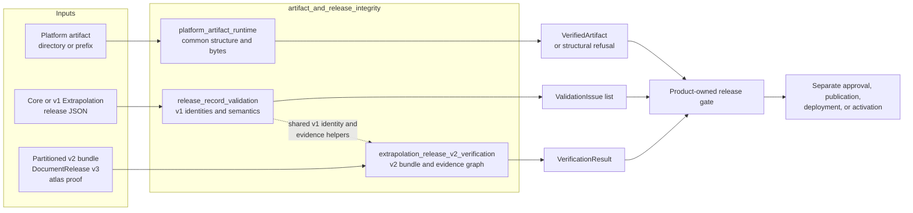
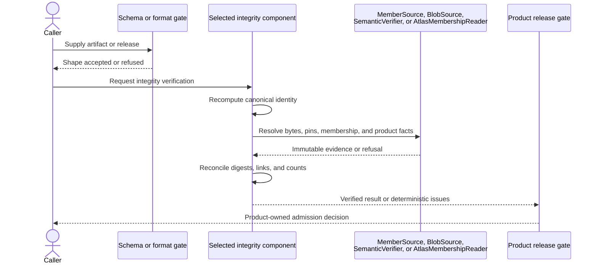

# Artifact and release integrity

## Purpose

The `artifact_and_release_integrity` module provides Rulespec’s integrity gates for immutable artifacts and release records. Its components recompute content identities, verify declared files and digests, resolve exact upstream pins, check release-specific evidence, and return deterministic validation results.

The components cover separate formats and do not replace one another. Passing validation proves integrity within the selected component’s scope; approval, publication, deployment, and activation remain product-owned decisions.

## Architecture

The module keeps storage and product knowledge behind small caller-supplied interfaces:

## Core components

| Component | Responsibility | Documentation |
| --- | --- | --- |
| `platform_artifact_runtime` | Builds and admits product-neutral platform artifacts. It verifies canonical bytes, identities, manifests, exact membership, payload digests, counts, and optional product semantics. It also provides race-resistant local readers and no-replace directory publication. | [Platform artifact runtime](platform_artifact_runtime.md) |
| `release_record_validation` | Validates canonical `RulespecCoreRelease` and single-JSON version 1 `ExtrapolationRelease` records. It checks release identities, exact input pins, evidence and receipt links, selection decisions, and coverage. Closed JSON Schema validation remains a separate required gate. | [Release record validation](release_record_validation.md) |
| `extrapolation_release_v2_verification` | Verifies copied, partitioned `ExtrapolationRelease` version 2 bundles offline. It closes directory membership, verifies manifests and Parquet schemas, resolves document and atlas pins, replays evidence coordinates, and reconciles dispositions, coverage, receipts, and root totals. | [Extrapolation release v2 verification](extrapolation_release_v2_verification.md) |