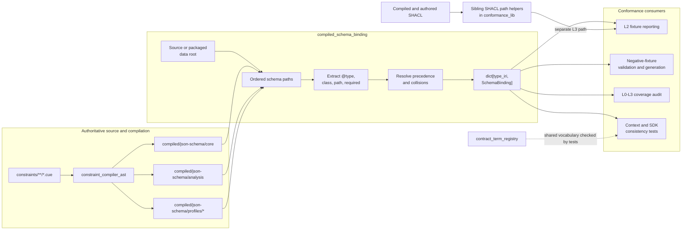
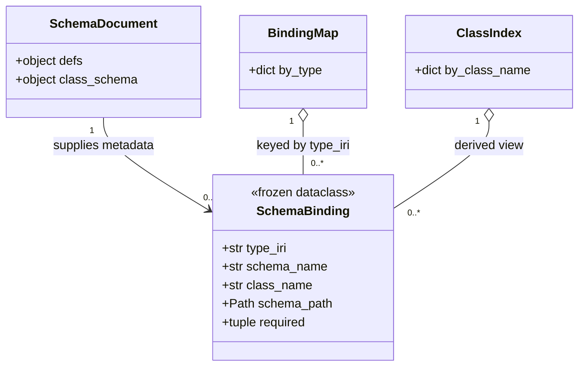
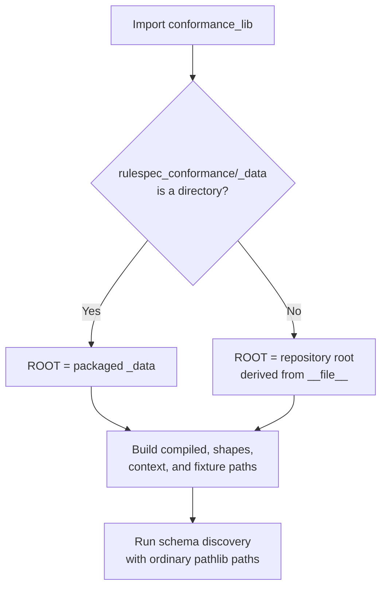
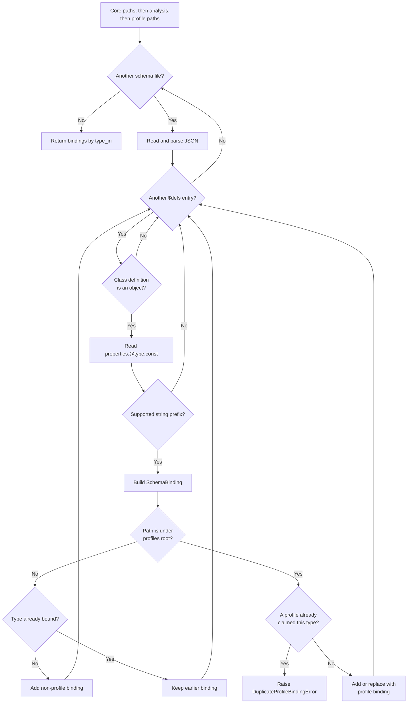
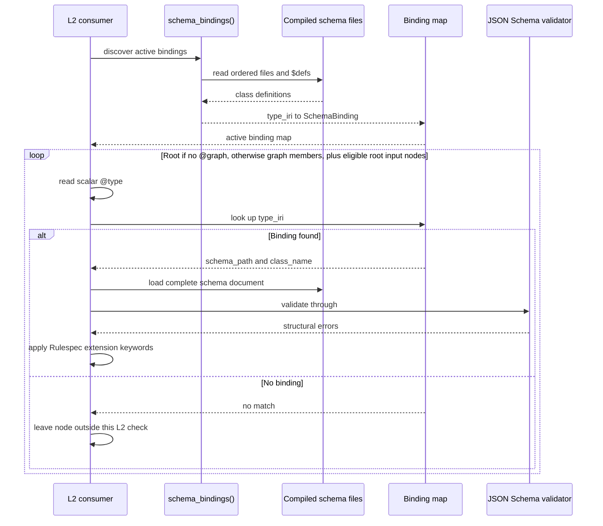

# Compiled schema binding

The `compiled_schema_binding` module is the lookup layer between generated Rulespec JSON Schema files and Level 2 (L2) shape validation. It discovers selected compiled classes with a fixed JSON for Linked Data (JSON-LD) `@type`, selects one active schema for each type, and records the result in an immutable `SchemaBinding` value.

This conceptual module lives within [`rulespec_conformance.conformance_lib`](../src/rulespec_conformance/conformance_lib.py); it is not a standalone import. It selects binding metadata only. Downstream tools load the complete schema document, select the referenced `$defs` class, run JSON Schema Draft 2020-12 validation, and enforce Rulespec extension keywords. Authoritative CUE constraints and the compiler define the generated schema content.

## At a glance

| Question | Answer |
| --- | --- |
| What goes in? | Compiled JSON Schema files under `compiled/json-schema/core/`, `compiled/json-schema/analysis/`, and `compiled/json-schema/profiles/<profile>/`. A bindable class has a string at `$defs.<Class>.properties["@type"].const` whose prefix is explicitly admitted for L2 dispatch. |
| What happens? | Discovery reads files in a fixed order, keeps the first encountered non-profile binding for each type, allows the first profile to add or replace a binding, and rejects later profile claims for that type. Every shipped profile is active; callers cannot select a subset. |
| What comes out? | A `dict[str, SchemaBinding]` keyed by compact `@type`. `schema_bindings_by_class()` can build a separate class-name index. Each binding identifies the complete schema document and its target `$defs` entry. |
| How is it checked? | Focused tests check collision handling, selected base-constraint preservation, prefix dispatch, semantic consistency, and fixture coverage. Separate package tests inspect installed resources. The current suite does not compare the complete Python and Rust binding maps or run installed-wheel L2 binding discovery. |

## Responsibilities and boundary

The module has five responsibilities:

1. Select the repository data root or the installed wheel's packaged data root.
2. Enumerate the JSON Schema families used for normal L2 class dispatch in deterministic precedence order.
3. Recognize generated class definitions with an explicit supported `@type` discriminator.
4. Resolve one active schema binding per type without silently choosing between sibling profile overlays.
5. Expose the schema identity and top-level required fields as immutable metadata for validators, reports, generators, and audits.

The module does not:

- parse CUE or generate JSON Schema;
- prove that a profile is stricter than the base class it replaces;
- validate a JSON-LD node or interpret the JSON-LD context;
- apply `x-rkaf-order` or `x-rkaf-not-equal`;
- select Shapes Constraint Language (SHACL) files as part of binding discovery; the shared library exposes separate SHACL path helpers;
- inventory every file under `compiled/json-schema/`; or
- verify release membership, content digests, or artifact integrity.

Use [Constraint compiler AST](constraint_compiler_ast.md) for source parsing, composition, and target generation. Use [Conformance fixture reporting](conformance_fixture_reporting.md) for the L1-L4 fixture flow and the application of the selected JSON Schema. The [`conformance_report.py` implementation](../tools/conformance_report.py) is the live reference while that companion page is pending.

## Architecture



The binding layer depends on the generated directory layout and schema structure, not on compiler objects. It uses only Python's standard library and does not import the compiler, term registry, JSON Schema validator, SHACL engine, or release tools.

## Component model



### `SchemaBinding` fields

| Field | Source | Consumer meaning |
| --- | --- | --- |
| `type_iri` | `$defs.<Class>.properties["@type"].const` | Compact JSON-LD type used as the primary dispatch key, such as `rkaf:Artifact` or `oa:TextPositionSelector`. |
| `schema_name` | Filename with `.schema.json` removed | Filename stem used for display. Because it omits the family and profile path, it is not unique. No current caller outside this module reads it. |
| `class_name` | Key under the document's `$defs` object | Exact target for a validator reference such as `#/$defs/TextPositionSelector`. |
| `schema_path` | Discovered file path | Absolute `Path` to the complete schema document. Consumers load the complete document so references to sibling `$defs` entries resolve. |
| `required` | Class schema's direct `required` array | Tuple used for coverage and certification counts. It commonly includes `@type`; it does not include requirements nested under conditional or disjunction branches. |

`@dataclass(frozen=True)` prevents field reassignment after construction. The record contains metadata only; consumers read `schema_path` to obtain schema content and select `$defs[class_name]`.

### Public and supporting API

| Name | Role | Important behavior |
| --- | --- | --- |
| `SchemaBinding` | Immutable binding record. | Its field values cannot be reassigned after construction. |
| `schema_bindings()` | Primary discovery entry point. | Returns bindings keyed by `type_iri`; rereads the selected schema files on every call. |
| `schema_bindings_by_class()` | Derived reverse index. | Calls `schema_bindings()` afresh, then keys values by `class_name`. It assumes class names are unique across the active set. |
| `compiled_json_schema_paths()` | Ordered input discovery. | Returns core, then analysis, then one-level profile paths. |
| `is_dispatched_type()` | Prefix policy. | Accepts only string values beginning with an entry in `L2_TYPE_PREFIXES`. |
| `L2_TYPE_PREFIXES` | Explicit L2 namespace allowlist. | Currently admits Rulespec `rkaf:` classes and the Web Annotation `oa:` selector classes compiled by Rulespec. |
| `DuplicateProfileBindingError` | Ambiguous-profile failure. | Stops discovery when more than one profile class claims the same `@type`. |

Repository tools use [`tools/conformance_lib.py`](../tools/conformance_lib.py) as a compatibility shim. It adds `src/` to `sys.path` and aliases the packaged implementation in `sys.modules`, so both import paths refer to one module object. Tests can therefore patch path constants without diverging from discovery.

### Programmatic use

Import the packaged path in reusable code:

```python
import json

from rulespec_conformance.conformance_lib import schema_bindings

bindings = schema_bindings()
binding = bindings["oa:TextPositionSelector"]

schema_document = json.loads(binding.schema_path.read_text())
class_schema = schema_document["$defs"][binding.class_name]

assert class_schema["properties"]["@type"]["const"] == binding.type_iri
assert tuple(class_schema.get("required", ())) == binding.required
```

Read the complete document rather than copying only the selected class. A class can refer to enums, constrained scalars, maps, or objects in sibling `$defs` entries in the same file.

Call `schema_bindings()` once and reuse the returned map inside a validation batch. Discovery has no cache, although the reference reporter separately caches parsed schema documents by `schema_path`.

## Data root and package behavior

The same code supports a source checkout and an installed `rulespec-conformance` wheel.



In a checkout, `_data/` is absent and `ROOT` resolves from `src/rulespec_conformance/conformance_lib.py` to the repository root. During wheel construction, Hatch force-includes `compiled/`, `shapes/`, `fixtures/`, the JSON-LD context, `VERSION`, and licenses under `rulespec_conformance/_data/`. An installed import therefore resolves the same relative layout without a checkout.

This root choice occurs at module import time. Tests that redirect the discovery tree patch the resolved constants on the implementation module. Code should not create a second root convention or import the repository shim from an installed application.

## Discovery inputs

`compiled_json_schema_paths()` deliberately selects a subset of the compiler's JSON Schema outputs.

| Family | Included in binding discovery? | Reason |
| --- | --- | --- |
| `core/*.schema.json` | Yes, first. | Universal JSON-LD classes and shared Web Annotation selectors. |
| `analysis/*.schema.json` | Yes, second when the directory exists. | Generic analysis classes have their own types. They are not profiles and do not consume the one-profile-per-type allowance. |
| `profiles/*/*.schema.json` | Yes, last when the root exists. | Domain profiles can introduce types or replace a base binding with a composed, stricter class. |
| `platform/*.schema.json` | No. | Platform artifacts use plain JSON validation and the artifact runtime rather than JSON-LD class dispatch. See [Platform artifact runtime](platform_artifact_runtime.md) and the [`rulespec_artifacts` implementation](../packages/rulespec-artifacts/src/rulespec_artifacts/_artifact.py). |
| `adversarial/*.schema.json` | No. | These schemas belong to a separate corpus that compares validator behavior; normal fixture dispatch does not use them. |
| `ai-extraction/*.schema.json` | No. | These schemas test known extraction errors through separate parity checks; normal L2 dispatch does not use them. |

Paths are sorted within each group. Profile discovery accepts exactly one directory level below `profiles/`; deeper schema layouts require an explicit code and policy change.

`schema_bindings()` has no profile-selection argument. It activates every matching profile file under the selected data root in one global map. A duplicate profile claim anywhere in that tree therefore aborts the whole registry; a caller cannot opt into one profile and exclude another.

## Binding discovery and precedence



The selection table makes the policy explicit:

| Candidate | Existing binding | Result |
| --- | --- | --- |
| Core or analysis class | None | Add the candidate. |
| Core or analysis class | Any earlier non-profile class | Keep the earlier class. Files are path-sorted; definitions within one file follow the serialized `$defs` order. |
| First profile class | None | Add the profile class. |
| First profile class | Core or analysis class | Replace the earlier class. |
| Any later profile class | A profile already claimed the same type | Raise `DuplicateProfileBindingError`, even when both entries come from the same profile directory or file. |

A profile replacement is expected to retain every base constraint and add or narrow constraints. `schema_bindings()` assumes that property; it does not compare schemas. `ProfileOverlaySupersetTests` provides bounded regression coverage for current core `rkaf:` overlays: direct required fields and property constraints in JSON Schema, plus selected top-level SHACL property constraints. It does not prove every possible base constraint or an overlay of an analysis class.

Analysis loads between core and profiles because its classes are independent. If discovery classified analysis files as profiles, an analysis class could replace a core binding and make a later profile appear to be a duplicate.

### Why dispatch prefixes are explicit

`L2_TYPE_PREFIXES` records which namespaces contain classes Rulespec itself compiles and validates. It is not inferred from every `@type` constant in every generated file.

The `oa:` prefix is required because Rulespec compiles class shapes for `oa:TextQuoteSelector` and `oa:TextPositionSelector`. Without it, a quote selector could omit `oa:exact`, and a position selector could omit its coordinate system or invert `oa:start` and `oa:end`, while the L2 dispatcher ignored the node.

Adding a prefix causes L2 to validate another namespace. Update the Python policy, the independent Rust registry in [`crates/rkaf-validate/build.rs`](../crates/rkaf-validate/build.rs), the context and vocabulary checks, and dispatch coverage in the same change.

## Runtime component interaction



The binding does not hold a validator instance. The reference reporter constructs a Draft 2020-12 wrapper with a `$ref` to the selected class and copies the complete `$defs` object into that wrapper. It then applies `x-rkaf-order` and `x-rkaf-not-equal` because a general JSON Schema library ignores those extension keywords.

The node walk and validation details belong to [Conformance fixture reporting](conformance_fixture_reporting.md). One important boundary affects producers: the Python L2 path checks the document root only when it has no list-valued `@graph`; otherwise it checks each object in that top-level list. It then also checks eligible nodes from a top-level `rkaf:input` object: either its graph members or the typed object itself. It does not recursively dispatch every inline JSON object. The separate L3 path validates the resulting Resource Description Framework (RDF) graph with SHACL.

## Consumers and system integration

| Consumer | Binding fields used | Purpose |
| --- | --- | --- |
| [`tools/conformance_report.py`](../tools/conformance_report.py) | Map key, `schema_path`, `class_name`, and `required` | Selects the class for L2 validation and reports schema and required-slot counts during self-certification. |
| [`tools/validate_negatives.py`](../tools/validate_negatives.py) | Map key, `schema_path`, and `class_name` | Proves each negative fixture fails compiled JSON Schema or the graph-validation path. |
| [`tools/generate_negatives.py`](../tools/generate_negatives.py) | `type_iri`, `schema_path`, and `class_name` | Finds a positive example for each class, reloads its required fields, and creates one missing-field case per direct requirement. |
| [`tools/l0_l3_coverage_audit.py`](../tools/l0_l3_coverage_audit.py) | Map keys and `required` | Checks positive, negative, edge, and direct required-field coverage across the active class set. |
| [`tools/test_semantic_carriers.py`](../tools/test_semantic_carriers.py) | Map keys, class names, and schema paths | Checks context inventory, Rust exports, profile identity, and other cross-surface consistency rules. |
| [`crates/rkaf-validate/build.rs`](../crates/rkaf-validate/build.rs) | Independent reconstruction of type, class, and file | Builds the Rust validator's embedded registry. It is intended to mirror the Python order, prefix filter, profile replacement, and collision failure rather than importing Python. |

Related module boundaries are:

- [Semantic contract compilation and binding](semantic_contract_compilation_and_binding.md) gives the parent view of generated schemas and Python vocabulary exports.
- [Constraint compiler AST](constraint_compiler_ast.md) owns `ShapeDef.type_iri`, composition, and emission of `properties["@type"].const`, `required`, and `$defs`.
- [Contract term registry](contract_term_registry.md) helps authors spell admitted compact names. `Term` does not select schemas, and the binding module does not import the registry.
- [Conformance fixture reporting](conformance_fixture_reporting.md) consumes the binding map for L2 and the compiled-plus-authored SHACL suite for L3; see the [`conformance_report.py` implementation](../tools/conformance_report.py).
- [L0 mapping audit](l0_mapping_audit.md) checks tabular and other non-JSON-LD mappings directly against CUE and context data. It is a parallel conformance path, not a binding consumer; see [`l0_mapping_audit.py`](../tools/l0_mapping_audit.py).
- [Release record validation](release_record_validation.md) and [Extrapolation release v2 verification](extrapolation_release_v2_verification.md) can verify releases that contain generated schemas, but they do not decide which schema validates a JSON-LD type. Their implementations are [`rulespec_release.py`](../tools/rulespec_release.py) and [`extrapolation_release_v2.py`](../tools/extrapolation_release_v2.py).

The companion-page names come from the supplied module tree and may be produced independently. The live implementation links above ground each relationship while those pages are pending.

## Validation and failure model

### What each gate proves

| Gate | Evidence it provides |
| --- | --- |
| `SchemaBindingCollisionTests` | One profile replaces a base binding, two profile claims raise, and the shipped tree has no collision. |
| `ProfileOverlaySupersetTests` | For current core `rkaf:` overlays, checks direct required fields and property constraints in JSON Schema and selected top-level SHACL property constraints. It is a bounded check, not a proof for every schema construct or possible overlay. |
| `L2DispatchPrefixTests` | Python binds both Web Annotation selector classes, the Python and Rust prefix constants match, and every numeric ordering class is reachable through Python dispatch. It does not compare the complete registries. |
| `CompositionCarrierTests` | Every bound class has a context entry and the intended generated Rust public surface, subject to documented profile exclusions. |
| `ProfileIsolationCarrierTests` | Checks that the US regulatory `rkaf:Artifact` and `rkaf:LifecycleEvent` overlays keep their base type and resolve to `USRegulatoryArtifact` and `USLifecycleEvent`. It is a sample gate, not an inventory of every overlay. |
| `tools/l0_l3_coverage_audit.py` | Every active type has positive, negative, and edge fixtures, and every direct required field has a missing-field negative. |
| `make test-package-conformance` | Builds and installs the wheel, then runs the installed CLI over packaged positive fixtures and SHACL and runs the installed contract resource checks. It does not call `schema_bindings()` or prove installed-wheel L2 dispatch and precedence. |

### Failure and skip behavior

`schema_bindings()` is a library function: it returns a map or raises an exception. It neither suppresses discovery errors nor translates them into command-line exit codes.

| Condition | Behavior |
| --- | --- |
| A selected file contains malformed JSON or undecodable text. | Discovery raises the underlying parse or decode error. It does not use the tolerant fixture `load_json()` helper. |
| A second profile definition claims an already profile-bound `@type`. | Discovery raises `DuplicateProfileBindingError` with the type and both display paths. |
| A `$defs` value is not an object. | Discovery skips that entry. |
| A class lacks the exact `properties.@type.const` structure. | Discovery skips that class. Shared helper shapes without their own type are therefore not bindings. |
| The discriminator is not a string or uses an unapproved prefix. | Discovery skips that class. |
| Two non-profile classes claim one type. | The earlier encountered class remains bound; no exception is raised. File paths are sorted, but definitions within a file follow serialized `$defs` order. Treat this as legacy tolerance, not permission to add duplicates. |
| Core, analysis, or profile directories are missing. | Their glob contributes no paths. Discovery cannot distinguish an intentionally absent family from a broken tree; compiler-output, parity, Rust-build, and package gates maintain independent file expectations. |
| A consumer sees a supported-prefix type absent from the map. | The reference reporter skips L2 JSON Schema validation for that node. Compiler-output and semantic-carrier tests provide independent checks for shipped source classes; discovery itself does not. |

## Known limitations and hazards

- **The wire discriminator is narrow.** Dispatch accepts one compact string `@type`. A JSON-LD array of types or an expanded absolute Internationalized Resource Identifier (IRI) does not match this registry without caller normalization.
- **The compiler layout is part of the interface.** Discovery requires a direct `const` at `properties["@type"]`. A semantically equivalent discriminator expressed through `$ref`, `allOf`, or another JSON Schema form remains invisible.
- **The input catalog is intentional, not exhaustive.** Platform, adversarial, AI-extraction, and any future unlisted families do not enter normal L2 dispatch automatically.
- **Profile classification is path-based.** A schema counts as a profile only when `COMPILED_PROFILE_JSON_SCHEMA_ROOT` appears in its parents. Moving files changes precedence semantics.
- **The required-field snapshot is shallow.** `required` contains only the class's direct array. Conditional `then.required` and disjunction-specific requirements need schema-aware analysis.
- **Non-profile duplicates are tolerated.** Encounter-order first-wins behavior can hide a core or analysis collision and raises no diagnostic. Python follows serialized `$defs` order within a file, while Rust's JSON map traversal need not choose the same duplicate; reject such duplicates instead of relying on either winner.
- **The reverse index has no collision check.** `schema_bindings_by_class()` overwrites an earlier value if two active types share one `class_name`. No current repository caller relies on this helper.
- **Discovery rereads every selected file.** Repeated calls inside fixture loops add avoidable file input and output work.
- **Selection does not validate schemas.** It does not run a Draft 2020-12 metaschema, resolve every `$ref`, check required-field types, or prove that the referenced class still exists after a file changes.
- **Python and Rust can drift.** Their registries are independent implementations. Current tests compare admitted prefixes and selected behavior, not every selected `(type, class, file)` tuple or synthetic collision in both languages. Add targeted cross-language evidence for any changed rule; an exact registry-parity check would close the remaining gap.
- **Dictionary iteration order is not part of the API.** Discovery is deterministic, but consumers should use keyed lookup or sort explicitly.

The bounded CUE parser has additional discriminator and composition hazards that belong to the compiler. See [Constraint compiler AST](constraint_compiler_ast.md#known-limitations-and-hazards) instead of treating successful binding discovery as proof that source meaning compiled faithfully.

## Contribution guide

### Start from the owning layer

| Change | Starting point | Binding work |
| --- | --- | --- |
| Add or change a core or analysis class. | Edit the owning `constraints/**/*.cue` shape and its normative documentation, then regenerate. | Ensure the shape declares a fixed supported `@type` and add fixture coverage. No registry edit is needed for an existing prefix and family. |
| Add a profile-only class. | Add the profile CUE shape under `constraints/profiles/<profile>/`. | Confirm the generated schema lands one level below `profiles/` and that its type has context and fixture coverage. |
| Overlay an existing class. | Compose the base CUE shape and retain the base `@type`. | Prove the generated overlay preserves every base constraint. Confirm no other profile claims that type. |
| Add another L2 namespace prefix. | Make a deliberate vocabulary and validation decision first. | Update `L2_TYPE_PREFIXES`, the Rust build registry, context checks, dispatch tests, and fixtures together. |
| Add a new compiled schema family to normal dispatch. | Define where that family sits relative to core, analysis, and profiles. | Update path discovery, precedence rules, wheel packaging if needed, the Rust mirror, collision tests, and this documentation. |
| Change source-versus-wheel data layout. | Update package-data ownership in `pyproject.toml`. | Keep `ROOT`, contract resource access, repository shims, and installed-package tests aligned. |

Generated schemas are derived files. Change the authoritative CUE or compiler, run `make cue-vet`, and regenerate with the canonical driver. Do not hand-edit `compiled/`. The complete compiler workflow is documented in [Constraint compiler AST](constraint_compiler_ast.md#contribution-guide).

### Tests to add

For a binding-policy change, test the decision directly with a small synthetic compiled tree. Cover:

- accepted and rejected discriminator forms;
- deterministic core and analysis ordering;
- a profile-only type;
- a profile that replaces a base type;
- a second profile collision with both paths in the error;
- any new prefix in Python and Rust;
- direct required-field metadata;
- context and fixture coverage for every new type; and
- source and installed-wheel roots when path behavior changes.

Avoid a test that derives its expected set from `schema_bindings()` itself. A registry can be incomplete and still agree with an expectation computed from the same incomplete registry.

### Local verification

Run from the repository root. If CUE or compiler output changed, run `make cue-vet` and `make compile` before the focused tests.

```bash
uv run --no-project --python 3.12 --with-requirements requirements.txt \
  python -m unittest \
  tools.test_constraints_compile.ProfileOverlaySupersetTests \
  tools.test_constraints_compile.SchemaBindingCollisionTests \
  tools.test_constraints_compile.L2DispatchPrefixTests \
  -v

uv run --no-project --python 3.12 --with-requirements requirements.txt \
  python tools/l0_l3_coverage_audit.py
```

Then run the integrated gates appropriate to the change:

```bash
# Compiler, semantic-carrier, coverage, parity, and drift checks.
make test-audits

# Positive and negative structural plus graph validation.
make test-shapes

# Required for package-data, root-selection, or import changes.
make test-package-conformance
```

`make compile` and the drift audit can update generated outputs and embedded digest pins. Review all resulting changes and keep unrelated worktree files untouched.

### Review checklist

- The binding originates in an authoritative CUE shape with an explicit fixed `@type`.
- The generated class appears under the intended core, analysis, or profile path.
- The compact type uses an explicitly admitted prefix and has a context entry.
- A profile replacement preserves base properties, required fields, and custom constraints.
- No second profile claims the same type.
- `class_name` points to the intended `$defs` entry, and the complete document resolves its internal references.
- Direct required-field coverage excludes only `@type`; conditional requirements require separate schema-aware coverage.
- If the change affects both registries, update both and add evidence for the changed rule; the current suite does not compare their complete selected maps.
- Positive, negative, and edge fixtures cover each new active type.
- If root or package paths change, add an installed-wheel test that calls `schema_bindings()`; the current package gate does not exercise that path.

## Key implementation files

- [`src/rulespec_conformance/conformance_lib.py`](../src/rulespec_conformance/conformance_lib.py) — packaged binding record, root selection, schema discovery, precedence, and collision policy.
- [`tools/conformance_lib.py`](../tools/conformance_lib.py) — in-checkout compatibility shim that exposes the same implementation module.
- [`tools/constraints_compile.py`](../tools/constraints_compile.py) — compiler path from `ShapeDef.type_iri` to JSON Schema `@type` constants, required fields, and `$defs`.
- [`tools/compile_all.sh`](../tools/compile_all.sh) — canonical routing from constraint families to compiled directories.
- [`tools/conformance_report.py`](../tools/conformance_report.py) — reference L2 binding consumer and L1-L4 fixture report.
- [`tools/generate_negatives.py`](../tools/generate_negatives.py) and [`tools/validate_negatives.py`](../tools/validate_negatives.py) — binding-driven negative-fixture generation and rejection checks.
- [`tools/l0_l3_coverage_audit.py`](../tools/l0_l3_coverage_audit.py) — class and required-field coverage over the active binding set.
- [`tools/test_constraints_compile.py`](../tools/test_constraints_compile.py) — profile superset, collision, prefix, and numeric-order reachability tests.
- [`tools/test_semantic_carriers.py`](../tools/test_semantic_carriers.py) — context, profile, and generated SDK consistency tests.
- [`crates/rkaf-validate/build.rs`](../crates/rkaf-validate/build.rs) — independent Rust binding registry built from the same generated schemas.
- [`pyproject.toml`](../pyproject.toml) — wheel package-data layout under `rulespec_conformance/_data/`.
- [`constraints/README.md`](../constraints/README.md) — authoritative source families, profile rules, compiled targets, and build workflow.
- [`CONTRIBUTING.md`](../CONTRIBUTING.md) — repository-wide contribution and verification guidance.
