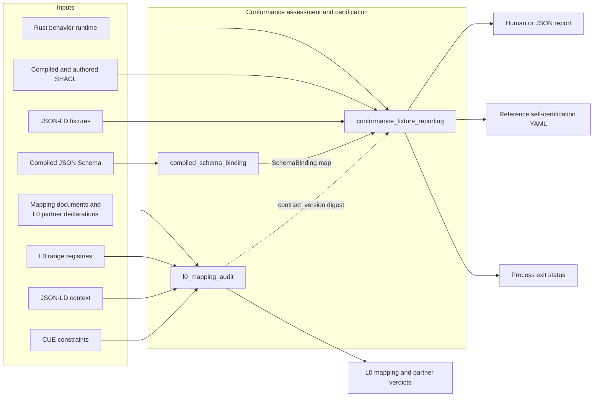
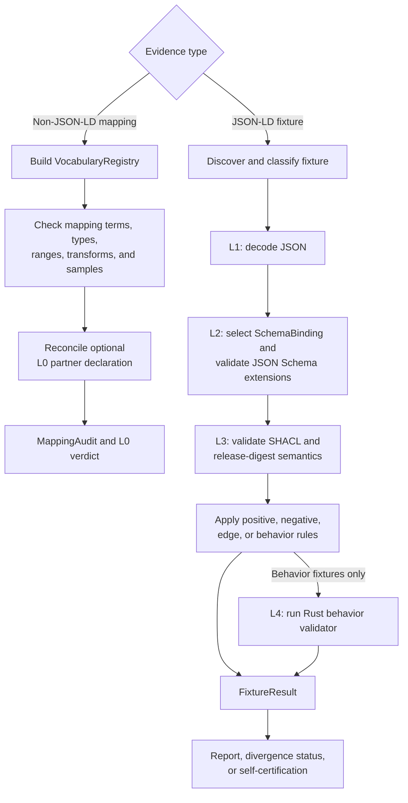

# Conformance assessment and certification

## Purpose

The `conformance_assessment_and_certification` module provides Rulespec’s evidence and reporting path:

- **L0:** Audits declared mappings from non-JSON-LD carriers, such as SQL tables, CSV, and Parquet, against the current vocabulary.
- **L1–L4:** Assesses JSON-LD fixtures through JSON decoding, JSON Schema validation, Shapes Constraint Language (SHACL) validation, semantic integrity checks, and Rust behavior tests.
- **Certification output:** Produces mapping verdicts, human and JSON reports, process exit statuses, and reference self-certification YAML.

The module consumes authoritative constraints and compiled artifacts. It does not compile CUE, inspect production carrier data, validate release artifacts, or issue central certification.

## Architecture

The two assessment paths remain separate. L0 checks declarations about non-JSON-LD mappings; it is not a prerequisite or reduced form of L1. The L1–L4 reporter uses only the L0 vocabulary registry’s digest when generating reference self-certification.

The documented verification entry points are `make test-audits` for L0 and related coverage checks, and `make test-conformance` for the L1–L4 fixture report.

## Core component documentation

- [Compiled schema binding](compiled_schema_binding.md) — discovers compiled schemas, resolves profile precedence, and provides immutable `SchemaBinding` records for L2 dispatch.
- [Conformance fixture reporting](conformance_fixture_reporting.md) — runs the L1–L4 fixture flow, records `FixtureResult` verdicts, detects divergences, and renders reports or reference self-certification.
- [L0 mapping audit](l0_mapping_audit.md) — builds `VocabularyRegistry`, audits mapping declarations and executable samples, and reconciles L0 partner claims into `MappingAudit` results.