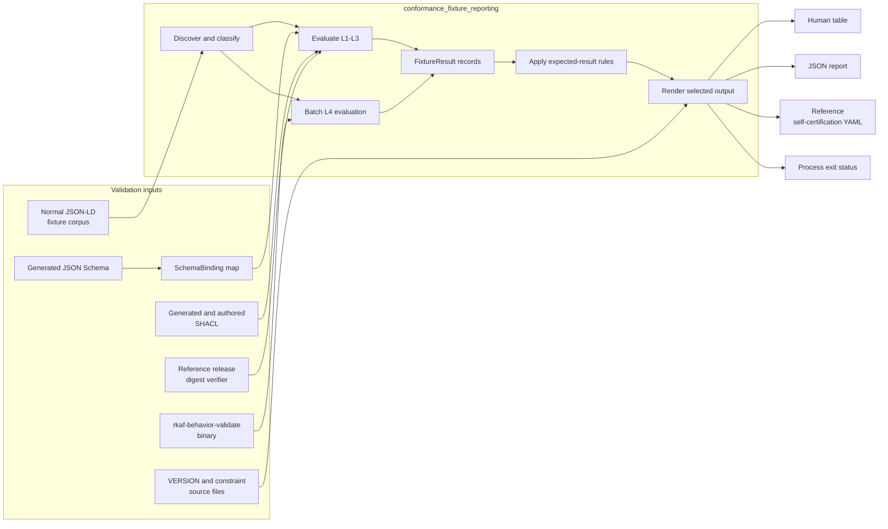
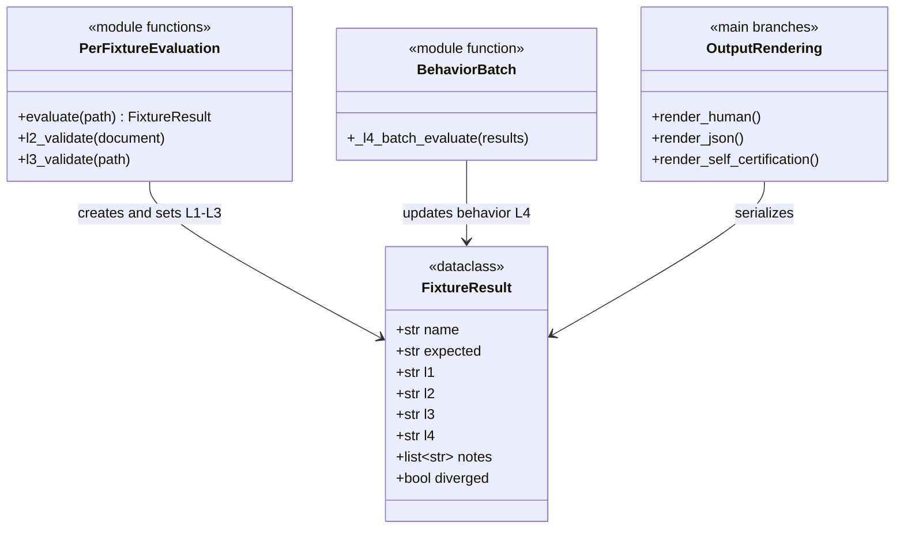
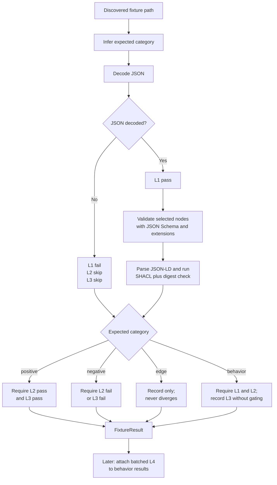
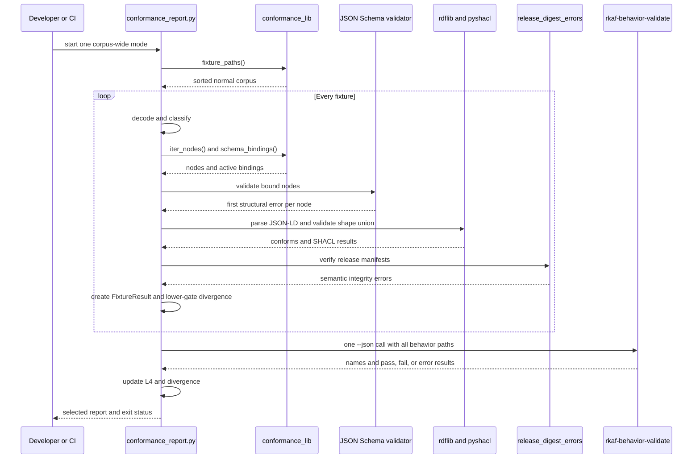
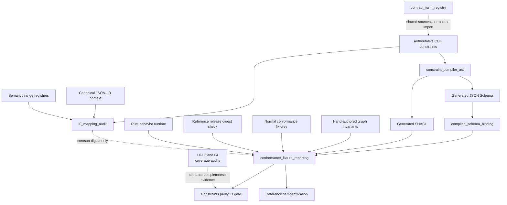

# Conformance fixture reporting

The `conformance_fixture_reporting` module is the repository-level verdict runner for Rulespec Levels 1 through 4 (L1-L4). [`tools/conformance_report.py`](../tools/conformance_report.py) discovers the normal JSON for Linked Data (JSON-LD) fixture corpus, records each result in a `FixtureResult`, compares the observed gates with the fixture's expected category, and emits a human table, JSON report, or reference self-certification.

The reporter combines existing validation parts; it does not define Rulespec meaning. Generated JSON Schema and Shapes Constraint Language (SHACL) files supply structural and graph rules, the shared binding layer selects L2 schemas, the release-digest verifier adds one semantic integrity check to L3, and the Rust runtime supplies L4 behavior verdicts.

## At a glance

| Question | Answer |
| --- | --- |
| What goes in? | Sorted `fixtures/**/*.jsonld` files outside the cross-gate corpora; generated JSON Schema; generated and hand-authored SHACL; the canonical JSON-LD context referenced by fixtures; the Rulespec `VERSION`; constraint sources used to compute the contract digest; and the built `rkaf-behavior-validate` binary for behavior fixtures. |
| What happens? | The reporter classifies each fixture, runs JSON decoding (L1), bound JSON Schema plus Rulespec extension checks (L2), SHACL plus reference-release digest verification (L3), and one batched Rust runtime call for behavior fixtures (L4). It then marks any mismatch between expected and observed results as a divergence. |
| What comes out? | A human-readable table, a machine-readable JSON document, or a reference self-certification YAML document. Process exit status reports whether any gated fixture diverged. |
| How is it checked? | `make test-conformance` builds the runtime and runs the full fixture corpus in the default table mode. Shape, coverage, parity, runtime-coverage, Rust, and continuous-integration gates test the parts that feed the report. |

## Responsibilities and boundary

The module has six responsibilities:

1. Discover the normal conformance fixture set in deterministic path order.
2. Infer each fixture's expected category from its relative path and filename.
3. Run the L1, L2, and L3 checks and retain their compact statuses and notes.
4. Run every behavior fixture through `rkaf-behavior-validate` in one subprocess and attach its L4 result.
5. Apply category-specific divergence rules without hiding permitted edge or behavior cases.
6. Render results and, in self-certification mode, identify the tested corpus and constraint sources with SHA-256 digests.

The module does not:

- compile CUE or generate JSON Schema, SHACL, Rust, or TypeScript; see [Constraint compiler AST](constraint_compiler_ast.md);
- decide which generated schema owns an `@type`; see [Compiled schema binding](compiled_schema_binding.md);
- define or validate L0 mappings; it reads only the L0 registry's computed contract digest in self-certification mode; see [L0 mapping audit](l0_mapping_audit.md) and [`l0_mapping_audit.py`](../tools/l0_mapping_audit.py);
- prove that every class, required field, or behavior branch has fixture coverage; the coverage audits own that question;
- run the projector, adversarial, or AI-extraction corpora, which have dedicated parity tools;
- build the Rust runtime automatically when the script runs directly;
- verify arbitrary platform artifacts or release records; see [Platform artifact runtime](platform_artifact_runtime.md) and [Release record validation](release_record_validation.md); or
- provide a packaged `rulespec-conformance` console command. The reporter is a source-tree tool; the installed package exposes the separate `rulespec-ci-validate` L3 command.

## Architecture and dependencies



The reporter imports repository shims from `tools/`. [`tools/conformance_lib.py`](../tools/conformance_lib.py) aliases the packaged [`rulespec_conformance.conformance_lib`](../src/rulespec_conformance/conformance_lib.py) module, so source-tree tools and package code use one implementation of fixture discovery, node traversal, schema binding, and SHACL path selection. [`tools/reference_release_digest.py`](../tools/reference_release_digest.py) uses the same shim pattern for the L3 digest check.

The direct Python dependencies are `jsonschema`, `rdflib`, `pyshacl`, `rdfcanon`, and the dependencies loaded by `l0_mapping_audit.py`, including PyYAML. The repository's [`requirements.txt`](../requirements.txt) and Makefile provide the supported Python 3.12 environment. Several imports occur before argument parsing, so even `--help` requires the eager dependency subset, including RDFLib, `rdfcanon`, and PyYAML.

## Core component: `FixtureResult`



Only `FixtureResult` is a Python class in this diagram; the other boxes group module functions and branches. The dataclass is mutable because `evaluate()` creates the lower-gate result and `main()` later adds L4 status and may change `diverged`.

### Fields and states

| Field | Meaning | Values produced by the current implementation |
| --- | --- | --- |
| `name` | Fixture path relative to `fixtures/`, in POSIX form. | For example, `behavior/example.jsonld`. |
| `expected` | Category inferred by `classify_fixture()`. | `positive`, `negative`, `edge`, or `behavior`. The source comment beside the field omits `behavior`, but runtime code uses it. |
| `l1` | JSON decoding result. | Initially `?`, then `pass` or `fail`. |
| `l2` | Bound JSON Schema and extension-keyword result. | Initially `?`, then `pass`, `fail`, or `skip` after an L1 parse failure. |
| `l3` | SHACL and semantic release-digest result. | Initially `?`, then `pass`, `fail`, or `skip` after an L1 parse failure. |
| `l4` | Rust behavior-runtime result. | `not-tested` for ordinary fixtures; `pass`, `fail`, `error`, or `skip` for behavior fixtures. |
| `notes` | Short diagnostic messages retained for output. | JSON parse message, up to three L2 messages, an allowed behavior-fixture L3 message, or an L4 skip message. |
| `diverged` | Whether the observed result violates the category's gate. | `False` or `True`; L4 processing can change a behavior result from false to true. |

`FixtureResult` is an internal reporting record, not a versioned package API. External automation should consume `--json`, whose field names provide a clearer process boundary than importing a repository tool.

### Function map

| Function | Role | Important behavior |
| --- | --- | --- |
| `corpus_digest(paths)` | Identify the exact discovered fixture set. | Hashes each sorted repository-relative path and file body with explicit eight-byte length prefixes, then returns `sha256:<hex>`. |
| `load_jsonld(path)` | Run L1. | Despite its name, it performs JSON decoding only. JSON-LD expansion occurs at L3. |
| `_load_schema(path)` | Read one schema document. | Caches parsed JSON by `Path` for the life of the process; returns `None` when the file is absent. |
| `l2_validate(doc)` | Run L2 across selected nodes. | Returns `(passed, error_messages)` after standard JSON Schema validation and Rulespec cross-field checks. |
| `_load_shacl_graph()` | Assemble the L3 shape graph. | Parses all selected Turtle files once and caches their union for the life of the process. |
| `l3_validate(path)` | Run L3. | Returns `(conforms, violation_count)` after JSON-LD parsing, SHACL, and release-digest verification. `evaluate()` currently uses only the Boolean. |
| `classify_fixture(name)` | Infer the expected category. | Applies ordered path/name substring rules described below. |
| `walk_fixtures()` | Select the corpus. | Delegates to the shared sorted `fixture_paths()` helper. |
| `evaluate(path)` | Build one lower-gate result. | Runs L1-L3 and applies the pre-L4 divergence rule. |
| `_l4_batch_evaluate(results)` | Run behavior cases once. | Returns a map from fixture stem to `pass`, `fail`, or `error`; an empty map means no runtime binary was found. |
| `main()` | Coordinate the run and render output. | Validates arguments, evaluates the corpus, attaches L4 results, emits one output mode, and returns `0` or `1`. `argparse` uses `2` for invalid command syntax. |

## Fixture discovery and classification

The shared `fixture_paths()` helper recursively finds `.jsonld` files below `fixtures/`, sorts them, and excludes any path containing one of these directory components:

- `projectors`, consumed by `tools/projector_parity.py`;
- `adversarial`, consumed by `tools/constraints_parity.py`; and
- `ai-extraction`, also consumed by `tools/constraints_parity.py`.

Classification then applies these rules in order:

| Order | Test against the lower-cased relative name | Category |
| ---: | --- | --- |
| 1 | Starts with `behavior/` | `behavior` |
| 2 | Contains `-negative` | `negative` |
| 3 | Contains `-edge` | `edge` |
| 4 | Anything else | `positive` |

The path rule has several practical effects:

- `behavior/` wins even when the filename also contains `-negative` or `-edge`.
- A `-positive` suffix is descriptive, not required; every unmatched filename becomes positive.
- Placement under `fixtures/edges/` does not make a fixture an edge. Its filename must contain `-edge` or the reporter gates it as positive.
- The tests are substring checks rather than suffix checks, despite the function's docstring describing filename endings.

The reporter and shared conformance library currently contain separate copies of `classify_fixture()`. Coverage tools use the shared copy; the reporter uses its local copy. Any policy change must update both or the coverage audit and verdict runner can disagree about the same file.

## Per-fixture data flow



### Expected-result rules

| Category | Lower-gate rule | L4 rule | Consequence |
| --- | --- | --- | --- |
| `positive` | L2 and L3 must both pass. | Not tested. | A JSON parse failure causes L2/L3 skips and therefore diverges. |
| `negative` | L2 or L3 must fail. | Not tested. | Negative fixtures must still contain parseable JSON. An L1 failure produces skips, not the expected validation failure, and therefore diverges. |
| `edge` | No pass/fail requirement. | Not tested. | Every outcome remains non-divergent; the row exists for visibility. |
| `behavior` | L1 and L2 must pass. L3 failure adds a note but is permitted. | L4 must pass. | A missing runtime, runtime error, failed behavior assertion, L1 failure, or L2 failure diverges. |

The reporter treats a negative as successful when either shape gate catches it. It does not require both L2 and L3 to reject the same document. Dedicated parity and negative-fixture tools provide more detailed evidence about which target enforced a rule.

## Gate implementation

### L1: JSON decoding

`load_jsonld()` calls the shared `load_json()` helper. It checks only that Python can decode the file as JSON text. It does not expand the JSON-LD context, resolve terms, verify JSON-LD 1.1 round trips, or prove that the top-level value is a mapping.

This is narrower than the normative L1 requirements in [`spec/rkaf-conformance.md`](../spec/rkaf-conformance.md). The L3 `rdflib` parse supplies the reporter's first JSON-LD-aware operation. A maintainer should therefore describe this column as the reporter's L1 approximation, not as independent proof of every normative L1 requirement.

### L2: bound JSON Schema plus extensions

`l2_validate()` obtains the active `SchemaBinding` map and walks these locations through `iter_nodes()`:

1. Every object in a list-valued top-level `@graph`; otherwise, the root document.
2. Every object in `rkaf:input.@graph`, when `rkaf:input` is a mapping with a list-valued graph.
3. A typed `rkaf:input` mapping when it has no list-valued graph.

For each node with a scalar `@type` admitted by `L2_TYPE_PREFIXES`, the gate looks up its binding. An admitted-prefix type with no binding passes through without an L2 error. When a binding exists, the reporter:

1. loads the complete schema document;
2. builds a Draft 2020-12 wrapper whose `$ref` targets `#/$defs/<class_name>`;
3. copies the document's complete `$defs` object into the wrapper;
4. calls `jsonschema.Draft202012Validator.validate()`; and
5. separately applies `x-rkaf-order` and `x-rkaf-not-equal` from the selected class.

General JSON Schema validators ignore the two `x-rkaf-*` extension keywords, so the explicit final step keeps Python verdicts aligned with the Rulespec validator. The standard validator reports its first validation error for each selected node; extension checks can add more. `evaluate()` retains at most three L2 messages in `notes`.

The node walk is deliberately shallow. It does not recursively select arbitrary inline objects, so L2 can miss an inline typed selector outside the listed locations. L3 sees the expanded Resource Description Framework (RDF) graph without JSON nesting. [Compiled schema binding](compiled_schema_binding.md) documents schema discovery, profile precedence, supported prefixes, and remaining Python/Rust registry differences.

### L3: SHACL and semantic release integrity

`l3_validate()` parses the fixture as JSON-LD into an `rdflib.Graph`. It loads one combined SHACL graph from:

- hand-authored `.ttl` files under `shapes/`; and
- generated core, analysis, and profile `.ttl` files selected by `shacl_shape_paths()`.

It calls `pyshacl.validate()` with Resource Description Framework Schema (RDFS) inference, advanced features enabled, and SHACL meta-validation disabled. It then counts `sh:ValidationResult` nodes and calls `release_digest_errors()` for every `rkaf:ReferenceResourceRelease` in the data graph. A fixture passes only when SHACL conforms and no semantic release-digest error exists.

The returned violation count includes both SHACL results and digest errors, but `evaluate()` discards the count. The JSON and human reports therefore expose only `L3: pass|fail`, not individual SHACL findings. Use [`tools/ci_validate.py`](../tools/ci_validate.py), [`tools/validate_negatives.py`](../tools/validate_negatives.py), or [`tools/reference_release_digest.py`](../tools/reference_release_digest.py) for detailed diagnostics.

### L4: batched Rust behavior validation

The reporter looks for the runtime in this order:

1. `crates/target/debug/rkaf-behavior-validate`;
2. `crates/target/release/rkaf-behavior-validate`.

It passes every behavior fixture path to the first binary found in one `--json` invocation. The Rust command evaluates each `rkaf:BehaviorTestCase`, compares computed output with `rkaf:expectedOutput`, and can also recognize an expected runtime error declared by a fixture.



The batch adapter handles runtime outcomes as follows:

| Runtime condition | Reporter result |
| --- | --- |
| Process returns `0` or `1` and emits valid JSON entries. | Maps each entry's `name` to its `result`; `pass` stays green and `fail` diverges. |
| Process returns any other status, including the runtime's setup-error status `2`. | Marks every submitted behavior fixture `error` and divergent. |
| Process output is not valid JSON. | Marks every submitted behavior fixture `error` and divergent. |
| Process output is valid JSON but has no list-valued `fixtures`, or an entry lacks `name` or `result`. | The adapter does not normalize the malformed response; it can terminate with `AttributeError`, `TypeError`, or `KeyError`. |
| No debug or release binary exists. | Returns no map; `main()` marks each behavior fixture `skip`, adds a build note, and marks it divergent. |
| An entry is missing or has any status other than `pass`, `fail`, or `error`. | Treats that fixture as `skip` and divergent through the same fallback used for a missing binary. |

Matching uses `Path(name).stem`, not the full relative path. Behavior fixture stems must therefore remain unique. The adapter retains neither the runtime's diagnostic text nor its standard error; run the Rust command directly when an L4 row needs investigation.

Because the debug path wins, a stale debug binary can also shadow a newer release binary during an ad hoc local run. The Makefile and continuous-integration flow rebuild the workspace before reporting.

## Output modes and certification data

The command supports three corpus-wide modes:

| Invocation | Output | Notes |
| --- | --- | --- |
| `python tools/conformance_report.py` | Fixed-width table plus divergence details. | Marks divergent rows with `*` and prints at most two notes for each divergent result. |
| `python tools/conformance_report.py --json` | One JSON document. | Includes Rulespec version, UTC timestamp, every complete notes list, and category counts. |
| `python tools/conformance_report.py --self-certify` | Reference self-certification YAML. | Uses hard-coded reference-implementation identity and narrative with live version, time, counts, and digests. It is not a generic partner form renderer. |

If both `--json` and `--self-certify` are present, the JSON branch wins. `--source-revision` is accepted and syntax-checked in every mode, but only self-certification output uses it.

Machine-readable content goes to standard output. RDFLib can write datatype-conversion diagnostics for intentionally malformed negative fixtures to standard error even when the report succeeds, so automation should capture the streams separately.

### JSON report shape

```json
{
  "rulespec_version": "<VERSION contents>",
  "ran_at": "<UTC timestamp>",
  "fixtures": [
    {
      "name": "<relative path>",
      "expected": "positive|negative|edge|behavior",
      "L1": "<status>",
      "L2": "<status>",
      "L3": "<status>",
      "L4": "<status>",
      "notes": [],
      "diverged": false
    }
  ],
  "summary": {
    "total": 0,
    "diverged": 0,
    "positive": 0,
    "negative": 0,
    "edge": 0,
    "behavior": 0
  }
}
```

Consumers should treat status strings and keys as the current process interface, not as a formally versioned schema. No checked JSON Schema for this output exists in the repository.

### Self-certification inputs and aggregation

Self-certification adds these derived values:

| Field or value | Source and calculation |
| --- | --- |
| `rulespec_version` | Exact trimmed contents of `VERSION`. |
| `test_corpus_run_at` | Current UTC time, rounded to whole seconds. |
| `source_revision` | Caller-supplied, exactly 40 lowercase hexadecimal characters, or `null` when omitted. The reporter does not run Git, confirm that the revision exists, or check whether the worktree matches it. |
| `test_corpus_version` | `corpus_digest()` over every included fixture's relative path and bytes. Paths and bodies receive explicit length prefixes, so concatenation cannot create an ambiguous digest input. |
| `constraint_contract_digest` | `load_vocabulary_registry().contract_version`, which hashes the current CUE shape sources, canonical JSON-LD context, and semantic range registries. |
| Schema, shape, and required-slot counts | Live binding and SHACL discovery. Direct required-slot counts exclude `@type`; they do not include conditional or branch-only requirements. |

The generated level summary uses these exact rules:

| Level | Self-certification `pass` rule |
| --- | --- |
| L1 | Every discovered fixture has `l1 == "pass"`, including edge, negative, and behavior fixtures. |
| L2 | Every positive has L2 pass, and every negative fails L2 or L3. Behavior and edge results do not enter this level's calculation. |
| L3 | Every positive has L3 pass, and every negative fails L2 or L3. Behavior and edge results do not enter this level's calculation. |
| L4 | At least one behavior fixture exists, and every behavior fixture has L4 pass. |

The L2 and L3 negative formulas deliberately accept rejection at either shape gate. They can therefore both print `pass` even when a particular negative fails only one of the two gates. The command's final exit status still comes from the per-fixture `diverged` values. An empty behavior corpus has no divergent behavior row, so it can produce `L4: fail` in YAML while the process still returns `0`.

The generated YAML always identifies the Rulespec maintainers and reference implementation, declares L1-L4, sets L0 to `not-claimed`, and embeds a maintained narrative about known divergences and coverage. That narrative names `rkaf-validate`, `ci_validate.py`, and other reference gates, but this command does not invoke them for L1-L3; it runs the Python checks documented above. Review the narrative whenever the implementation, behavior families, or documented limitations change because it is source text, not a summary inferred from result details.

## System integration



The module sits inside the broader conformance assessment capability:

- [Conformance assessment and certification](conformance_assessment_and_certification.md) provides the parent view of L0 mapping evidence, L1-L4 fixture verdicts, and certification output.
- [Compiled schema binding](compiled_schema_binding.md) owns `SchemaBinding`, input-family discovery, profile precedence, and `@type` dispatch. The reporter consumes that map rather than reconstructing it.
- [Constraint compiler AST](constraint_compiler_ast.md) owns the CUE-to-target path. The reporter consumes generated files and never imports compiler AST components.
- [Semantic contract compilation and binding](semantic_contract_compilation_and_binding.md) explains how CUE compilation and Python term exports feed downstream consumers.
- [Contract term registry](contract_term_registry.md) helps authors spell registered `rkaf:` names. `FixtureResult` and the validation gates do not import `Term` or `contract.terms`.
- [L0 mapping audit](l0_mapping_audit.md) owns `VocabularyRegistry` and `MappingAudit`. The reporter calls `load_vocabulary_registry()` only to obtain `contract_version` for the reference YAML.
- [Platform artifact runtime](platform_artifact_runtime.md), [Release record validation](release_record_validation.md), and [Extrapolation release v2 verification](extrapolation_release_v2_verification.md) apply separate artifact and release rules. Their live implementations are [`rulespec_artifacts/_artifact.py`](../packages/rulespec-artifacts/src/rulespec_artifacts/_artifact.py), [`rulespec_release.py`](../tools/rulespec_release.py), and [`extrapolation_release_v2.py`](../tools/extrapolation_release_v2.py). Passing this fixture report does not replace those checks.

These companion-page links follow the supplied [`module_tree.json`](module_tree.json) and may resolve only after their independent documentation tasks run. Live implementation links in this section ground component behavior where an implementation file exists.

## Validation and failure model

### What each gate proves

| Gate | Evidence it provides |
| --- | --- |
| `make test-conformance` | Builds the Rust workspace and release runtime CLI, then runs the complete L1-L4 fixture report against the existing generated tree. This is the canonical direct check for this module. |
| `make test-shapes` | Runs positive SHACL validation and dedicated negative-fixture rejection after reference-corpus checks. It provides more diagnostic detail than the aggregate report. |
| `make test-audits` | Runs vocabulary, compiler, semantic, L0-L3 coverage, L4 coverage, constraint-parity, projector-parity, version, and generated-output checks. It proves breadth and cross-target agreement that `FixtureResult` does not record. |
| `cargo test --manifest-path crates/Cargo.toml --workspace` | Tests the Rust validators, projectors, and behavior runtime. |
| `.github/workflows/constraints-parity.yml` | Builds the full Rust workspace, runs Rust tests and projector parity, then executes the reporter as a process. |
| `make test` | Runs Rust, shape, audit, conformance, and installed-package gates. It is the broad repository check. |

The current checkout has no focused Python test module that imports `conformance_report.py` or asserts `FixtureResult`, classification, output, or L4-adapter behavior directly. Full-corpus process execution and focused tests for shared bindings, schemas, release digests, and the Rust runtime provide indirect coverage. Changes to reporter-only branches should add direct tests instead of relying only on a green corpus.

### Exit and failure behavior

| Condition | Observable behavior |
| --- | --- |
| Every gated fixture matches its category rule. | Returns `0`. Edge outcomes never prevent this. |
| One or more gated fixtures diverge. | Returns `1`; all output modes still emit their report. |
| `--source-revision` has the wrong syntax or another argument is invalid. | `argparse` exits `2` and prints usage. |
| `jsonschema` cannot be imported inside L2. | Each JSON-decodable fixture gets an L2 failure message; gated fixtures diverge and the command normally returns `1`. |
| `pyshacl` cannot be imported inside L3. | L3 returns failure with violation count `-1`; gated fixtures normally diverge and the command returns `1`. |
| `rdflib`, `rdfcanon`, PyYAML, or another eagerly imported dependency is absent. | Module import fails before argument parsing; no report or normalized exit status is produced. |
| A selected schema is missing. | L2 records `schema missing for <type>` and fails that fixture. |
| A fixture fails JSON decoding. | L1 fails and L2/L3 skip. This diverges for positive, negative, and behavior fixtures but remains informational for an edge. |
| The L4 binary is absent. | Behavior rows get L4 `skip` plus a build note and diverge; the process returns `1`. |
| A schema, shape, version, registry, or other setup file raises an uncaught read or parse error. | The command can terminate with a traceback rather than its documented setup status. |

The module docstring describes exit code `2` for missing files, an unsupported `pyshacl` version, and parse setup errors. The current `main()` does not normalize those cases to `2`; only `argparse` reliably does so. The reporter also does not call the explicit `pyshacl` version check used by `ci_validate.py`. Treat this table as the executable behavior until code and command documentation converge.

## Known limitations and maintenance hazards

- **L1 is narrower than its label.** It proves JSON decoding, not complete JSON-LD 1.1 processing or lossless expansion and compaction.
- **L1 does not require a JSON object.** A scalar or list can decode successfully and then cause the mapping-oriented L2 path to raise instead of producing a normalized fixture result.
- **L2 selection is shallow.** It checks the root or top-level graph members plus eligible behavior-input nodes, not every nested typed object.
- **Unknown admitted-prefix types can pass L2.** `is_dispatched_type()` can accept a type that has no active binding; the reporter then skips it without an error.
- **Scalar `@type` is assumed.** A list-valued or expanded type does not enter ordinary L2 dispatch.
- **Diagnostics are intentionally compact.** JSON Schema returns one error per node through `.validate()`, `evaluate()` retains three L2 notes, human output prints two notes per divergent fixture, and L3 details are discarded.
- **Edge fixtures cannot fail the run.** This is useful for observation but unsuitable for a regression that must gate a change.
- **Classification is duplicated and name-driven.** The local and shared functions can drift, directory placement does not guarantee category, and substring matches can classify an unexpectedly named file.
- **The command is corpus-wide.** The normative specification still shows `--level` and `--fixture` examples, but current argument parsing implements only `--json`, `--self-certify`, and `--source-revision`.
- **Setup errors do not share one exit path.** Missing lazy dependencies become ordinary failures, eager import errors abort, and many file errors escape as tracebacks despite the docstring's exit-code description.
- **L4 matching assumes unique stems.** Two behavior paths with the same filename stem collide in the returned map. Runtime diagnostic strings and standard error are not copied into `FixtureResult`.
- **The L4 fallback message is broader than the cause.** A missing or unrecognized runtime result is reported with the same “binary missing” note as an absent executable.
- **Debug L4 output has precedence.** A stale debug binary shadows the release binary because lookup stops at the first existing path.
- **Caches assume a one-shot command.** Schema documents and the union SHACL graph remain cached in an imported process. A long-running caller that edits generated files must clear the module caches or restart.
- **Schema discovery repeats.** `_load_schema()` caches file contents, but `schema_bindings()` still rereads and rebuilds the binding map for each L2 fixture and again during self-certification counts.
- **The source revision is asserted, not observed.** A syntactically valid hash can name the wrong commit or a dirty worktree. Release evidence needs an independently verified clean revision.
- **Reference YAML includes maintained prose.** Live counts and digests do not guarantee that the hard-coded implementation description or known-divergence text remains current.
- **Report JSON has no checked schema.** Consumers depend on current implementation fields without a versioned output definition.

## Contribution guide

### Start from the owning layer

| Change | Authoritative starting point | Reporter work |
| --- | --- | --- |
| Add or correct a fixture. | The applicable Rulespec specification section and `fixtures/README.md`. | Choose a name that produces the intended category, keep the canonical context reference, and run the relevant dedicated gate plus the full report. |
| Change a structural or graph rule. | `constraints/**/*.cue` for compilable rules; `shapes/` only for graph rules that CUE cannot express. | Regenerate targets, prove the rule fires on a focused defect, and confirm expected positive and negative verdicts. Never hand-edit `compiled/`. |
| Change schema dispatch or node selection. | `rulespec_conformance.conformance_lib` and the independent Rust registry when applicable. | Update binding and traversal tests, then confirm L2 and coverage tools still select the same classes and fixtures. |
| Change fixture categories or excluded corpora. | Shared fixture policy in `conformance_lib.py`. | Update both classification implementations, all discovery consumers, focused tests, `fixtures/README.md`, and this page. |
| Change L4 behavior. | `spec/rkaf-behavior.md`, `crates/rkaf-runtime`, and `crates/rkaf-runtime-cli`. | Add behavior fixtures, direct runtime tests, L4 coverage-audit evidence, and adapter tests when response handling changes. |
| Change output fields or status values. | `conformance_report.py` and the self-certification template/specification. | Add output-focused tests and update every downstream parser before changing the emitted interface. |
| Change certification identity or digest inputs. | The certification specification and the source module that owns the digest. | Keep the template, generated reference declaration, release process, and verification notes aligned. |

The CUE files under `constraints/` are the source of truth for generated structural rules. Follow [Constraint compiler AST](constraint_compiler_ast.md#contribution-guide) for `cue vet`, generation, parity, and drift checks. Edit hand-authored SHACL only for graph invariants that the compiler does not own.

### Tests to add

Reporter changes should add focused coverage for the changed decision. Useful cases include:

- classification precedence and names placed in unexpected directories;
- cross-gate directory exclusion and stable sorting;
- malformed JSON across positive, negative, edge, and behavior categories;
- an admitted-prefix type with and without a binding;
- root, top-level `@graph`, behavior-input graph, and unsupported inline-node traversal;
- JSON Schema failures plus `x-rkaf-order` and `x-rkaf-not-equal` failures;
- SHACL failure, release-digest failure, and missing dependency behavior;
- L4 subprocess statuses `0`, `1`, and `2`, malformed JSON output, missing entries, duplicate stems, and a missing binary;
- human, JSON, and YAML output field stability;
- `--json` and `--self-certify` precedence; and
- source-revision syntax, corpus digest stability, and self-certification aggregation.

Use temporary fixture, schema, and binary paths in unit tests. Patch the implementation module's globals, clear `_SCHEMA_CACHE` and `_SHACL_GRAPH_CACHE` between cases, and avoid deriving expected categories or bindings from the same helper under test.

### Local verification

Run commands from the repository root. The Makefile supplies Python 3.12 and the repository requirements, and its conformance target builds the L4 runtime first. Generated files under `compiled/` are ignored by Git, and `test-conformance` does not generate them; run `make cue-vet` and `make compile` first in a fresh checkout or after a CUE/compiler change.

```bash
make test-conformance
```

For a broader constraint or fixture change, run the dedicated evidence gates:

```bash
make test-shapes
make test-audits
make test-conformance
```

Run `make test` before release-oriented work. It adds the Rust workspace and installed-package checks.

For a machine-readable local report without relying on a globally configured Python, build the runtime and use the same environment as the Makefile:

```bash
cargo build --manifest-path crates/Cargo.toml --workspace
uv run --no-project --python 3.12 --with-requirements requirements.txt \
  python tools/conformance_report.py --json > /tmp/rulespec-conformance.json
```

Generate local self-certification evidence without inventing a source revision:

```bash
uv run --no-project --python 3.12 --with-requirements requirements.txt \
  python tools/conformance_report.py --self-certify \
  > /tmp/rulespec-self-certification.yaml
```

Only pass `--source-revision <40-character-lowercase-commit>` after verifying that the completed run used that exact clean checkout. Writing a file under `conformance/partners/` is a release-evidence change, not a routine local test side effect.

### Review checklist

- The fixture set excludes only the designated cross-gate corpora and remains deterministically sorted.
- Each new filename produces the intended `positive`, `negative`, `edge`, or `behavior` category.
- Positive fixtures pass L2 and L3; negative fixtures contain valid JSON and fail at least one shape gate.
- Edge-only observations are not being used as required regressions.
- L2 checks every intended node and applies both Rulespec extension keywords after Draft 2020-12 validation.
- L3 uses the complete selected SHACL union and the release-digest verifier.
- The runtime binary exists, every behavior fixture receives exactly one result, and behavior stems remain unique.
- JSON consumers can handle any output change, and a checked schema or version is added if the interface becomes public.
- Self-certification digests cover the intended fixture and constraint inputs, and `source_revision` matches the tested clean tree.
- Hard-coded certification identity, coverage prose, and known-divergence notes remain accurate.
- Focused tests cover reporter-only logic; the full corpus, coverage audits, parity checks, and Rust tests also pass.
- Generated JSON Schema, SHACL, and Rust files came from the authoritative CUE and compiler path.

## Key implementation files

- [`tools/conformance_report.py`](../tools/conformance_report.py) — `FixtureResult`, gate coordination, divergence policy, L4 adapter, output modes, and corpus digest.
- [`src/rulespec_conformance/conformance_lib.py`](../src/rulespec_conformance/conformance_lib.py) — fixture discovery, node traversal, schema bindings, custom L2 comparisons, and SHACL path selection.
- [`tools/conformance_lib.py`](../tools/conformance_lib.py) — source-tree alias for the packaged shared library.
- [`src/rulespec_conformance/reference_release_digest.py`](../src/rulespec_conformance/reference_release_digest.py) — canonical `ReferenceResourceRelease` digest verification used by L3.
- [`tools/l0_mapping_audit.py`](../tools/l0_mapping_audit.py) — vocabulary registry and constraint contract digest used by self-certification.
- [`crates/rkaf-runtime-cli/src/main.rs`](../crates/rkaf-runtime-cli/src/main.rs) — `rkaf-behavior-validate` input, result, diagnostic, and exit behavior.
- [`crates/rkaf-runtime/`](../crates/rkaf-runtime/) — reference implementation of L4 behavior rules.
- [`fixtures/README.md`](../fixtures/README.md) — corpus categories and fixture contribution rules.
- [`spec/rkaf-conformance.md`](../spec/rkaf-conformance.md) — normative conformance levels and certification requirements.
- [`conformance/self-certification.template.yaml`](../conformance/self-certification.template.yaml) — partner declaration fields and source-revision guidance.
- [`tools/ci_validate.py`](../tools/ci_validate.py) and [`tools/validate_negatives.py`](../tools/validate_negatives.py) — detailed positive and negative shape gates.
- [`tools/l0_l3_coverage_audit.py`](../tools/l0_l3_coverage_audit.py) and [`tools/l4_coverage_audit.py`](../tools/l4_coverage_audit.py) — fixture breadth and behavior-branch checks.
- [`tools/constraints_parity.py`](../tools/constraints_parity.py) — JSON Schema and SHACL parity over dedicated cross-gate corpora.
- [`Makefile`](../Makefile) — supported local environment and integrated test targets.
- [`.github/workflows/constraints-parity.yml`](../.github/workflows/constraints-parity.yml) — continuous-integration order and reporter invocation.
- [`CONTRIBUTING.md`](../CONTRIBUTING.md) — repository-wide evidence, fixture, and review workflow.
