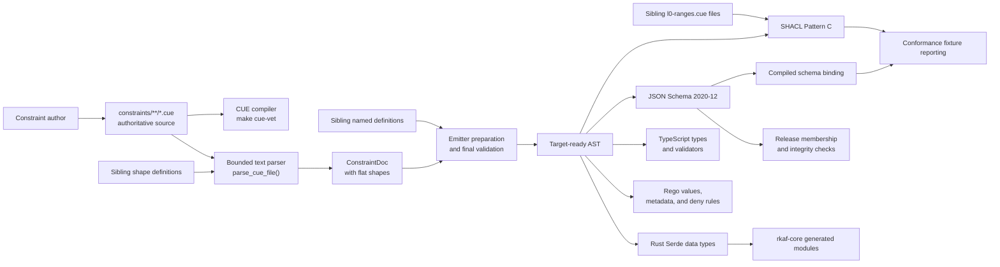
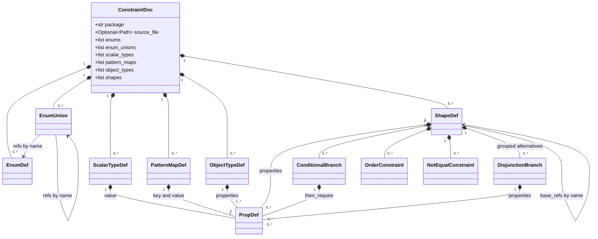
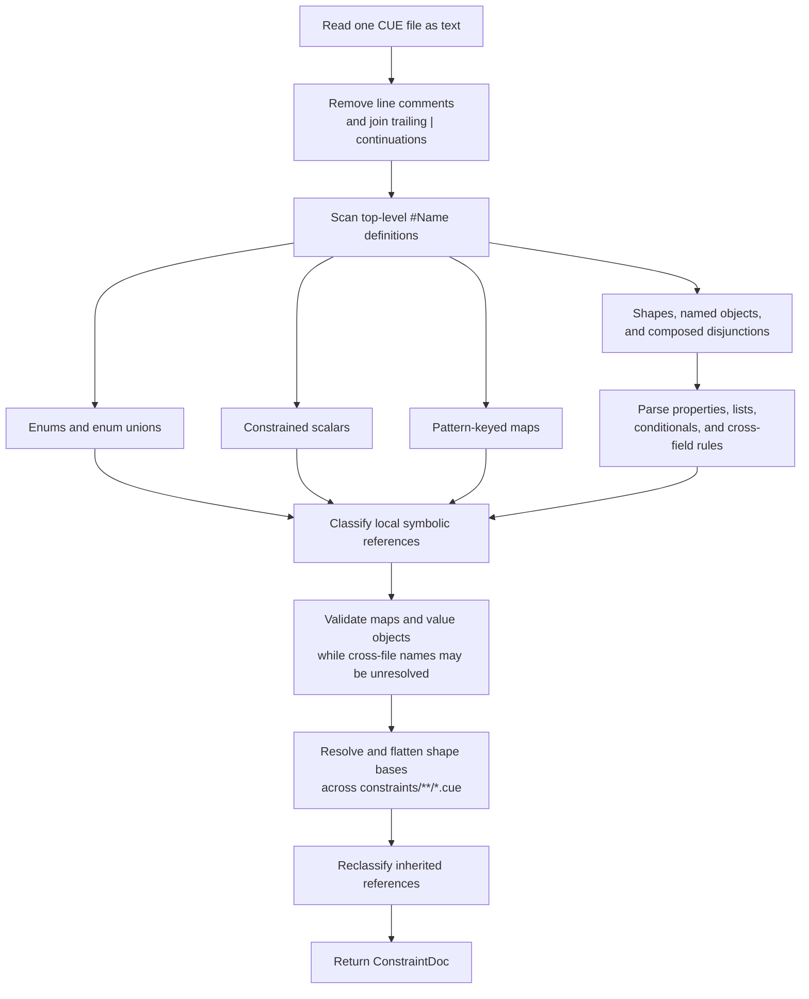
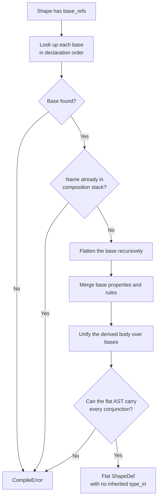
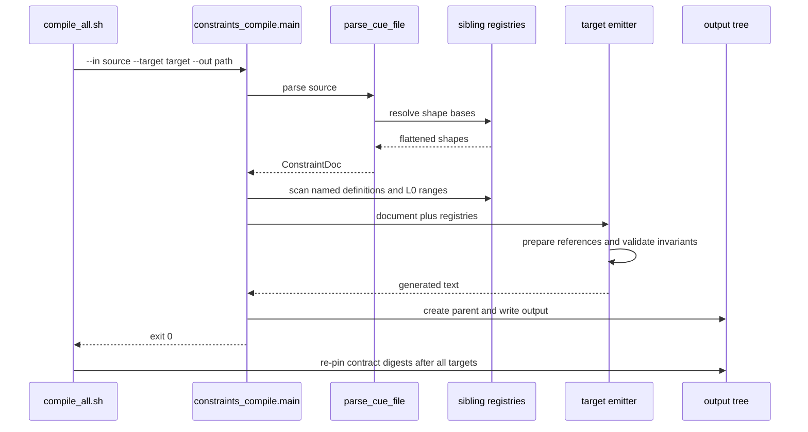
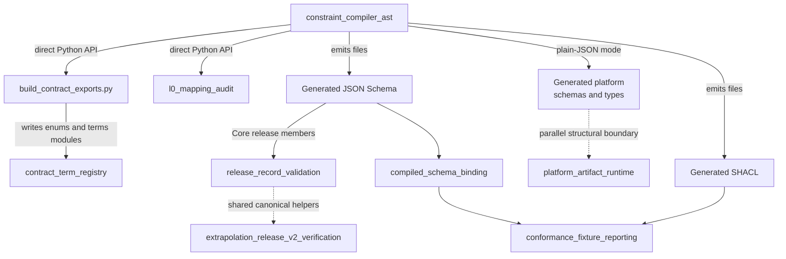

# Constraint compiler AST

The `constraint_compiler_ast` module is the compiler's target-neutral in-memory model. [`tools/constraints_compile.py`](../tools/constraints_compile.py) defines the model, parser, composition logic, and output generators. `parse_cue_file()` recognizes the repository's supported CUE forms, builds a `ConstraintDoc`, and flattens shape composition across files. Before generation, the command-line interface resolves remaining sibling definitions and validates the completed document.

The compiler implements a deterministic subset of CUE; it is not a general CUE parser. Run the CUE compiler first to validate syntax and unification. Generated files are derived artifacts: change the CUE source or compiler, then regenerate.

## At a glance

| Question | Answer |
| --- | --- |
| What goes in? | One `constraints/**/*.cue` source file, plus sibling CUE definitions and `l0-ranges.cue` files discovered under the nearest `constraints/` directory. |
| What happens? | The compilation path recognizes Rulespec's supported CUE patterns, classifies symbolic references, validates target-independent rules, and flattens shape composition into a `ConstraintDoc`. |
| What comes out? | JSON Schema 2020-12, Rust Serde data types, TypeScript types and validators, Shapes Constraint Language (SHACL) Turtle, or Rego value and constraint data. |
| How is it checked? | `cue vet` checks CUE itself; compiler unit tests, regenerated-output checks, semantic-carrier tests, and cross-target parity checks test the generated meaning. |

## Responsibilities and boundary

The module has four responsibilities:

1. Represent the supported CUE meaning in a small, target-neutral abstract syntax tree (AST).
2. Resolve local and cross-file definitions without making output depend on file-system traversal order.
3. Flatten CUE shape composition without weakening inherited constraints.
4. Feed the same normalized document to every target emitter.

It does not validate arbitrary CUE syntax, execute CUE comprehensions, run conformance fixtures, bind schemas to JSON-LD classes, or verify release records. Those responsibilities belong to the CUE toolchain and the downstream modules linked in [System integration](#system-integration).

The implementation uses only the Python standard library. It does not import the term registry, conformance library, artifact runtime, or release validators.

## Architecture



The AST is an internal module within one compiler file, not a separately installed Python package. Library callers import its dataclasses and functions from `tools.constraints_compile`; the canonical build invokes the same file through its command-line interface.

## AST component model



### Document and named definitions

| Component | Role | Important details |
| --- | --- | --- |
| `ConstraintDoc` | Aggregate root passed to emitters. | Keeps `package`, optional resolved `source_file`, and every definition parsed from one CUE file. When present, `source_file` defines the sibling-discovery scope; pass a registry explicitly for complete cross-file output. |
| `EnumDef` | Closed ordered set of literal strings. | `values` remain in source declaration order. |
| `EnumUnion` | Closed set assembled from named enums or other unions. | `refs` may cross files. Resolution detects missing references and cycles. |
| `ScalarTypeDef` | Reusable constrained string. | Holds one synthetic `PropDef`, which lets the normal property emitters carry its allowed and forbidden patterns. |
| `PatternMapDef` | Named object with constrained string keys and values. | Used for JSON-LD language maps. The current validator requires at least one entry and proves that the key pattern accepts valid BCP 47 examples while rejecting malformed keys and `@none`. |
| `ObjectTypeDef` | Closed named object used as a property value. | A top-level CUE object containing `@value` becomes this type rather than an RDF node shape. The supported named form is a typed-literal object with exactly `@value` and `@type`. |

### Shapes and constraints

| Component | Role | Important details |
| --- | --- | --- |
| `ShapeDef` | Resource or plain-JSON object shape. | Owns properties, guarded branches, cross-field rules, disjunction groups, and unresolved `base_refs`. `type_iri` binds an RDF shape to its class. Composition returns a flat shape. |
| `PropDef` | Common representation for a property or nested member. | Carries its kind, reference names, requiredness, list rules, fixed value, patterns, format, numeric bounds, inline values, and JSON-LD value-object branches. Most emitter logic dispatches on `type_ref`. |
| `ConditionalBranch` | Guarded requirements or prohibitions. | Supports equality, inequality, or presence guards; required properties live in `then_require`, and prohibited property names live in `then_forbid`. |
| `OrderConstraint` | Inclusive ordering between two fields. | CUE's rejected condition `lower > upper` becomes the accepted rule `lower <= upper`. |
| `NotEqualConstraint` | Inequality between two present scalar fields. | Missing optional values remain valid; equal present values fail. |
| `DisjunctionBranch` | One alternative in a shape disjunction. | A `ShapeDef.disjunctions` entry is a group of alternatives; each alternative contains its own properties. |

### `PropDef.type_ref`

`PropDef` acts as a discriminated record. Contributors must keep the parser, classifiers, validators, and all emitters aligned when adding a kind.

| Value | Meaning | Related fields |
| --- | --- | --- |
| `string` | String, fixed string, inline literal enum, pattern, or formatted date. | `fixed_value`, `pattern`, `forbidden_pattern`, `string_format`, `inline_enum_values` |
| `int` / `float` | Integer or number with optional inclusive bounds. | `min_inclusive`, `max_inclusive` |
| `bool` | Boolean or fixed boolean. | `fixed_value` |
| `enum` | Reference whose values come from `EnumDef` or `EnumUnion`. | `enum_ref` |
| `enum_union` | Inline union of named enum references. | `enum_union_refs` |
| `named` | Reference to a reusable map, object, or same-document plain-JSON shape. Cross-file shape definitions are not part of the named-definition registry. Constrained scalar references are copied into the referring `PropDef` instead. | `named_ref` |
| `list` | Array or JSON-LD scalar-or-array value. | `list_inner_enum`, `list_inner_named`, `list_of_string`, minimum, maximum, uniqueness, and `list_allow_scalar` |
| `json_object` | Open JSON object from the explicit CUE `{...}` spelling. | No nested member model. |
| `value_object` | Closed inline JSON-LD value object. | `object_properties` and mutually exclusive `object_alternatives` for typed or language-tagged literals. |

`optional=False` means required. During composition, a property stays required when either declaration requires it; the implementation computes `base.optional and derived.optional`.

## Parsing and normalization

The parser recognizes the regular source forms documented in [`constraints/README.md`](../constraints/README.md). Its expressions are formatting-sensitive regular expressions, so a semantically equivalent CUE spelling may still require parser support.



### Supported source patterns

The main recognized families are:

- Closed literal enums, enum aliases, and unions of named enums.
- Reusable constrained strings, pattern-keyed maps, named typed literals, and resource shapes.
- Primitive properties, fixed literals, numeric bounds, allowed and forbidden string patterns, strict dates, and inline closed values.
- Enum, named-object, strict-list, one-or-many, list-bound, and unique-list properties.
- Inline JSON-LD value objects with typed-literal and language-tagged alternatives.
- Embedded bases, conjunction composition, and a disjunction of composed overlays.
- Equality, inequality, and presence conditionals; conditionally required or prohibited fields.
- Cross-field ordering, cross-field inequality, and sibling disjunctions.

The parser first reads a `#Name` reference as an enum reference because CUE uses the same syntax for every definition kind. After it has read the whole document, `_classify_local_named_references()` changes references to reusable scalars, maps, and objects into their correct AST forms. `_classify_global_named_references()` repeats that work against sibling definitions.

## Cross-file resolution

Cross-file behavior depends on the source path. `_constraints_root()` walks upward to the nearest directory named `constraints`; registry scans stay inside that tree.

There are three related registries:

| Registry | Contents | Consumer |
| --- | --- | --- |
| Shape registry | Unresolved `ShapeDef` objects from every sibling `.cue` file. | Shape composition. |
| Named-definition registry | Enums, enum unions, constrained scalars, pattern maps, and named object types. | Reference classification and every emitter. |
| Reference-class registry | Property-to-class entries from every `l0-ranges.cue`, in deterministic kernel-first order. | SHACL `sh:class` generation and the L0 audit. |

Sibling files are scanned in sorted path order. The named-definition registry rejects duplicate enum, enum-union, scalar, map, and object names with `CompileError`. The shape registry differs: its sorted sibling scan keeps the first definition of a repeated shape name, while a shape in the current input file replaces the sibling entry before composition. Avoid duplicate shape names across files. Enum unions resolve recursively and keep reference order.

Tests that construct cross-file examples must place them under a temporary directory named `constraints`; otherwise the compiler correctly has no sibling scope to scan.

## Shape composition

Composition happens before any emitter runs. Each emitter therefore receives one complete shape instead of implementing inheritance independently.



The merge follows these rules:

- Bases contribute first, so inherited property order remains stable in generated SDK types.
- A repeated property unifies field by field. Minimums take the larger value; maximums take the smaller value; uniqueness becomes stricter; scalar-or-list permission can only become stricter.
- A conflicting pattern, reference, fixed value, format, or other conjunction that `PropDef` cannot represent fails instead of selecting one side.
- Conditional branches with the same guard merge their requirements and prohibitions.
- Orders and disjunction groups accumulate. Duplicate `NotEqualConstraint` values are removed.
- `type_iri` is not inherited. Composition reuses fields but does not create another generated shape bound to the base class.
- Missing bases, sibling parse failures, and cycles fail compilation rather than producing a partial shape.

This policy is the composition pass's central invariant: composition may deduplicate or narrow, but it must not loosen the CUE source.

## Compilation interaction

The canonical driver is [`tools/compile_all.sh`](../tools/compile_all.sh), called by `make compile`. It invokes a fresh compiler process for each source-target pair.



`parse_cue_file()` resolves local references and shape bases. `main()` then classifies cross-file definitions and validates named forms before dispatch. Every emitter calls `_prepare_named_references()` again so direct library calls receive the same validation. The named-definition registry serves every target. The reference-class registry affects SHACL only, although `main()` currently scans it for every target.

`ConstraintDoc.source_file` lets emitter preparation discover and classify sibling definitions. A library caller should still pass the named-definition registry explicitly for cross-file output: the emitters use that argument to assemble enum values, inline self-contained definitions, and compute Rust and TypeScript import paths. The CLI always supplies it. Synthetic documents without a source path must also supply any registry they need.

### Programmatic entry points

| Function | Use |
| --- | --- |
| `parse_cue_file(path, resolve_composition=True)` | Parse one file and, by default, flatten shape composition. Pass `False` for registry or export scans that deliberately need raw base references. |
| `target_json_schema`, `target_rust`, `target_typescript`, `target_shacl`, `target_rego` | Render one document as text. These functions do not write files; pass registries for complete cross-file output. |
| `property_to_jsonschema()` | Convert one `PropDef` into its JSON Schema fragment. It is an emitter helper, not a complete document compiler. |
| `range_registry_paths()` | Return every `l0-ranges.cue` path in deterministic order. This is also used by the L0 audit. |
| `main()` | Parse CLI arguments, build registries, select one emitter, and write the requested output or stdout. |

The cross-file scan helpers currently have underscore-prefixed names, so treat them as internal even though repository tools use them. Prefer the CLI outside this repository. In an in-repository library call, mirror the CLI explicitly:

```python
from pathlib import Path

from tools.constraints_compile import (
    _scan_global_enum_registry,
    _scan_reference_class_registry,
    parse_cue_file,
    target_json_schema,
    target_shacl,
)

source = Path("constraints/core/artifact.cue")
document = parse_cue_file(source)
registry = _scan_global_enum_registry(source)
ranges = _scan_reference_class_registry(source)

json_schema = target_json_schema(document, registry=registry)
shacl = target_shacl(
    document,
    reference_classes=ranges,
    source_file=source,
    registry=registry,
)
```

## Target behavior

| Target | Main output | Important behavior and limits |
| --- | --- | --- |
| JSON Schema 2020-12 | A document with named definitions in `$defs`. | Cross-file enums and named types used by ordinary shape properties are inlined. A named type used only in a conditional or disjunction branch is not currently inlined, so that edge case can leave an unresolved `$ref`. Conditionals use `if`/`then`; disjunction groups use `anyOf`. JSON-LD shapes stay open. The plain-JSON platform shape is closed. Ordering and inequality use `x-rkaf-order` and `x-rkaf-not-equal`, which generic JSON Schema validators ignore unless the caller applies them. Date patterns provide a lexical floor because `format` may be annotation-only. |
| Rust | Serde enums, aliases, maps, closed property types, and structs. | JSON-LD structs preserve an optional `@id` and extra properties; plain-JSON structs deny unknown fields. Cross-file types use generated module paths. The output provides structural data types; constraints that Rust types or Serde cannot express require the Rulespec validation path. |
| TypeScript | Literal unions, interfaces, and `validate{Name}` functions. | Type declarations carry much of the structure. Generated validators add selected checks for named types, patterns, dates, conditionals, some list rules, ordering, inequality, and value-object closure. Resource interfaces do not add `ShapeDef.type_iri` as `@type`, and properties that occur only in a shape disjunction are omitted. The validators are not a complete runtime implementation. |
| SHACL | Pattern-C `sh:NodeShape` Turtle for shapes with `type_iri`. | Uses `sh:or` and `sh:not`, never `sh:if` or `sh:then`. JSON-LD value objects become RDF literal rules. Reference ranges become `sh:class`. Platform sources have no RDF target. |
| Rego | Closed value lists, named-type metadata, shape metadata, and current `deny` rules. | Executable `deny` rules currently cover only `NotEqualConstraint`; the enum, named-type, and list output is data or metadata for policy authors. This is not a complete shape validator, and the current parity gate does not load it. |

The command-line target names are exactly `json-schema`, `rust`, `typescript`, `shacl`, and `rego`. CUE is an input, not an output target.

### Output routing

[`tools/compile_all.sh`](../tools/compile_all.sh) owns output paths and target eligibility:

| Source family | Portable outputs | Rust output |
| --- | --- | --- |
| `constraints/core/` | `compiled/{json-schema,typescript,shacl,rego}/core/` | `crates/rkaf-core/src/generated/` |
| `constraints/platform/` | JSON Schema and TypeScript under `compiled/*/platform/`; no SHACL or Rego | `crates/rkaf-core/src/generated/platform/` |
| `constraints/analysis/` | Under `compiled/*/analysis/` | `crates/rkaf-core/src/generated/analysis/` |
| `constraints/adversarial/` and `constraints/ai-extraction/` | Portable target directories | No Rust output |
| `constraints/profiles/<name>/` | Under `compiled/*/profiles/<name>/` | Under `generated/profiles/<snake_case_name>/`, except `profiles/refspec`, which has no `rkaf-core` Rust target |

The driver removes obsolete RefSpec Rust output before a build and re-pins the embedded contract digests after every source has compiled.

## System integration



Use the companion module pages for downstream details:

- [`contract_term_registry`](contract_term_registry.md) describes the `Term` string subtype and generated term exports. The AST does not import `Term`; [`tools/build_contract_exports.py`](../tools/build_contract_exports.py) uses `parse_cue_file(resolve_composition=False)` for enum exports and writes term data separately. Until that module page is available, see the [`Term` implementation](../src/rulespec_conformance/contract/_term.py).
- [`l0_mapping_audit`](l0_mapping_audit.md) is a direct library consumer of `ConstraintDoc`, `parse_cue_file()`, and `range_registry_paths()`. Its implementation is in [`tools/l0_mapping_audit.py`](../tools/l0_mapping_audit.py).
- [`compiled_schema_binding`](compiled_schema_binding.md) explains how a fixed JSON-LD `@type` maps to emitted JSON Schema and how `SchemaBinding` records that mapping. Downstream L2 validation applies `x-rkaf-order` and `x-rkaf-not-equal`. See [`conformance_lib.py`](../src/rulespec_conformance/conformance_lib.py) for the current implementation.
- [`conformance_fixture_reporting`](conformance_fixture_reporting.md) consumes schema bindings and the compiled-plus-authored SHACL suite; it does not inspect AST objects. The report implementation is [`tools/conformance_report.py`](../tools/conformance_report.py).
- [`platform_artifact_runtime`](platform_artifact_runtime.md) covers byte admission, identity, membership, and verification. The compiler's `platform-artifact` mode only defines closed plain-JSON data types and does not replace those checks. See [`rulespec_artifacts/_artifact.py`](../packages/rulespec-artifacts/src/rulespec_artifacts/_artifact.py).
- [`release_record_validation`](release_record_validation.md) validates Core release identity and manifests that pin generated JSON Schema members; it does not call the compiler AST. See [`tools/rulespec_release.py`](../tools/rulespec_release.py).
- [`extrapolation_release_v2_verification`](extrapolation_release_v2_verification.md) is a separate verifier that uses its own release-record schemas and shared canonical helpers, not this AST. See [`tools/extrapolation_release_v2.py`](../tools/extrapolation_release_v2.py).

The companion-page names come from the supplied module tree. Each entry also includes a live implementation link while those pages are pending in this wiki.

Two working Rust projectors are process-level compiler clients rather than AST imports: [`rkaf-projector-json-schema`](../crates/rkaf-projector-json-schema/src/lib.rs) and [`rkaf-projector-openapi`](../crates/rkaf-projector-openapi/src/lib.rs) invoke the CLI with `--target json-schema` during derivation. [`rkaf-projector-json-ld`](../crates/rkaf-projector-json-ld/src/lib.rs) also invokes the compiler, but currently requests the unsupported target `cue`; that derive path must be corrected before it can work. CUE remains an input, not a supported output. The [`rkaf-validate` build](../crates/rkaf-validate/build.rs) embeds emitted JSON Schemas, and the [Python distribution](../pyproject.toml) includes the generated `compiled/` tree as package data.

## Validation and failure model

### What each gate proves

| Gate | Evidence it provides |
| --- | --- |
| `make cue-vet` | The real CUE compiler accepts the authoritative sources. It does not run this output generator. |
| `tools.test_constraints_compile` | Parser, AST, composition, registry, emitter, profile-boundary, and focused failure behavior. |
| `tools.test_semantic_carriers` | Meaning survives regeneration, JSON-LD expansion and compaction, SHACL validation, composition, and profile isolation. |
| `tools/constraints_parity.py` | Checks core fixture verdict parity for JSON Schema and SHACL; adversarial divergence is reported separately. Rust and TypeScript receive presence-by-name checks only. Rego is not loaded. |
| `tools/codegen_drift_audit.py` | The tracked generated Rust tree matches a fresh canonical compilation. This command runs the compiler and writes generated output during its check. |
| `tools/conformance_report.py` | Compiled JSON Schema and compiled-plus-authored SHACL work in the L1-L3 fixture flow. |

For recognized conflicts and unsupported cases, `CompileError` stops generation when the AST cannot carry the source meaning faithfully. Common causes include:

- a missing or cyclic shape base;
- a sibling file that prevents a complete shape-registry scan;
- conflicting composed property facets;
- a missing or cyclic enum-union reference;
- duplicate enum, enum-union, scalar, map, or object names in the cross-file named-definition registry;
- an invalid pattern map or typed-literal object;
- contradictory list bounds; or
- a cross-field inequality that names a missing or incompatible property.

The command-line interface returns:

| Exit code | Meaning |
| --- | --- |
| `0` | The requested target was generated. |
| `1` | A `CompileError` prevented faithful output. |
| `2` | Setup failed, currently including a missing input file. |

The CLI builds the complete output string before writing it, so a failed single-file compilation does not write that target. The multi-file driver stops on the first failing command and can leave outputs completed earlier in that run; rerun the full canonical build after correcting the source.

Deterministic behavior depends on sorted sibling scans, declaration-order lists, named-definition duplicate rejection, deterministic shape lookup, stable source-relative import paths, and generated provenance headers. Do not replace these with unsorted file-system traversal.

## Known limitations and hazards

- The parser recognizes repository conventions, not the complete CUE language. New aliases, equivalent expression layouts, comments, interpolation, comprehensions, or nested structures may require parser changes. Its preprocessing splits each raw line at the first `//`, so `//` inside a quoted CUE string is unsupported. Some unrecognized property expressions fall back to a plain string, and unknown top-level forms can be skipped, so add negative parser tests instead of assuming every unsupported spelling raises `CompileError`.
- Inline nested structs are faithfully represented only when they are JSON-LD value objects containing `@value`. A different inline struct follows a legacy lossy path that can hoist nested fields and can even replace the outer `@type`. Do not add such a source form; use a supported named type or extend the AST and every emitter with regression tests.
- JSON Schema's `x-rkaf-order` and `x-rkaf-not-equal` are Rulespec extensions. Use the Rulespec validator or apply both checks explicitly.
- Rust output represents wire structure but does not encode every pattern, conditional, cardinality, ordering, or inequality rule in the type system.
- Rego output is currently incomplete and is not part of the cross-target verdict gate.
- SHACL generation covers Pattern C and only emits node shapes with a concrete `type_iri`. Hand-authored graph invariants remain in `shapes/`.
- Shape-disjunction support differs by target. JSON Schema emits every property in every `anyOf` branch; the current SHACL emitter tests only the first property in each branch, and the Rust and TypeScript emitters produce the common structural fields rather than a branch sum type. Do not rely on richer branch semantics without extending those emitters and their executable tests.
- The unresolved-shape cache is keyed by resolved path and has no modification-time invalidation. The canonical driver is safe because each source-target compilation uses a new process; a long-running library caller that edits CUE must clear the cache or restart before recompiling.
- The file stem `platform-artifact` selects the plain-JSON behavior. Renaming that source without updating `_PLAIN_JSON_PACKAGES` changes target semantics.

## Contribution guide

### Change the source of truth first

For a vocabulary or constraint change, edit `constraints/**/*.cue`. Never hand-edit `compiled/` or generated Rust. The rationale and source ownership rules are in the [constraints overview](../constraints/README.md) and the [CUE source decision](../docs/adr/2026-05-12-rkaf-constraint-source-cue.md).

### Adding a new CUE form or AST facet

1. Decide whether the new form has one target-neutral meaning. If targets would interpret it differently, define the shared meaning before adding syntax.
2. Extend the smallest AST component that can carry that meaning. Prefer a new explicit field or component over field-name-specific emitter behavior.
3. Update the parser and add a focused test that proves both the accepted spelling and the intended AST.
4. Add target-independent validation. Reject unsupported or ambiguous variants with `CompileError`.
5. Update every applicable emitter. A target that cannot preserve the meaning must fail explicitly or document an intentional, tested partial target such as Rego.
6. Update downstream handling when the output uses a custom keyword, generated helper, context coercion, or L0 range.
7. Add cross-file, composition, and adversarial tests when the new meaning can cross those boundaries.

Keep the compiler generic. Named maps and objects let any property reuse a definition without adding SKOS-, profile-, or field-name branches to an emitter.

### Tests to add

Place focused parser and emitter tests in [`tools/test_constraints_compile.py`](../tools/test_constraints_compile.py). Add semantic round-trip coverage in [`tools/test_semantic_carriers.py`](../tools/test_semantic_carriers.py) when RDF expansion, datatype, identity, composition, or profile isolation matters.

At minimum, test:

- the parsed AST fields;
- all applicable emitted targets;
- invalid input that must fail closed;
- cross-file resolution when the definition can live elsewhere;
- composition when a base can carry the facet; and
- a real validator verdict when syntax alone cannot prove fidelity.

### Local verification

Run from the repository root:

```bash
# Install the repository-pinned CUE binary once if .tools/cue is absent.
./tools/install-cue.sh

# Validate authoritative CUE syntax.
make cue-vet

# Fast compiler-focused loop with the repository's pinned Python dependencies.
uv run --no-project --python 3.12 --with-requirements requirements.txt \
  python -m unittest tools.test_constraints_compile -v

# Regenerate every canonical target and re-pin contract digests.
make compile

# Run compiler, semantic-carrier, mapping, export, parity, and drift audits.
make test-audits
```

`make compile` does not run `make cue-vet`; run both. Compilation and [`tools/codegen_drift_audit.py`](../tools/codegen_drift_audit.py) can also update the digest pins in [`spec/rkaf-conformance.md`](../spec/rkaf-conformance.md) and the [US rulemaking reference manifest](../reference-corpora/us-rulemaking/v0.2/manifest.dcat.jsonld), so review those changes with the generated files.

When a CUE change adds, removes, or changes enums or terms, regenerate the tracked Python exports before the audit:

```bash
uv run --no-project --python 3.12 --with-requirements requirements.txt \
  python tools/build_contract_exports.py
```

CI validates the same sources and generated outputs in [`.github/workflows/constraints-parity.yml`](../.github/workflows/constraints-parity.yml), then runs SHACL Pattern-C lint, cross-target parity, conformance reporting, package checks, and Rust workspace tests.

## Key implementation files

- [`tools/constraints_compile.py`](../tools/constraints_compile.py) — AST, parser, registries, composition, emitters, and CLI.
- [`tools/compile_all.sh`](../tools/compile_all.sh) — canonical source-to-target routing and digest re-pinning.
- [`tools/test_constraints_compile.py`](../tools/test_constraints_compile.py) — parser, composition, emitter, profile, and registry tests.
- [`tools/test_semantic_carriers.py`](../tools/test_semantic_carriers.py) — meaning-level checks through JSON-LD, SHACL, generated files, and SDK types.
- [`tools/constraints_parity.py`](../tools/constraints_parity.py) — cross-target fixture verdict comparison.
- [`tools/codegen_drift_audit.py`](../tools/codegen_drift_audit.py) — proof that tracked generated Rust matches CUE.
- [`constraints/README.md`](../constraints/README.md) — source layout, target obligations, profile boundaries, and build commands.
- [`CONTRIBUTING.md`](../CONTRIBUTING.md) — repository-wide contribution workflow.
