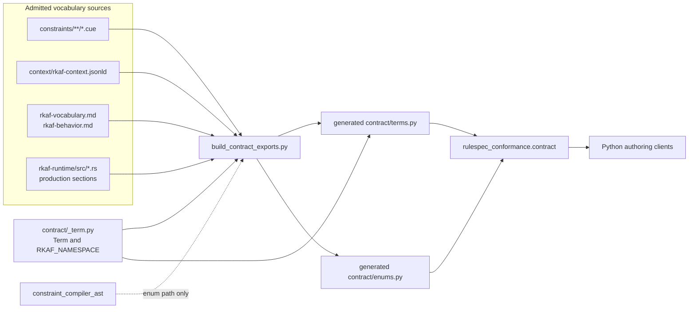
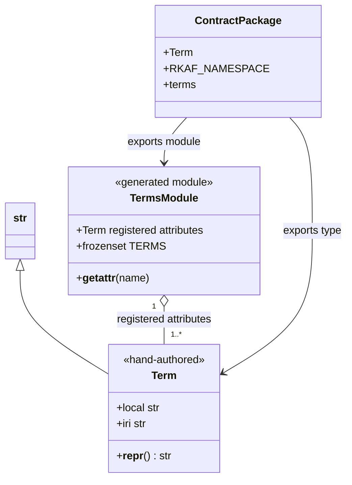
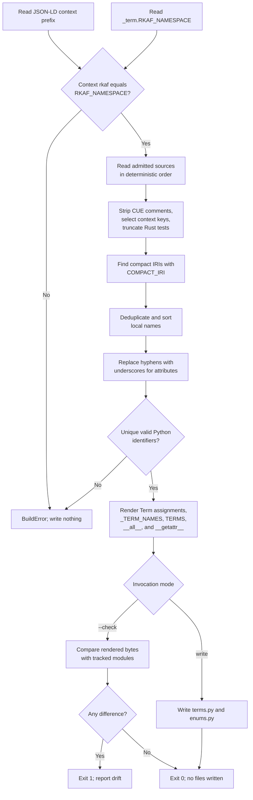
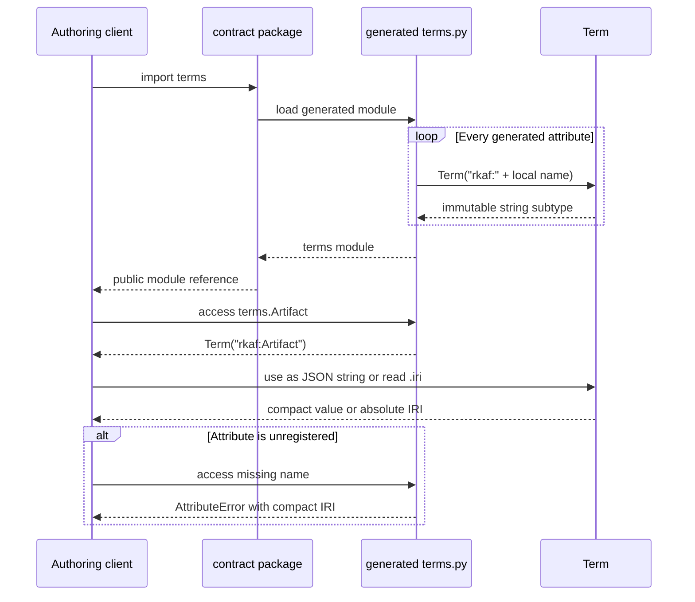
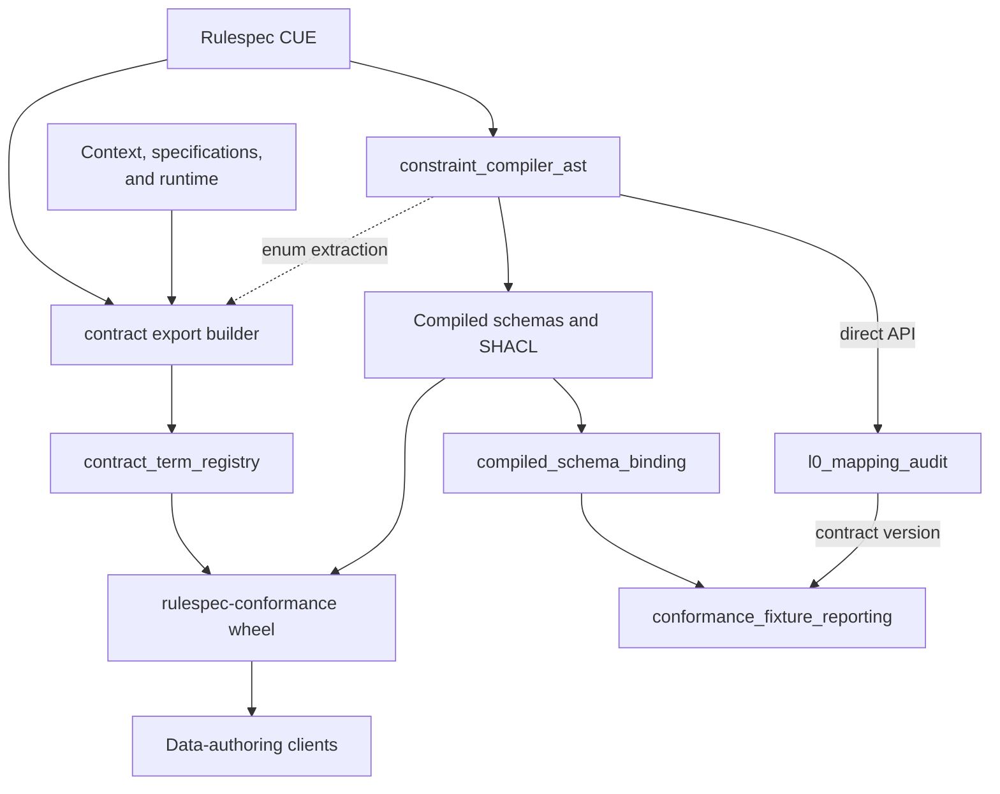

# Contract term registry

The `contract_term_registry` module gives Python consumers the importable, versioned set of compact `rkaf:` names found in admitted Rulespec sources. The hand-authored [`Term`](../src/rulespec_conformance/contract/_term.py) type remains compatible with ordinary strings and expands a compact Internationalized Resource Identifier (IRI) to its absolute form. The generated [`terms.py`](../src/rulespec_conformance/contract/terms.py) module exposes one `Term` attribute per registered name, a membership set, and a clear error for unknown attributes.

Use the registry when authoring Rulespec data. It neither defines term semantics nor validates arbitrary strings. Membership means that the scanner found matching text in an admitted source; it is not independent proof of a semantic declaration. Change the authoritative CUE, context, specification, or runtime source, then regenerate the registry. Never edit `terms.py` by hand.

## At a glance

| Question | Answer |
| --- | --- |
| What goes in? | Compact `rkaf:` names found in the admitted CUE, JSON-LD context, vocabulary and behavior specifications, and non-test Rust runtime sources, plus the hand-authored `RKAF_NAMESPACE`. |
| What happens? | The build tool filters each admitted source, scans compact IRIs, deduplicates and sorts local names, maps them to valid Python attributes, and renders each value as a `Term`. |
| What comes out? | Generated module attributes such as `terms.Artifact`, the public `terms.TERMS` membership set, and compact-to-absolute expansion through `.iri`. |
| How is it checked? | The generator's `--check` mode detects byte drift and namespace disagreement; focused tests check completeness, string behavior, unknown-name rejection, and namespace equality; an installed-wheel check proves that the packaged registry can be imported without a source checkout. |

## Responsibilities and limits

The module has four responsibilities:

1. Represent a compact `rkaf:` IRI as a normal Python string with `.local` and `.iri` accessors.
2. Turn the repository's admitted vocabulary sources into deterministic Python attributes.
3. Raise an error when a consumer imports or accesses a renamed, retired, misspelled, or unregistered attribute.
4. Ship the tracked generated registry in the `rulespec-conformance` wheel so consumers do not need this repository or a CUE toolchain.

The module does not:

- validate values passed directly to `Term(...)`;
- define a term's class, range, cardinality, lifecycle, or other meaning;
- expand prefixes other than the fixed `rkaf:` prefix;
- parse or validate JSON-LD, bind a class to a compiled schema, or run conformance fixtures;
- expose source provenance or descriptive metadata for each term; or
- replace the generated enum and lattice exports in `contract.enums`.

Use [Constraint compiler AST](constraint_compiler_ast.md) for CUE parsing and target generation, [Compiled schema binding](compiled_schema_binding.md) for class-to-schema selection, and [Conformance fixture reporting](conformance_fixture_reporting.md) for validation flow. Those modules share vocabulary sources or generated data with this registry, but they do not use `Term` to perform validation.

## Architecture



[`tools/build_contract_exports.py`](../tools/build_contract_exports.py) generates `terms.py` and `enums.py` in one invocation. The two paths differ:

- Term generation scans admitted source text for compact IRIs. It does not build a `ConstraintDoc` or use the compiler abstract syntax tree (AST).
- Enum generation calls the parser documented in [Constraint compiler AST](constraint_compiler_ast.md), then resolves and flattens enum unions.

The shared command means a compiler failure in the enum path can still block term regeneration. The generated term values remain independent of the compiler's interpretation of CUE shapes.

## Component model and dependencies



| Component | Ownership | Role |
| --- | --- | --- |
| [`contract/_term.py`](../src/rulespec_conformance/contract/_term.py) | Hand-authored | Defines `RKAF_NAMESPACE`, the private compact prefix, and `Term`. This is the only Python namespace spelling inside the `contract` package. |
| [`contract/terms.py`](../src/rulespec_conformance/contract/terms.py) | Generated and tracked | Defines every registered term attribute, `_TERM_NAMES`, `TERMS`, `__all__`, and the unknown-name guard. |
| [`contract/__init__.py`](../src/rulespec_conformance/contract/__init__.py) | Hand-authored | Exports the `terms` module, `Term`, and `RKAF_NAMESPACE` from the package root. It does not copy every term attribute to the package root. |
| [`tools/build_contract_exports.py`](../tools/build_contract_exports.py) | Hand-authored repository tool | Selects sources, scans names, validates Python mappings and the namespace, and renders both generated export modules. |
| [`tools/test_contract_exports.py`](../tools/test_contract_exports.py) | Hand-authored test suite | Checks the behavior consumers rely on independently of generated byte equality. |
| [`contract/__main__.py`](../src/rulespec_conformance/contract/__main__.py) | Hand-authored package check | Verifies representative terms, a retired-name refusal, enum membership, namespace equality, and packaged resources after installation. |

`_term.py` imports no project module and uses only Python's built-in `str`. Generated `terms.py` imports only `Term` and `RKAF_NAMESPACE`. Because `Term` subclasses `str`, registry values work as ordinary string constants in JSON-LD, SPARQL, fixtures, and dictionary keys.

## `Term` API and string behavior

`Term` subclasses `str` without overriding construction, equality, hashing, or formatting. `__slots__ = ()` prevents per-instance attributes and a per-instance `__dict__`; `str` provides immutability.

| API | Result | Important detail |
| --- | --- | --- |
| `str(term)` | The exact compact IRI, such as `rkaf:Artifact`. | No conversion occurs because the object is already a string. |
| `term.local` | The local name after `rkaf:`. | The property slices after five characters; it does not check the prefix. |
| `term.iri` | `RKAF_NAMESPACE + term.local`. | Expansion uses the fixed namespace and does not read the JSON-LD context at runtime. |
| `repr(term)` | A diagnostic form such as `Term('rkaf:Artifact')`. | The custom representation does not affect serialization or equality. |
| `term == "rkaf:Artifact"` | `True` for the matching value. | Native string equality and hashing make raw compact strings work in `TERMS` membership checks. |

Use generated attributes for registered names:

```python
import json

from rulespec_conformance.contract import RKAF_NAMESPACE, Term, terms

artifact = terms.Artifact

assert isinstance(artifact, Term)
assert artifact == "rkaf:Artifact"
assert artifact.local == "Artifact"
assert artifact.iri == RKAF_NAMESPACE + "Artifact"
assert "rkaf:Artifact" in terms.TERMS
assert json.loads(json.dumps({terms.usageEligibility: terms.officialUse})) == {
    "rkaf:usageEligibility": "rkaf:officialUse"
}
```

`Term` is a representation type, not a factory that proves membership. `Term("rkaf:notDeclared")` succeeds, and a value without the `rkaf:` prefix produces meaningless `.local` and `.iri` results. Code that accepts external strings must check `value in terms.TERMS`; code that names a fixed term should import or access the generated attribute.

## Generated registry API

| Surface | Use | Stability |
| --- | --- | --- |
| `terms.<name>` | Retrieve one registered compact IRI as a `Term`. | Public. Case is preserved; `-` in the local name becomes `_` only in the Python attribute. |
| `terms.TERMS` | Test membership in all registered compact IRIs. | Public `frozenset[Term]`; use it for membership, not ordered traversal. |
| `terms.Term` | Import the value type from the generated module. | Public alias of the hand-authored type. Prefer the package-root import for type annotations. |
| `terms.RKAF_NAMESPACE` | Expand a local name when no `Term` object is available. | Public alias of the hand-authored constant. |
| `terms.__all__` | Defines wildcard exports and lists the public generated names. | Public module export list. |
| `terms._TERM_NAMES` | Supplies the generated attribute names used to build `TERMS`. | Private implementation detail; its sort order is not a public vocabulary order. |
| `terms.__getattr__` | Rejects a missing module attribute with a term-specific message. | Called only after normal module lookup fails. |

The generator maps local names as follows:

| Compact IRI | Python access | Stored value |
| --- | --- | --- |
| `rkaf:Artifact` | `terms.Artifact` | `Term("rkaf:Artifact")` |
| `rkaf:hasContentDigest` | `terms.hasContentDigest` | `Term("rkaf:hasContentDigest")` |
| `rkaf:us-cfr` | `terms.us_cfr` | `Term("rkaf:us-cfr")` |

Generated enum tuples keep their wire values as plain strings rather than `Term` objects. Their `rkaf:` members still compare equal to registry values because `Term` inherits string equality and hashing.

Replacing `-` with `_` can collapse two distinct local names to one Python name. Generation fails if that collision occurs. It also fails when the mapped name is not a Python identifier or is a Python keyword.

An unknown attribute fails through the module guard:

```python
from rulespec_conformance.contract import terms

terms.assignedConcept  # raises AttributeError; this term is retired
```

Direct import converts the missing-attribute failure to `ImportError`:

```python
from rulespec_conformance.contract.terms import assignedConcept  # ImportError
```

The package root exports `terms`, not each term constant. Use `terms.Artifact` or import `Artifact` from `rulespec_conformance.contract.terms`; do not rely on `rulespec_conformance.contract.Artifact`.

## Source selection

Term discovery scans an explicit list of admitted sources for matching text. Source selection determines which text can add a registry name.

| Source | Admitted text | Preparation |
| --- | --- | --- |
| `constraints/**/*.cue` | Compact IRIs in every sorted CUE file. | A string-aware pass removes `//` comments while preserving `//` inside quoted values such as URLs. |
| `context/rkaf-context.jsonld` | Context keys that begin with `rkaf:`. | The tool parses JSON. It checks the separate `rkaf` prefix mapping against `RKAF_NAMESPACE`. |
| `spec/rkaf-vocabulary.md` | The complete normative vocabulary document. | Scanned as text. |
| `spec/rkaf-behavior.md` | The L4 behavior wire vocabulary, which has no complete CUE definition. | Scanned as text. |
| `crates/rkaf-runtime/src/*.rs` | Sorted Rust runtime sources that carry the rest of the L4 wire vocabulary. | Each file is truncated at its first `#[cfg(test)]` so deliberately invalid test names cannot enter the registry. |

The tool deliberately excludes:

- `shapes/*.ttl`, which contains retired names held at `sh:maxCount 0` and SHACL shape identifiers that are not data terms;
- `fixtures/**`, whose negative cases invent invalid names and whose positive cases may carry retired fields to prove rejection;
- other narrative specifications, which discuss historical names and renames; and
- `compiled/**`, which is derived, ignored by Git, and absent from a fresh clone.

See the source-policy comment in [`build_contract_exports.py`](../tools/build_contract_exports.py) before adding another input family. Adding a broad directory can silently admit examples, negative cases, or historical terms.

## Generation data flow



`COMPACT_IRI` accepts local names matching `[A-Za-z][A-Za-z0-9_-]*`. A negative lookbehind prevents the `rkaf:` segment in Rulespec `urn:rkaf:...` identifiers from becoming a term. `scan_terms()` records every source in which it finds a local name, but `render_terms()` emits only the name and value. Runtime consumers therefore cannot ask the packaged registry where a term was discovered.

The final `TERMS` set is built from the generated module attributes rather than from a second list of values. This construction prevents the attribute set and membership set from disagreeing.

## Consumer interaction



Importing `rulespec_conformance.contract` eagerly imports the generated `terms` and `enums` modules. This exposes missing or invalid generated files immediately. It can also prevent the generator from importing `_term` through the package, so restore valid tracked exports before regenerating.

## Namespace consistency

`RKAF_NAMESPACE` is hand-authored because `.iri` must work without reading package data. The JSON-LD context remains the external declaration of the `rkaf` prefix. Three checks keep the two spellings aligned:

1. `build_contract_exports.py` compares `context["@context"]["rkaf"]` with `RKAF_NAMESPACE` before it renders either generated module.
2. `tools.test_contract_exports` repeats the equality assertion as a consumer-level test.
3. `python -m rulespec_conformance.contract` reads the packaged context and checks the namespace after wheel installation.

A namespace migration must change the context and `_term.py` in the same change. A partial change fails generation. A repository-wide migration must also update other absolute `rkaf` IRIs and run the vocabulary, compiler, audit, and validator checks; this module checks only its package.

## System integration



The registry helps authors spell registered names; compiled schemas and SHACL determine whether the resulting data conforms. Current `SchemaBinding`, `FixtureResult`, `VocabularyRegistry`, artifact, and release components do not import `Term` or `contract.terms`.

Use the companion pages for the rest of the system:

- [Semantic contract compilation and binding](semantic_contract_compilation_and_binding.md) places the registry and compiled schemas under their shared parent capability; see the [`contract` package](../src/rulespec_conformance/contract/__init__.py) and [`build_contract_exports.py`](../tools/build_contract_exports.py).
- [Constraint compiler AST](constraint_compiler_ast.md) documents CUE parsing, cross-file resolution, and target generation. Its enum output path feeds the same export builder, but the builder's term path is the lexical scan documented here.
- [Compiled schema binding](compiled_schema_binding.md) explains how `SchemaBinding` connects a fixed JSON-LD `@type` value to generated JSON Schema. It consumes compiled files, not registry objects; see [`conformance_lib.py`](../src/rulespec_conformance/conformance_lib.py).
- [L0 mapping audit](l0_mapping_audit.md) documents `VocabularyRegistry` and mapping checks. It reads the CUE model and context independently rather than treating `TERMS` as semantic proof; see [`l0_mapping_audit.py`](../tools/l0_mapping_audit.py).
- [Conformance fixture reporting](conformance_fixture_reporting.md) documents the Levels 1 through 4 (L1-L4) fixture flow. It consumes schema bindings and reads the L0 vocabulary registry's computed contract version for self-certification; see [`conformance_report.py`](../tools/conformance_report.py).
- [Platform artifact runtime](platform_artifact_runtime.md), [Release record validation](release_record_validation.md), and [Extrapolation release v2 verification](extrapolation_release_v2_verification.md) cover separate artifact-admission and release checks. They have no direct registry dependency; see [`rulespec_artifacts/_artifact.py`](../packages/rulespec-artifacts/src/rulespec_artifacts/_artifact.py), [`rulespec_release.py`](../tools/rulespec_release.py), and [`extrapolation_release_v2.py`](../tools/extrapolation_release_v2.py).

The companion-page names come from the supplied module map and may be produced independently. The live implementation links above ground each relationship in the current checkout while companion pages are pending.

## Validation and failure model

### What each gate proves

| Gate | Evidence it provides |
| --- | --- |
| `python tools/build_contract_exports.py --check` | Rebuilds both export modules in memory; checks source presence, context namespace equality, name mapping, deterministic rendering, and exact agreement with tracked files. |
| `python -m unittest tools.test_contract_exports -v` | Checks CUE-term completeness, enum-member registration, generated attribute values, `.local`, `.iri`, registry identity, JSON string behavior, retired and invented-name refusal, kebab-case mapping, namespace equality, and resource-accessor behavior against the checkout. |
| `make test-audits` | Runs the focused suite and drift gate alongside vocabulary, compiler, L0, semantic-carrier, parity, and generated-code audits. |
| `python -m rulespec_conformance.contract` | Checks representative source families, a retired-name refusal, namespace equality, enum registration, and packaged resource inventory. In the canonical package gate it runs outside the checkout. |
| `make test-package-conformance` | Builds and installs the conformance wheel in a scratch environment, then runs the module check from outside the source checkout. |

The builder uses these exit codes:

| Exit code | Meaning |
| --- | --- |
| `0` | Write mode completed, or `--check` found no drift. |
| `1` | `--check` found drift, or a namespace, collision, union, or other build consistency error occurred. |
| `2` | Required source setup is missing, or the CUE parser failed while building the sibling enum export. |

The tool renders both complete modules before write mode starts. A scan, parser, namespace, or rendering error therefore leaves the tracked outputs untouched. `--check` never writes files.

### Failure locations

| Condition | Where it fails |
| --- | --- |
| Consumer accesses an unregistered generated attribute. | `terms.__getattr__` raises `AttributeError`; direct `from ...terms import name` raises `ImportError`. |
| Consumer constructs `Term("rkaf:notDeclared")`. | It does not fail. The caller must use a generated attribute or check `TERMS`. |
| Context and Python namespaces disagree. | Generation returns exit code `1`; focused and installed-package checks also fail. |
| Two terms map to the same Python attribute. | `render_terms()` raises `BuildError`. |
| A local name maps to a keyword or invalid identifier. | `render_terms()` raises `BuildError`. |
| Sources changed but generated files did not. | `--check` returns exit code `1` and names the drifted modules. |
| A required input is absent. | The command returns exit code `2` before generation. |

## Known limitations and hazards

- **Construction is unchecked.** `Term` assumes the generated caller supplied `rkaf:`. Raw strings and direct construction bypass registry membership.
- **Discovery is lexical.** Any matching text in an admitted source can mint a name even when it appears only as an example or placeholder. In the current tree, the illustrative `<rkaf:level>` text in `spec/rkaf-behavior.md` admits `terms.level`. Tests prove agreement with the configured scan, not that every match is a semantic declaration.
- **The allowlist is closed.** A valid term that appears only in an excluded shape, fixture, different specification, or different runtime directory remains absent until the source policy changes.
- **Unsupported local syntax is invisible.** The scanner recognizes letters, digits, underscores, and hyphens after an initial letter. A different legal IRI local form does not reach Python-name validation because the regex does not match it.
- **Python names can differ from vocabulary names.** Hyphens become underscores. Always use the attribute's value for wire output. The generator rejects attribute-name collisions.
- **Membership has no metadata.** `TERMS` says that a compact value was discovered. It does not say whether the name is a class, property, enum member, or behavior code, and it does not expose the declaring source.
- **The set has no normative order.** `TERMS` is a `frozenset`. Ordered enum and lattice meaning belongs to `contract.enums`.
- **Literal strings bypass unknown-name checks.** Code that writes values such as `"rkaf:typo"` never touches the module guard. Prefer generated attributes in authored code.
- **The combined generator shares failures.** Term scanning does not use the compiler AST, but the command also generates enums. An unrelated enum parse or union error can block both outputs.

## Contribution guide

### Change the declaring source first

Choose the source that owns the term:

| Change | Authoritative starting point | Related work |
| --- | --- | --- |
| Add or change a structural vocabulary term. | `constraints/**/*.cue` and the normative vocabulary documentation required by repository audits. | Regenerate compiled targets and contract exports. Add context coercion only when JSON-LD processing requires it. |
| Add or change an L4 behavior wire term. | `spec/rkaf-behavior.md` and the corresponding production Rust runtime code. | Keep examples from looking like new compact IRIs unless they are declarations. |
| Retire or rename a term. | Remove or replace it in every admitted declaring source. | One remaining textual match keeps the old name registered. Update retirement tests when the term must fail explicitly. |
| Change the `rkaf` namespace. | `context/rkaf-context.jsonld` and `_term.py` together. | Treat this as a repository-wide migration and run every compiler, audit, validation, and package gate. |
| Change Python attribute mapping or `Term` behavior. | `build_contract_exports.py` or `_term.py`. | Add focused tests for string compatibility, collisions, invalid names, serialization, membership, and expansion. |

Do not add consumer-specific constants to this package. The accepted ownership decision in [`docs/decisions.md`](../docs/decisions.md) requires generated exports to contain Rulespec declarations rather than local application vocabulary.

### Regenerate and verify

Run commands from the repository root. When CUE sources change, follow the complete compile workflow in [Constraint compiler AST](constraint_compiler_ast.md), including `make cue-vet` and `make compile`. Then regenerate the tracked Python exports:

```bash
uv run --no-project --python 3.12 --with-requirements requirements.txt \
  python tools/build_contract_exports.py
```

Review both generated modules because the command writes both. A term change should produce the expected `terms.py` additions or removals and no unexplained names.

Run the focused checks:

```bash
uv run --no-project --python 3.12 --with-requirements requirements.txt \
  python tools/build_contract_exports.py --check

uv run --no-project --python 3.12 --with-requirements requirements.txt \
  python -m unittest tools.test_contract_exports -v
```

Run the integrated audit gate before submitting:

```bash
make test-audits
```

Run `make test-package-conformance` when changing package exports, package data, import behavior, or the installed self-check. It builds wheels and uses scratch environments, so ensure the compiled tree is current first.

### Review checklist

- The new name originates in an admitted authoritative source.
- Examples, comments, fixtures, and test-only runtime code did not add accidental terms.
- Every removed name disappeared from all admitted sources.
- The Python attribute preserves the exact compact IRI as its value.
- Hyphen conversion creates no collision or misleading access name.
- Enum members that begin with `rkaf:` remain present in `TERMS`.
- Namespace expansion matches the packaged JSON-LD context.
- String equality, JSON serialization, dictionary keys, and membership checks remain compatible.
- Generated files changed only through `build_contract_exports.py`.

## Key implementation files

- [`src/rulespec_conformance/contract/_term.py`](../src/rulespec_conformance/contract/_term.py) — hand-authored namespace and `Term` string subtype.
- [`src/rulespec_conformance/contract/terms.py`](../src/rulespec_conformance/contract/terms.py) — tracked generated term attributes, membership set, and unknown-name guard.
- [`src/rulespec_conformance/contract/__init__.py`](../src/rulespec_conformance/contract/__init__.py) — public package surface.
- [`src/rulespec_conformance/contract/__main__.py`](../src/rulespec_conformance/contract/__main__.py) — installed-package verification.
- [`tools/build_contract_exports.py`](../tools/build_contract_exports.py) — source policy, scanner, name mapping, deterministic renderer, and drift gate.
- [`tools/test_contract_exports.py`](../tools/test_contract_exports.py) — focused consumer behavior and resource tests.
- [`context/rkaf-context.jsonld`](../context/rkaf-context.jsonld) — JSON-LD namespace declaration and coercion entries.
- [`docs/decisions.md`](../docs/decisions.md) — accepted decision to ship the authoring surface as generated imports.
- [`pyproject.toml`](../pyproject.toml) — conformance wheel and package-data configuration.
- [`Makefile`](../Makefile) — audit and scratch-wheel verification entry points.
