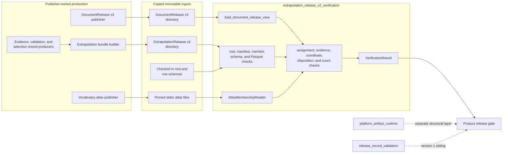
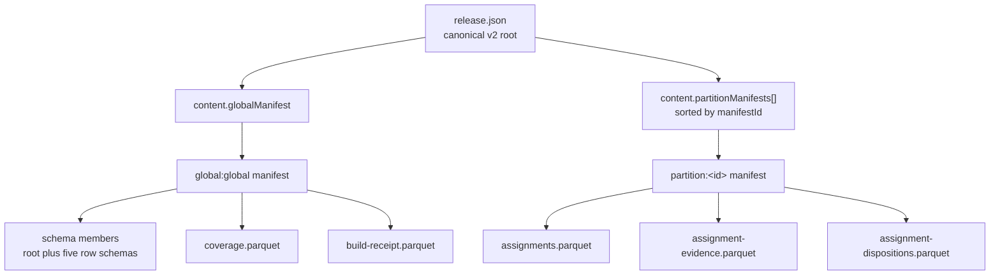
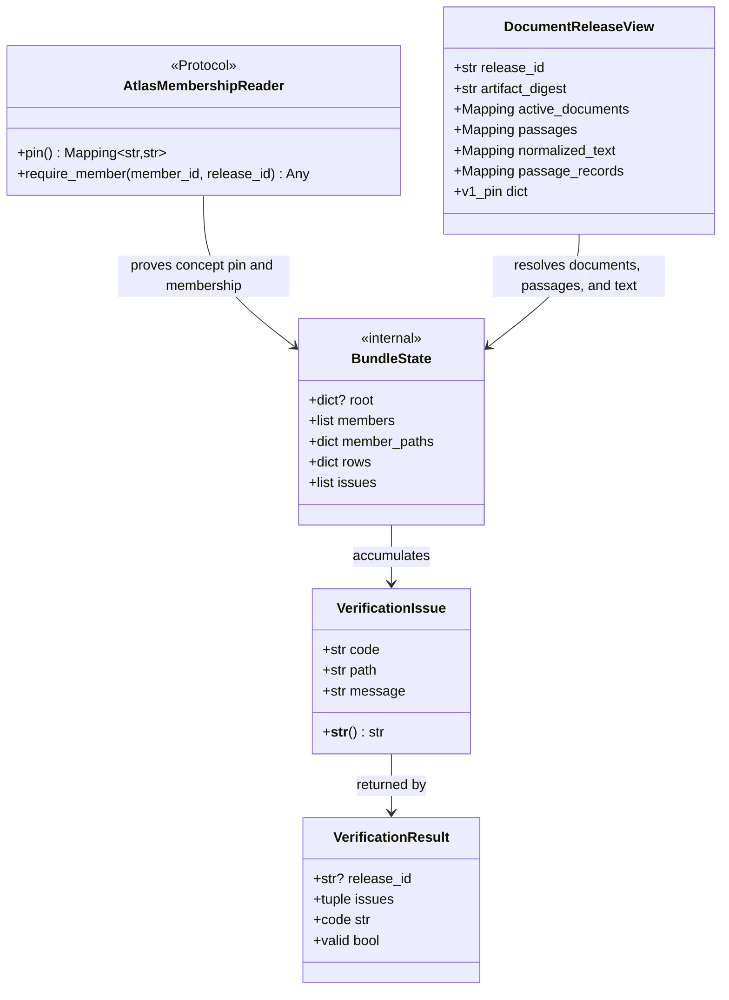
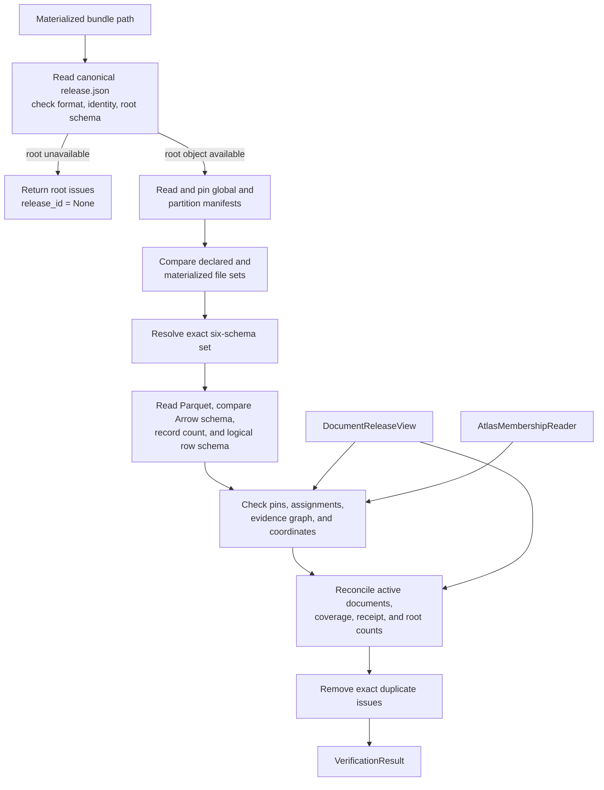
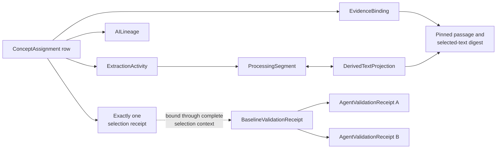
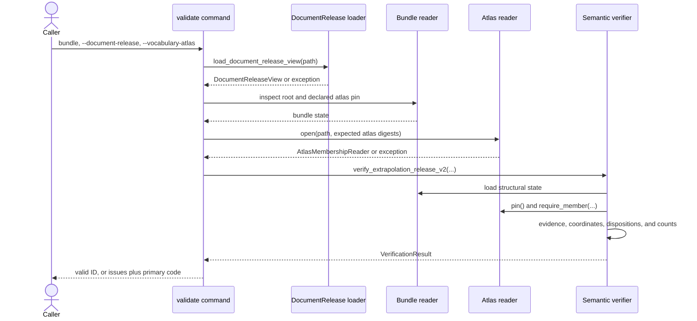

# Extrapolation release v2 verification

The `extrapolation_release_v2_verification` module is Rulespec's offline verifier for copied, partitioned `ExtrapolationRelease` version 2 bundles. It proves that the root, manifests, schemas, Parquet members, release pins, assignment evidence, document dispositions, coverage, and build receipt describe the same immutable release.

The implementation lives in [`tools/extrapolation_release_v2.py`](../tools/extrapolation_release_v2.py). It reads only local files and caller-supplied atlas facts; it does not query a database, call a network service, import a sibling product, or publish the release. The [Rulespec release-record specification](../spec/rulespec-releases.md#3a-extrapolationrelease-version-2) defines the format's meaning. This page explains the implementation, its system boundary, and the contribution workflow.

## At a glance

| Question | Answer |
| --- | --- |
| What goes in? | A fully materialized `rulespec-extrapolation-release` version `2.0` directory, a verified view of its exact copied `DocumentRelease` version 3 input, and, when concept membership is in scope, an `AtlasMembershipReader` for the pinned vocabulary atlas. |
| What happens? | The verifier checks canonical JSON and content identity, closes file membership, hashes every declared file, validates the exact schema set and Parquet row shapes, resolves the assignment and evidence graph, replays text coordinates, and reconciles every active document. |
| What comes out? | `VerificationResult` contains the release ID and an ordered, deduplicated tuple of `VerificationIssue` records. Its `code` is `valid` or the highest-precedence refusal code. |
| How is it checked? | Closed JSON Schemas, exact Apache Arrow schemas, deterministic positive and negative bundles, copied upstream bytes, and focused unit tests exercise both structural and semantic refusals. |

## Responsibilities and boundary

The module owns the checks specific to the partitioned v2 distribution:

- RFC 8785 canonical JSON for identity-bearing roots and manifests;
- content-derived v2 release identity;
- safe, relative POSIX object keys and a symlink-free materialization;
- complete declared membership with no missing or extra files;
- manifest, member, schema, and row byte and count reconciliation;
- the exact registered root and row schema set;
- closed Apache Arrow schemas for every Parquet role;
- version 1 assignment and evidence-record compatibility inside v2 rows;
- exact document, passage, concept-release, and atlas pins;
- evidence, lineage, validation, projection, and selection links;
- complete `assigned`, `abstained`, `excluded`, or `failed` disposition accounting;
- coverage, build-receipt, and root count reconciliation; and
- deterministic diagnostic records and core-code precedence.

The module verifies records that other systems produced. It does not:

- parse source documents or construct `ProcessingSegment` records;
- invoke a model or create extraction and AI-lineage records;
- run independent validators or produce baseline receipts;
- apply a selection policy or choose a served assignment;
- provide a production vocabulary-atlas storage adapter;
- certify the complete `DocumentRelease` v3 conformance class;
- admit the separate platform-artifact format; or
- approve, publish, deploy, or activate a release.

The verifier's `DocumentReleaseView` is deliberately narrow. It proves the copied bytes and extracts only the active-document, normalized-text, passage, and digest facts required by assignment verification. The upstream publisher's full validator remains authoritative for every other `DocumentRelease` rule.

Version 1 uses a single JSON record and a different validation surface. See [Release record validation](release_record_validation.md) for that format, shared durable record identities, and the submitted-receipt model. The [Platform artifact runtime](platform_artifact_runtime.md) implements a separate product-neutral artifact format and stronger provider and local-publication adapters. Passing either sibling verifier cannot substitute for passing this one.

## System context and dependencies



### Physical dependencies

| Dependency | Use |
| --- | --- |
| Python standard library | Command-line parsing, paths, strict JSON hooks, hashing, regular expressions, counters, dataclasses, and protocols. |
| [`rfc8785`](../requirements.txt) | Canonicalizes v2 roots, manifests, schema-set inputs, policy inputs, and selection-context inputs. |
| [`jsonschema`](../requirements.txt) | Applies Draft 2020-12 validation to the root, registered row schemas, and embedded version 1 records. |
| [`pyarrow`](../requirements.txt) | Reads and writes Parquet and enforces exact, metadata-insensitive Arrow schemas. |
| [`tools/rulespec_release.py`](../tools/rulespec_release.py) | Supplies version 1 strict loading, canonical bytes, stable record IDs, qualified digests, and schema-compatible evidence behavior. |
| `AtlasMembershipReader` | Supplies the selected atlas pin and proves concept membership in an assigned reference release. |
| Copied `DocumentRelease` v3 bytes | Supply active document versions, passages, normalized document text, and passage text digests. |
| Checked-in schemas | Define the closed root and five data-row shapes carried inside the bundle. |

The module has no runtime dependency on SpicyRegs, RefSpec, a provider SDK, a database client, or an HTTP client. The CLI's [`RulespecAtlasMembershipStub`](../tools/atlas_membership_stub.py) is a local fixture adapter, not a production atlas format.

## Bundle structure

The root pins one global member manifest and one or more partition manifests. Those manifests close the directory by naming every schema and Parquet member. Files not reachable from this graph are invalid.



Each manifest reference contains exactly `manifestId`, `scopeKind`, `scopeId`, `objectKey`, `byteSize`, and `sha256`. Each subordinate manifest contains exactly `format`, `formatVersion`, `manifestId`, `scope`, `members`, and `counts`. The verifier requires `spicy-artifact-member-manifest` version `1.0`, exact scope agreement, sorted member object keys, and recomputed manifest counts.

Every member descriptor contains exactly:

```text
objectKey, role, mediaType, byteSize, sha256, recordCount,
schemaId, partitionId, servingShardId
```

Rulespec sets `partitionId` and `servingShardId` to `null`; scope comes from the containing manifest. Schema members use `application/schema+json` and a null `recordCount`. Data members use `application/vnd.apache.parquet` and a nonnegative record count.

### Registered member roles

| Role | Allowed scope | Contents | Physical schema |
| --- | --- | --- | --- |
| `schema` | Global | The v2 root schema and five row schemas. | JSON Schema document identified by `$id`. |
| `assignments` | Partition | Document, assignment, subject, concept, release, policy result, lineage, and optional confidence fields. | `ASSIGNMENTS_ARROW_SCHEMA` plus `assignments-v1.schema.json`. |
| `assignment-evidence` | Partition | Canonical version 1 evidence, lineage, validation, projection, artifact, and selection records. | `EVIDENCE_ARROW_SCHEMA` plus `assignment-evidence-v1.schema.json`. |
| `assignment-dispositions` | Partition | One terminal result and its counts for each active document. | `DISPOSITIONS_ARROW_SCHEMA` plus `assignment-dispositions-v1.schema.json`. |
| `coverage` | Global | Global or narrower-scope document and assignment totals. | `COVERAGE_ARROW_SCHEMA` plus `coverage-v1.schema.json`. |
| `build-receipt` | Global | Producer, timing, release status, input release, policy, and record count. | `BUILD_RECEIPT_ARROW_SCHEMA` plus `build-receipt-v1.schema.json`. |

The root `schemaSet` must contain exactly six sorted descriptors: one root schema with role `schema` and one schema for each data role. Every descriptor must resolve to one schema member with the same ID and digest. Every data member must name the registered schema ID for its role.

## Core component model



### `AtlasMembershipReader`

`AtlasMembershipReader` is the product-owned proof seam. `pin()` returns the exact selected atlas asset pin; `require_member()` proves that `member_id` belongs to `release_id`. The verifier compares the returned pin with `content.input_releases.vocabulary_atlas_asset` and calls `require_member()` for every assignment.

The programmatic API permits `atlas=None` for a deliberately narrower check in which concept membership is out of scope. In that mode the verifier skips atlas-pin and concept-membership proof. A standard release-admission path with a vocabulary atlas pin should always provide the reader. The CLI opens the local atlas named by `--vocabulary-atlas` whenever the root declares an atlas pin.

### `DocumentReleaseView`

`DocumentReleaseView` is a frozen, read-only-by-convention summary of the upstream bytes:

| Field | Meaning |
| --- | --- |
| `release_id` | Recomputed `urn:spicyregs:document-release:v3:<digest>` identity. |
| `artifact_digest` | Unqualified RFC 8785 SHA-256 digest of the document release's `format`, `formatVersion`, and `content`. |
| `active_documents` | `document_id -> document_version_id` for rows whose state is `active`. |
| `passages` | `passage_id -> (document_id, document_version_id, qualified text digest)`. |
| `normalized_text` | `document_version_id -> normalized_text`, used to validate omitted source ranges. |
| `passage_records` | Full passage rows, used to replay source slices against exact passage text. |
| `v1_pin` | Compatibility view containing `release_id` and `release_digest=sha256:<artifact_digest>`. |

`load_document_release_view()` first proves the root's canonical bytes, format, version, and content-derived identity. It then checks manifest references, manifest bytes and scopes, sorted descriptors, aggregate counts, exact directory membership, every member digest, and record counts for `current-documents`, `documents`, and `passages`. Finally, it rejects duplicate identities and unresolved active versions before returning the view.

This loader raises on the first invalid upstream condition. It does not return `VerificationIssue` records because an untrusted or mismatched upstream input prevents the v2 verifier from establishing its reference frame.

### `VerificationIssue`

`VerificationIssue` is a frozen dataclass with a stable machine-readable `code`, a narrow `path`, and a concrete `message`. Its string form is:

```text
<code> <path>: <message>
```

The verifier accumulates issues so one run can provide a useful repair set. Before returning, it removes exact duplicate `(code, path, message)` triples while preserving encounter order.

### `VerificationResult`

`VerificationResult` is a frozen dataclass containing the parsed release ID, when available, and the final issue tuple. `valid` is true only when the tuple is empty. `code` is `valid` on success; otherwise, it selects the issue with the highest priority in `CORE_CODE_PRECEDENCE`. The primary code therefore need not match the first issue in the tuple.

If the root cannot be read as an object, `release_id` is `None` and the verifier returns the root issue set without running dependent semantic checks.

## Principal callable surface

| Function | Responsibility |
| --- | --- |
| `verify_extrapolation_release_v2()` | Runs structural and semantic checks and returns `VerificationResult`. |
| `load_document_release_view()` | Verifies the copied upstream seam and constructs `DocumentReleaseView`. |
| `canonical_json_bytes()`, `canonical_sha256()` | Encode the restricted RFC 8785 domain and hash it. |
| `load_strict_canonical_json()`, `write_canonical_json()` | Read byte-exact canonical JSON or write it without a trailing newline. |
| `expected_release_id()`, `stamp_root()` | Derive or attach the v2 content identity. |
| `write_parquet()` | Write a role under its fixed Arrow schema and deterministic compression settings. |
| `v2_selection_context_digest()` | Bind selection receipts to the complete pre-selection graph. |
| `build_parser()`, `main()` | Expose the `validate` command. |

The underscore-prefixed functions and `_BundleState` are implementation details. Contributors should preserve their phase boundaries, but consumers should build on the principal functions and four core types.

## Canonical bytes and identity

The v2 root and all member manifests use RFC 8785 over a restricted JSON domain. The implementation accepts null, strings, booleans, arrays, string-keyed objects, and integers from `-(2^53-1)` through `2^53-1`. It rejects binary floating-point values, non-finite constants, duplicate keys, unsupported Python values, a UTF-8 byte order mark, and any source bytes that differ from their canonical re-encoding.

The release identity covers only `format`, `formatVersion`, and `content`:

```text
urn:rulespec:extrapolation:v2:
  SHA-256(RFC8785({format, formatVersion, content}))
```

Root `annotations` are identity-neutral. Changing any manifest reference, schema descriptor, policy, input pin, profile, count, or other `content` field changes the release ID.

Several nested identities protect different decisions:

| Identity | Preimage and purpose |
| --- | --- |
| `schemaSetId` | RFC 8785 digest of the ordered schema descriptors; binds role resolution to exact schemas. |
| `policySha256` | RFC 8785 digest of `assignmentPolicy` without `policySha256`; detects policy-record changes. |
| Version 1 record IDs | `stable_record_id()` over the record type's identity fields; binds packaged evidence to the established v1 model. |
| `validation_sample_manifest.manifest_digest` | Version 1 canonical digest of its ordered `record_refs`. |
| `selection_context_digest` | Qualified RFC 8785 digest of input pins, profile, policy, validation sample, sorted assignments, and sorted non-selection evidence. |
| Text digests | SHA-256 of exact UTF-8 text; bind passage, derived, inserted, and selected text. |

The module intentionally uses both v2 RFC 8785 canonicalization and the established version 1 canonical encoder from `rulespec_release.py`. `assignment-evidence.record_json` must be canonical Rulespec v1 JSON. Do not replace one encoder with the other without a versioned compatibility decision and independent golden evidence.

Assignment `confidence` is the one floating-point data field. It lives in Parquet, must be null or finite, and has no policy threshold meaning. When computing `selection_context_digest`, the verifier converts a float to a 17-significant-digit decimal string so the canonical manifest domain remains float-free.

## Verification data flow



### Phase 1: root and format

`_read_v2_root()` refuses a missing or linked `release.json`, noncanonical bytes, a non-object root, another format or version, an incorrect content-derived ID, and Draft 2020-12 schema errors. A readable object remains available for later checks even when its format, identity, or schema is invalid, allowing the result to report additional useful issues.

### Phase 2: manifests and complete membership

`_read_subordinate_manifests()` validates the global reference and requires at least one partition reference. It checks sorted manifest IDs, duplicate manifest identities, safe paths, exact manifest bytes, canonical source, closed fields, format, scope, sorted members, closed descriptors, role-to-scope rules, media types, and aggregate counts.

`_verify_member_files()` walks the complete bundle. It rejects every symlink, reports declared files that are absent, reports materialized files that are undeclared, and compares each declared member's byte size and SHA-256 digest. `release.json`, manifest files, schema files, and data files all participate in closure.

### Phase 3: schema registration and Parquet rows

`_validate_schema_set()` requires the exact registered schema IDs and role assignments. It recomputes `schemaSetId`, matches descriptors to schema members and digests, loads each JSON Schema, checks it as Draft 2020-12, and verifies its `$id`.

`_read_data_rows()` applies two complementary row gates:

1. The Parquet table's Arrow schema must equal the role's hard-coded schema, ignoring metadata.
2. Every converted row must validate against the registered logical JSON Schema.

The member's `recordCount` must equal the Parquet row count. Rows are grouped by role in `_BundleState` for semantic checks.

### Phase 4: assignment pins and durable identities

`_validate_assignments_and_evidence()` recomputes the assignment-policy digest and compares the bundle's document and atlas pins with the verified inputs. Each assignment must:

- have a unique `assignment_id`;
- resolve to the pinned active document version;
- reconstruct a valid version 1 `ConceptAssignment`;
- carry the stable ID derived from that record;
- contain null or finite diagnostic confidence;
- name a concept that the atlas proves belongs to the assigned concept release; and
- pin the same reference-resource release declared by the root.

### Phase 5: evidence graph and coordinate replay

Each `assignment-evidence` row carries `record_id`, `record_type`, optional `assignment_id`, and canonical `record_json`. The verifier supports the version 1 record types registered in `V1_RECORD_DEFS`, including evidence bindings, extraction activity, AI lineage, processing segments, derived projections, portable artifacts, agent and baseline validation receipts, and selection receipts.



The verifier checks packaging identity against the identity inside `record_json`, recomputes stable IDs for non-artifact records, and validates each record against the version 1 schema definition. It then resolves assignment bindings, passage identity and digest, extraction activity, AI lineage, one selection receipt per assignment, processing-segment projections, and baseline receipt independence.

A valid baseline names exactly two completed, supporting `AgentValidationReceipt` records. The two attempts must differ in validator actor, independence group, provider model ID, and response artifact.

`_validate_projection_coordinates()` replays each `ProcessingSegment` and reciprocal `DerivedTextProjection`:

- the derived-text digest must match exact UTF-8 text;
- segment and projection references and input passage lists must agree;
- ordered half-open slices must start at zero, remain contiguous, and close at the derived text length;
- `source_range` slices must reproduce exact text from one declared pinned passage;
- `inserted_text` slices must reproduce their text and digest;
- `transformed_range` slices must name a transform version; and
- omitted ranges must resolve within the pinned normalized document text.

The validation-sample manifest must hash its ordered references, and every reference must resolve to an assignment, evidence record, passage, or assigned concept. Finally, the root and every `ExtrapolationSelectionReceipt` must carry the recomputed `selection_context_digest`.

### Phase 6: dispositions, coverage, receipts, and rollups

Every active document in the copied `DocumentRelease` must have exactly one disposition row, and no foreign document may appear.

| Disposition | Required state |
| --- | --- |
| `assigned` | At least one selected assignment and no `failure_id`. |
| `abstained` | Zero assignments and no `failure_id`. |
| `excluded` | Zero assignments and no `failure_id`. |
| `failed` | Zero assignments and a string `failure_id`. |

For every disposition, the declared assignment, selected-assignment, and evidence counts must match the rows that resolve to that document. `reason_code` must contain at least three lowercase dot-separated segments and match the producer diagnostic pattern.

Coverage scopes must be unique, and exactly one `global/global` row must reproduce the active-document, disposition, and assignment-selection totals. Exactly one build receipt must pin the same document release and policy and count all assignment, evidence, disposition, and coverage rows. Root counts must then reproduce dispositions, row counts, partition-manifest count, member count, and total member bytes.

## Component interaction

The CLI and programmatic API use the same verifier, but the CLI also turns upstream-loading failures into stable terminal output.



The CLI exits `0` and writes `valid <release_id>` to standard output on success. It exits `1` on refusal, writes each issue and then the primary code to standard error, and reports an invalid document or atlas input as `invalid.assignment-pin`.

## Failure model

Core codes have explicit precedence. This makes the one-line terminal result stable even when one corrupted bundle causes several downstream issues.

| Priority | Code | Typical cause |
| ---: | --- | --- |
| 1 | `invalid.root-syntax` | Root bytes are missing canonical JSON syntax or the root is not an object. |
| 2 | `invalid.format` | Wrong format name or version. |
| 3 | `invalid.identity` | Root release ID differs from its content-derived identity. |
| 4 | `invalid.membership-missing` | A root, manifest, or declared member is absent. |
| 5 | `invalid.membership-extra` | A materialized file is undeclared. |
| 6 | `invalid.member-digest` | A manifest, member, or schema descriptor has the wrong size or digest. |
| 7 | `invalid.path` | Unsafe path or symbolic link. |
| 8 | `invalid.schema` | Closed fields, types, roles, Arrow schema, JSON Schema, counts, or canonical row rules fail. |
| 9 | `invalid.duplicate-identity` | Manifest, member, schema, assignment, evidence, disposition, or coverage identity repeats. |
| 10 | `invalid.foreign-key` | Schema, document, concept, or another required target does not resolve. |
| 11 | `invalid.coordinate` | Derived or omitted text coordinates do not replay against pinned text. |
| 12 | `invalid.eligibility-evidence` | Reserved core category for eligibility proof failures. |
| 13 | `invalid.reconciliation` | Reserved core category for cross-record reconciliation failures. |
| 14 | `invalid.privacy` | Reserved core category for privacy-rule failures. |
| 15 | `invalid.statistics` | Coverage, build receipt, root counts, or aggregate statistics differ. |
| 16 | `invalid.shard` | Reserved core category for shard-rule failures. |
| 17 | `invalid.assignment-pin` | Document, atlas, reference release, or segment pins differ. |
| 18 | `invalid.assignment-evidence` | Stable IDs, canonical evidence, links, receipts, or selection context fail. |
| 19 | `invalid.assignment-disposition` | Active-document partition or per-document terminal state fails. |
| 20 | `invalid.tier` | Reserved core category for tier-rule failures. |

Some categories are reserved in the shared precedence list but have no direct emission site in the current implementation. Keep their positions stable unless the release format deliberately changes its diagnostic compatibility.

Invalid submitted data normally becomes an issue. Upstream `DocumentRelease` loading raises `OSError`, JSON, value, or Arrow errors; atlas adapters may also raise operational exceptions outside the small set converted to membership issues. Callers should keep malformed-data refusals distinct from unavailable storage or broken adapters.

## Using the module

### Command line

Run from the repository root with the pinned dependencies:

```bash
uv run --no-project --python 3.12 \
  --with-requirements requirements.txt \
  python tools/extrapolation_release_v2.py validate \
  release-records/fixtures/extrapolation-release-v2/valid \
  --document-release \
  release-records/fixtures/upstream/spicyregs-document-release-v3 \
  --vocabulary-atlas \
  release-records/fixtures/rulespec-atlas-membership-stub
```

Both input options are required by the CLI. The atlas adapter checks the expected manifest and distribution digests taken from the bundle before semantic verification begins.

### Programmatic verification

```python
from pathlib import Path

from tools.extrapolation_release_v2 import (
    load_document_release_view,
    verify_extrapolation_release_v2,
)

document_release = load_document_release_view(
    Path("/copied-inputs/document-release-v3")
)
atlas_reader = open_product_atlas_reader()  # Product-owned immutable adapter.

result = verify_extrapolation_release_v2(
    Path("/copied-inputs/extrapolation-release-v2"),
    document_release=document_release,
    atlas=atlas_reader,
)

if not result.valid:
    for issue in result.issues:
        print(issue)
    raise ValueError(result.code)

print(result.release_id)
```

Load and verify the external inputs before relying on the result. Do not construct `DocumentReleaseView` from unverified database rows or use `atlas=None` to turn a partial diagnostic pass into release admission.

### Builder helpers

`stamp_root()`, `write_canonical_json()`, and `write_parquet()` support the deterministic fixture builder. `write_parquet()` fixes the role's Arrow schema, uses Zstandard level 9, disables dictionary encoding, writes statistics, and selects Parquet version 2.6. It does not build manifests, reconcile content, or make a release valid by itself.

## Performance and safety characteristics

The verifier hashes member files in 1 MiB chunks, but it materializes the file-name set, each Parquet table, converted Python rows, and the evidence graph in memory. Partitioning bounds producer output operationally; this implementation does not impose explicit byte, row, partition, or manifest-count limits. Size untrusted inputs before admitting them in a resource-constrained service.

Path checks reject empty keys, NUL, backslashes, absolute paths, `.` and `..` segments, non-normalized POSIX spellings, and Windows drive prefixes. Directory scans reject symbolic links. The implementation still uses ordinary path checks and opens rather than descriptor-relative no-follow handles. Verify a quiescent copied directory; do not run it against a concurrently mutable or adversarial filesystem. See [Platform artifact runtime](platform_artifact_runtime.md#local-filesystem-safety-and-publication) for stronger local race and publication controls.

The verifier continues after many structural issues so it can return a repair set. Later issues may be consequences of an earlier corrupted member. Use `VerificationResult.code` for the stable primary category, then repair issues in structural-to-semantic order.

## Known limitations and maintenance hazards

- `DocumentReleaseView` verifies only the upstream facts this consumer needs. A successful load is not full `DocumentRelease` v3 certification.
- `AtlasMembershipReader` is a structural protocol. Trust, authorization, caching, and storage failure policy belong to the caller's adapter.
- `atlas=None` creates a partial check by skipping atlas pin and concept membership.
- All data rows are loaded into memory. The module is portable and deterministic, not a streaming large-corpus verifier.
- Confidence remains diagnostic. Adding a threshold to admission would change policy meaning and requires an explicit format and ownership decision.
- The CLI inspects the bundle once to discover the atlas pin and loads it again during verification. Treat the materialized directory as immutable for the whole call.
- Arrow schemas and JSON Schemas must evolve together. A change to only one layer will refuse otherwise plausible data.
- Evidence records retain version 1 canonical bytes and stable IDs. Changing v1 identity fields can invalidate v2 rows, selection context, fixtures, and downstream references.
- Issue messages aid people, but callers should branch on `code`. Paths and messages may become more specific without changing the core category.
- Passing the checked fixture proves this local seam. It does not prove production ownership of emission policy, validation execution, deterministic selection, approval, publication, or activation.

## Contribution guide

### Files that move together

| Change | Files to inspect or update |
| --- | --- |
| Format meaning, ownership, or compatibility | [`spec/rulespec-releases.md`](../spec/rulespec-releases.md), applicable decision records, and this page. |
| Root shape or registered schema descriptor | [`extrapolation-release-v2.schema.json`](../release-records/schemas/extrapolation-release-v2.schema.json), `ROOT_SCHEMA_ID`, `EXPECTED_SCHEMA_ROLES`, fixture schemas, and tests. |
| Data-row field or type | The role schema under [`release-records/schemas/extrapolation-release-v2/`](../release-records/schemas/extrapolation-release-v2/), the matching `ROLE_ARROW_SCHEMAS` entry, fixture builder rows, and tests. |
| Manifest, role, media, or scope rule | `ALLOWED_ROLES`, descriptor validators, schema registration, fixture builder, and positive and negative corpus cases. |
| Assignment or evidence meaning | [`tools/extrapolation_release_v2.py`](../tools/extrapolation_release_v2.py), [`tools/rulespec_release.py`](../tools/rulespec_release.py), version 1 schemas, durable IDs, selection context, and fixtures. |
| Document input seam | `DocumentReleaseView`, `load_document_release_view()`, copied upstream fixture bytes, and the owning product's current v3 validator. |
| Atlas proof behavior | `AtlasMembershipReader`, the product adapter, [`tools/atlas_membership_stub.py`](../tools/atlas_membership_stub.py), and atlas tests. |
| Diagnostic or refusal boundary | Emission site, `CORE_CODE_PRECEDENCE`, focused unit test, sealed negative bundle, and `corpus.json`. |
| Checked conformance bytes | [`tools/build_extrapolation_release_v2_fixtures.py`](../tools/build_extrapolation_release_v2_fixtures.py) and [`release-records/fixtures/extrapolation-release-v2/`](../release-records/fixtures/extrapolation-release-v2/). |

### Implementation rules

1. Decide whether a change belongs to the v2 package, the shared version 1 record model, the upstream document publisher, the atlas adapter, or the separate platform-artifact layer.
2. Preserve byte authority. Recompute identities and links from exact pinned bytes; never repair or substitute an identifier silently.
3. Keep root and manifest canonicalization float-free and within the JSON-safe integer range.
4. Change the Arrow schema and logical row schema together. Add both positive and negative coverage.
5. Keep the exact schema set closed. A new data role requires a registered schema, role-to-scope decision, descriptor rules, row reader, semantic meaning, and a version-compatibility decision.
6. Verify submitted segments, validation receipts, and selection receipts. Do not add their producing workflows to this verifier.
7. Add semantic issues through `_issue()` with a stable code, the narrowest useful path, and a message that names the violated invariant.
8. Preserve issue precedence and exact-duplicate removal. Add a sealed case when a change affects the primary code.
9. Regenerate fixtures through the builder; do not hand-edit canonical roots, manifests, Parquet files, or corpus digests.
10. Keep the reusable path offline and sibling-independent. Put product file formats and provider behavior behind narrow readers.

### Test strategy

[`tools/test_extrapolation_release_v2.py`](../tools/test_extrapolation_release_v2.py) covers:

- agreement between canonical encoders on the safe domain;
- rejection of duplicate keys, floats, a byte order mark, and noncanonical JSON;
- valid, closed root and row schemas;
- confidence as optional diagnostic data;
- verification without a sibling checkout;
- all four active-document dispositions;
- identity-neutral annotations;
- deterministic fixture rebuilding;
- sealed negative corpus digests and named primary codes;
- complete, digest-pinned copied `DocumentRelease` bytes; and
- the fixture-only upstream passage-carriage boundary.

The checked [`corpus.json`](../release-records/fixtures/extrapolation-release-v2/corpus.json) currently exercises valid data plus wrong version, wrong identity, missing and extra membership, member corruption, unsafe and linked paths, unknown roles, duplicate assignments and dispositions, foreign evidence, broken coordinates, a disposition gap, and an assignment-pin mismatch.

Add a positive test for every supported behavior and a resealed negative bundle for every new semantic refusal. A negative case must retain correct outer identities and digests until it reaches the intended gate; otherwise, it only retests an earlier failure.

### Local verification

Run from the repository root:

```bash
# Focused verifier, corpus, and local atlas seam.
uv run --no-project --python 3.12 \
  --with-requirements requirements.txt \
  python -m unittest \
  tools.test_extrapolation_release_v2 \
  tools.test_atlas_membership_stub -v

# Rebuild checked v2 fixture bytes after an intentional format change.
uv run --no-project --python 3.12 \
  --with-requirements requirements.txt \
  python tools/build_extrapolation_release_v2_fixtures.py --write

# Exercise the broader release, schema, artifact, and drift audit group.
make test-audits
```

The deterministic-builder test rebuilds the valid bundle in a temporary directory and compares its tree digest with the checked fixture. Review every regenerated file and corpus digest. `make test-audits` may cover other generated evidence; preserve unrelated worktree changes.

### Review checklist

- Does the change preserve the verifier's offline, sibling-independent boundary?
- Does each new field have a clear identity effect, physical type, logical schema rule, and semantic owner?
- Do the root, manifests, member descriptors, schema set, Arrow schemas, and JSON Schemas remain closed and mutually consistent?
- Can every assignment resolve the exact active document, concept release, evidence binding, extraction activity, AI lineage, and selection receipt?
- Do projection slices reproduce the pinned source text and close the derived text exactly?
- Does every active document have one terminal disposition, and do coverage, receipt, and root totals agree?
- Does malformed data become the intended issue without hiding operational failures?
- Does the primary code remain deterministic when several issues coexist?
- Are fixture roots and manifests regenerated from exact bytes rather than edited by hand?
- Does the result prove only verification, without implying production, approval, publication, or activation?

## Key implementation and evidence files

- [`tools/extrapolation_release_v2.py`](../tools/extrapolation_release_v2.py) — verifier, input view, canonicalization, fixed Arrow schemas, helpers, and CLI.
- [`tools/test_extrapolation_release_v2.py`](../tools/test_extrapolation_release_v2.py) — focused schema, identity, fixture, corpus, and boundary tests.
- [`tools/build_extrapolation_release_v2_fixtures.py`](../tools/build_extrapolation_release_v2_fixtures.py) — deterministic valid and invalid bundle builder.
- [`release-records/schemas/extrapolation-release-v2.schema.json`](../release-records/schemas/extrapolation-release-v2.schema.json) — closed root schema.
- [`release-records/schemas/extrapolation-release-v2/`](../release-records/schemas/extrapolation-release-v2/) — closed data-row schemas.
- [`release-records/fixtures/extrapolation-release-v2/`](../release-records/fixtures/extrapolation-release-v2/) — positive bundle, sealed negative bundles, copied upstream input, and corpus ledger.
- [`tools/atlas_membership_stub.py`](../tools/atlas_membership_stub.py) — local fixture implementation of the atlas proof seam.
- [`spec/rulespec-releases.md`](../spec/rulespec-releases.md) — normative release meaning, identity, dispositions, and ownership limits.
- [`requirements.txt`](../requirements.txt) — pinned or bounded verifier dependencies.

## Related module documentation

- [Release record validation](release_record_validation.md) documents version 1 Core and Extrapolation JSON records, durable IDs, evidence rules, and the shared atlas concept.
- [Platform artifact runtime](platform_artifact_runtime.md) documents the separate product-neutral artifact package, storage-reader interfaces, structural admission, race-resistant local reads, and publication.
- [Conformance fixture reporting](conformance_fixture_reporting.md) documents L1-L4 contract fixture assessment and reporting; it does not verify this release bundle.
- [Compiled schema binding](compiled_schema_binding.md) documents JSON-LD schema discovery; the v2 verifier instead resolves its exact closed schema set from the release.
