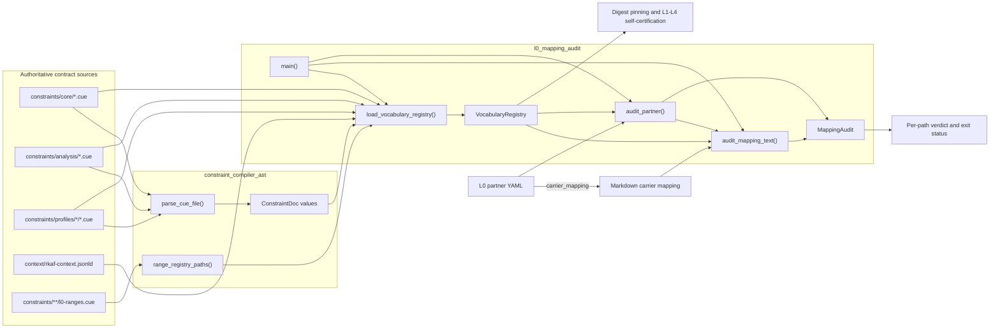
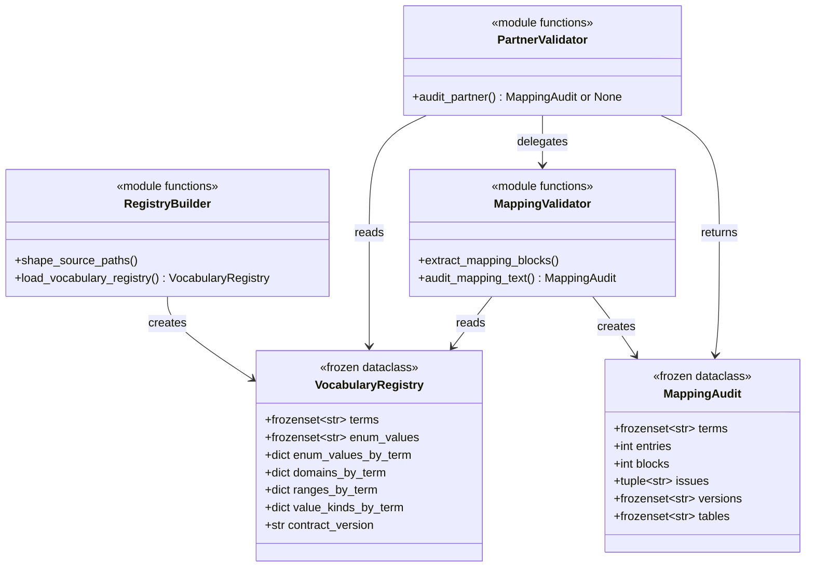
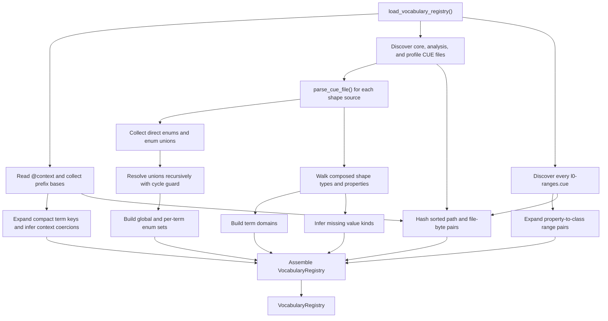
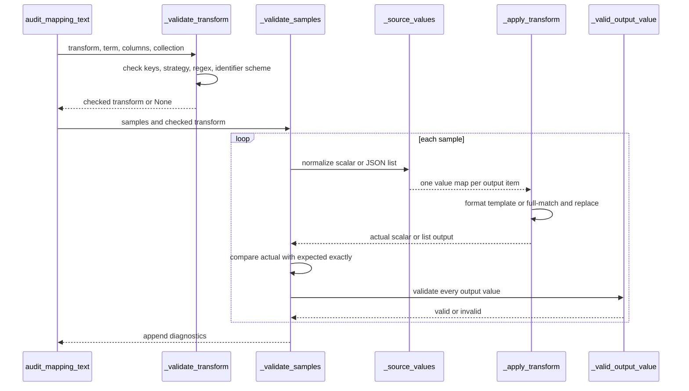
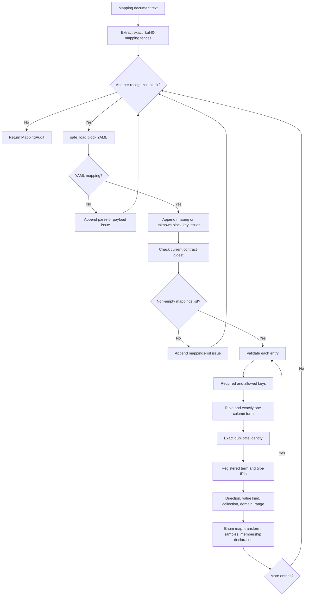
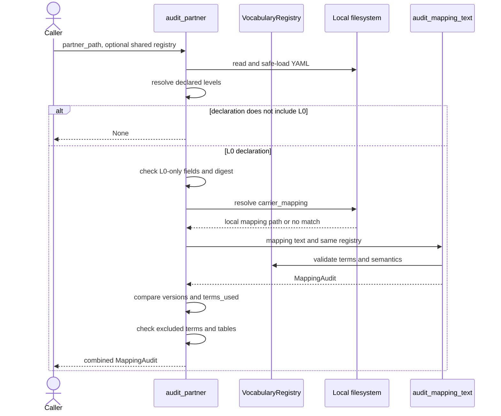
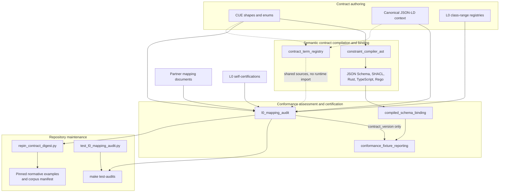

# L0 mapping audit

The `l0_mapping_audit` module verifies that mappings from non-JSON-LD carriers to the current Rulespec vocabulary claim no more than they prove. It builds a `VocabularyRegistry` from authoritative CUE shapes, the JSON-LD context, and relationship-range registries. It then audits fenced `yaml rkaf-l0-mapping` blocks and reconciles L0 partner self-certifications with their referenced mapping documents.

The source-tree implementation lives in [`tools/l0_mapping_audit.py`](../tools/l0_mapping_audit.py). [The conformance specification](../spec/rkaf-conformance.md#01-l0--vocabulary-normative) defines the normative L0 requirements; this page explains the code, data flow, extension points, and verification boundary.

## At a glance

| Question | Answer |
| --- | --- |
| What goes in? | Vocabulary-bearing CUE files from the kernel, analysis module, and domain profiles; the canonical JSON-LD context; every `l0-ranges.cue` registry; a Markdown mapping document or an L0 partner YAML declaration; and executable transform samples embedded in the mapping. |
| What happens? | The module derives registered terms, closed-enum values, property domains, class ranges, value kinds, and a content digest. It then parses mapping blocks, checks each entry, executes declared transforms against samples, and reconciles partner-level claims with the mapping. |
| What comes out? | A frozen `VocabularyRegistry`, a frozen `MappingAudit`, human-readable `[PASS]` or `[FAIL]` CLI output, and process status `0` for success or `1` for a reported path failure. A non-L0 partner returns `None` and is skipped. |
| How is it checked? | `tools/test_l0_mapping_audit.py` exercises mappings, transforms, enums, relationship direction, partner claims, and scope exclusions. It also audits every normative mapping block in `spec/rkaf-conformance.md`. `make test-audits` runs the focused suite and the no-argument repository audit. |

## Responsibilities and boundary

The module has four responsibilities:

1. Build one deterministic view of the vocabulary facts needed for L0 checks.
2. Audit one or more mapping blocks embedded in a Markdown document.
3. Audit an L0 self-certification and reconcile it with its local mapping file.
4. Provide a repository command that audits explicit paths or discovers checked-in L0 declarations.

The module does not:

- transform production rows or emit JSON-LD, Resource Description Framework (RDF), or another output carrier;
- read a carrier corpus, query a database, or prove that mapped columns exist;
- enforce `source_membership` against actual values or verify projected and excluded counts;
- validate L1-L4 JSON-LD conformance; see [Conformance fixture reporting](conformance_fixture_reporting.md);
- select generated JSON Schema bindings; see [Compiled schema binding](compiled_schema_binding.md);
- compile CUE or generate JSON Schema, Shapes Constraint Language (SHACL), Rust, TypeScript, or Rego; see [Constraint compiler AST](constraint_compiler_ast.md);
- use the generated Python `Term` registry as semantic authority; see [Contract term registry](contract_term_registry.md);
- fetch remote mappings or issue a central certification; or
- validate platform artifacts, release records, or release membership.

L0 is a parallel vocabulary-only path for tabular, SQL, Parquet, CSV, and other non-JSON-LD carriers. It is neither a prerequisite for L1 nor a reduced L1 check.

## Architecture and dependencies



The direct non-standard Python dependency is PyYAML. Registry construction also imports `ConstraintDoc`, `parse_cue_file()`, and `range_registry_paths()` from `constraints_compile.py`. The import has two forms so direct script execution can use `constraints_compile`, while unit tests importing `tools.l0_mapping_audit` can use `tools.constraints_compile`.

`l0_mapping_audit.py` is a repository tool, not a packaged console command in `rulespec-conformance`. Reusable installed-package code should not depend on it as a stable public API.

### Relationship to adjacent modules

| Module | Relationship to L0 mapping audit |
| --- | --- |
| [Constraint compiler AST](constraint_compiler_ast.md) | Direct dependency. L0 reuses `ConstraintDoc` and the CUE parser to read shapes and enum definitions, and it reuses the shared range-file discovery helper. |
| [Contract term registry](contract_term_registry.md) | Shares CUE and context sources but is not imported. `Term` provides authoring names; it does not supply the domains, ranges, closed enums, or value kinds needed for this audit. |
| [Compiled schema binding](compiled_schema_binding.md) | Parallel conformance path. Schema binding selects generated JSON Schema for L2 JSON-LD validation; L0 reads source constraints directly. |
| [Conformance fixture reporting](conformance_fixture_reporting.md) | Downstream digest consumer. The L1-L4 reporter calls `load_vocabulary_registry()` only to record `contract_version` in reference self-certification output. |
| [Semantic contract compilation and binding](semantic_contract_compilation_and_binding.md) | Parent documentation for the CUE model and generated term surface that supply part of the broader system context. |

## Core components



`frozen=True` prevents field reassignment, and the set and tuple fields are immutable. `VocabularyRegistry` still contains mutable dictionaries, although its enum and domain mappings contain `frozenset` values. Treat the full registry as read-only after construction.

### `VocabularyRegistry`

| Field | Meaning | Primary source |
| --- | --- | --- |
| `terms` | Full admitted term and class Internationalized Resource Identifiers (IRIs). | Compact term keys in the context plus CUE shape types and properties. |
| `enum_values` | Global set of all expanded CUE enum members. | Direct enums and recursively resolved enum unions. |
| `enum_values_by_term` | Closed members admitted for each constrained property. | Property enum references, list-inner enums, inline values, and enum-union references. |
| `domains_by_term` | Admitted subject classes for each property. | The type of each shape that declares the property. |
| `ranges_by_term` | Required related-node class for class-valued properties. | The union of all discovered `l0-ranges.cue` files. |
| `value_kinds_by_term` | Expected L0 representation: `iri`, `vocab`, `literal`, `number`, or `date`. | JSON-LD context coercion first, then CUE property structure when the context supplies no kind. |
| `contract_version` | `sha256:<64 lowercase hex>` identity of the exact L0 contract inputs. | Sorted source paths and file bytes. |

### `MappingAudit`

| Field | Meaning | Counting detail |
| --- | --- | --- |
| `terms` | Registered mapping terms collected after the entry passes key, table, and column validation. | A term can appear here even when a later domain, range, transform, or sample check fails; `issues` still makes the audit fail. |
| `entries` | Number of items encountered in every parsed, non-empty `mappings` list. | Non-mapping and otherwise invalid items still count. |
| `blocks` | Number of recognized, terminated mapping fences. | Invalid YAML inside a recognized fence still counts as a block. |
| `issues` | Ordered diagnostics accumulated during the audit. | An empty tuple is the programmatic pass condition. |
| `versions` | Syntactically valid `sha256:` versions encountered in mapping blocks. | A stale but correctly shaped digest remains in the set and also produces an issue. |
| `tables` | Non-empty table names reached after the entry key check. | The table can be retained even when a later column or semantic check fails; partner audit still fails because the issue remains. |

`MappingAudit` is evidence about the declaration, not a transformed dataset. It deliberately preserves counts and admitted names even when diagnostics exist so callers can report useful context with a failed result.

## Building the vocabulary registry

### Source discovery

`shape_source_paths()` selects vocabulary-bearing shape sources in deterministic order:

1. `constraints/core/*.cue`;
2. `constraints/analysis/*.cue`, when the directory exists; and
3. `constraints/profiles/*/*.cue`, when the profiles directory exists.

The function does not scan adversarial, AI-extraction, or platform CUE packages. Range registries are not parsed as shapes. `range_registry_paths()` recursively discovers every `l0-ranges.cue` beneath the selected `constraints/` root, with the kernel registry ordered before nested module and profile registries.

When a caller redirects `cue_dir` to a synthetic tree, the default analysis, profiles, and semantics paths derive from that tree's siblings. This prevents tests from silently mixing synthetic input with the real repository. Passing `profiles_dir=None` or `analysis_dir=None` explicitly disables that source family.

### Construction flow



The CUE parser resolves shape composition before L0 inspects the `ConstraintDoc`. Registry construction reads direct properties, properties required by conditional branches, and properties inside disjunction branches. See [Constraint compiler AST](constraint_compiler_ast.md) for the parser's supported CUE forms and composition behavior.

### Term expansion and value-kind inference

The context supplies prefix bases. `_expand()` leaves a full HTTP(S) IRI unchanged, expands a recognized `prefix:suffix`, and leaves an unrecognized compact value unchanged. Mapping documents themselves must use full HTTP(S) IRIs for terms and types; compact forms are accepted only while reading authoritative sources.

Context coercions take precedence over CUE inference:

| Source form | Registered L0 kind |
| --- | --- |
| Context `@type: "@id"` | `iri` |
| Context `@type: "@vocab"` | `vocab` |
| Context `@type: "xsd:date"` | `date` |
| Context numeric XML Schema type | `number` |
| Any other string-valued context `@type` | `literal` |
| CUE property with any closed enum | `vocab`, if the context supplied no kind |
| CUE property with `format: date` | `date`, if the context supplied no kind |
| CUE `int` or `float` property | `number`, if the context supplied no kind |
| Other CUE property | `literal`, if the context supplied no kind |

The module merges enum members and domains when the same term appears in several shapes. It assumes the upstream constraint and parity gates catch conflicting source declarations; it does not issue a separate conflict diagnostic while constructing these maps.

### Contract digest

`_contract_version()` hashes every path in sorted order. For each path, it adds:

1. the repository-relative POSIX path, or the absolute path when the file is outside the repository;
2. a null byte;
3. the exact file bytes; and
4. another null byte.

The resulting value is `sha256:<hex>`. The input set contains all selected kernel, analysis, and profile shape files, the canonical context, and all range registries. It excludes generated schemas, compiler code, fixtures, prose specifications, and partner mappings. A source rename therefore changes the digest even when the file bytes remain the same.

The digest identifies the contract used by an L0 claim; it is not the Rulespec package version or Git revision. `tools/repin_contract_digest.py` uses the same registry builder to update the checked-in normative examples and reference-corpus pin after compilation.

## Mapping document format

A mapping document can contain prose and unrelated code blocks. `extract_mapping_blocks()` recognizes only a non-indented, case-sensitive opening line that matches this exact info string:

````text
```yaml rkaf-l0-mapping
...
```
````

Spaces or tabs may separate `yaml` from `rkaf-l0-mapping`, and trailing horizontal whitespace is allowed. The closing fence must be exactly three backticks plus optional horizontal whitespace. An unterminated recognized fence is an issue. A document with no recognized fence is also an issue.

Each fence body is parsed with `yaml.safe_load()` and must contain exactly two top-level keys:

| Key | Rule |
| --- | --- |
| `rulespec_version` | Required `sha256:<64 lowercase hex>` string equal to `VocabularyRegistry.contract_version`. |
| `mappings` | Required non-empty YAML list. Each item is one mapping entry. |

Unknown keys are rejected at the block, entry, transform, sample, and `source_membership` levels. PyYAML's default loader does not report duplicate YAML keys; later values replace earlier values before this module sees the result.

The normative conformance page contains complete, executable examples. Link to [the carrier-mapping format](../spec/rkaf-conformance.md#carrier-mapping-format) and [worked L0 patterns](../spec/rkaf-conformance.md#worked-pattern--attestation-as-a-table) instead of copying those mappings into another document.

### Mapping entry fields

| Field | Required? | Validation and meaning |
| --- | --- | --- |
| `table` | Yes | Non-empty carrier-local string. The audit does not verify that the table exists. |
| `column` or `columns` | Exactly one | `column` is one non-empty string. `columns` is a non-empty, duplicate-free list of non-empty strings used by a composite transform. |
| `subject_type` | Yes | Full registered HTTP(S) IRI for the carrier row's Rulespec class. |
| `term` | Yes | Full registered HTTP(S) IRI for the mapped property. |
| `direction` | Yes | `forward` or `inverse`. It changes how domain and range are interpreted. |
| `value_kind` | Yes | `iri`, `vocab`, `literal`, `number`, or `date`, matching the registry. |
| `object_type` | Conditional | Full registered HTTP(S) IRI for the related node. Required for inverse mappings and whenever the range registry defines a class range. |
| `collection` | No | `scalar` by default or `json-list`. A `json-list` mapping must name exactly one source column. |
| `enum_map` | Conditional | Non-empty source-string to full-IRI mapping for a closed enum whose value kind is `iri` or `vocab`. |
| `transform` | Conditional | Either a non-empty Python format `template`, or a non-empty regex `pattern` plus string `replacement`. |
| `samples` | Conditional | Non-empty executable examples required by every valid transform. Each sample has exactly `input` and `output`. |
| `source_membership` | No | Exactly `table` and `column`, both non-empty strings. Valid only with one mapped source column. |

An entry must have all required keys and no unknown keys before deeper checks run. This early return limits cascading diagnostics when the basic shape is wrong.

### Duplicate identity

The implementation treats this tuple as a mapping's identity:

```text
(table, ordered columns tuple, term, direction)
```

An exact repeat produces an issue. The same column may map to a different term or appear in a mapping with the opposite direction. Because column order is significant, `columns: [a, b]` and `columns: [b, a]` do not collide.

### Direction, domain, and range

`subject_type` always describes the entity represented by the carrier row. `object_type` describes the related node. Direction determines which one occupies the property's declared domain and range:

| Direction | Emitted relationship | Domain checked against | Range checked against |
| --- | --- | --- | --- |
| `forward` | Carrier subject `--term-->` transformed value | `subject_type` | `object_type` |
| `inverse` | Transformed related node `--term-->` carrier subject | `object_type` | `subject_type` |

An inverse mapping always requires `object_type`. A forward mapping requires it when `ranges_by_term` defines a class range. The audit checks a domain only when CUE supplied at least one domain and checks a range only when an L0 range registry supplied one.

### Value strategies

| Strategy | Allowed kinds | What the audit proves |
| --- | --- | --- |
| Direct column | `literal`, `number`, or `date` | A `scalar` or one-column `json-list` declaration can pass when its kind matches the registry. No row value is inspected, and a direct `json-list` is not parsed. |
| `enum_map` | `iri` or `vocab` on a closed-enum term | Every target is a full HTTP(S) IRI, is globally registered, and belongs to that term's allowed set. |
| Template transform | Any registered kind | Every sample renders exactly and the rendered output has the declared kind. |
| Regex transform | Any registered kind | The pattern compiles, the one scalar string input matches in full, replacement runs, and each sample output is exact and has the declared kind. |

An `iri` mapping needs a transform with executable samples or an `enum_map`. A `vocab` mapping likewise needs an `enum_map` or executable transform. The audit permits both keys together, although one clear strategy is easier to review.

A transform is not a closed-enum membership check. If a term has a closed set and the mapping must preserve that set, use `enum_map`; transform output is checked only for its declared value shape.

### Transform and sample execution



Template transforms use Python `str.format_map()`. Every template receives all keys from `sample.input`:

- A one-column scalar sample also exposes the declared column's value as `{value}`.
- A multi-column scalar sample adds no `{value}` alias.
- A `json-list` sample accepts a Python/YAML list or a JSON-array string. For each item, it replaces the declared column's value in the template namespace, adds the `{value}` alias, and returns a list.
- Every sample input must include all declared source columns; extra keys remain allowed.

Regex transforms use Python regular expressions. They require one scalar source column, require a string input, call `re.fullmatch()` before replacement, and then call `re.sub()`.

For the five scheme-bearing identifier predicates, a transform must also declare a full-IRI `identifier_scheme` that belongs to the closed enum for that predicate's scheme property. Supplying `identifier_scheme` for any other term is an issue. The operative policy is the `IDENTIFIER_SCHEME_TERMS` map in the module.

Sample output kinds use these checks:

| Kind | Accepted sample output |
| --- | --- |
| `iri` | String matching a syntactic absolute IRI prefix such as `https:`, `urn:`, or another legal scheme, with no whitespace. |
| `vocab` | Full HTTP(S) IRI string. |
| `literal` | String. |
| `number` | Python `int` or `float`, excluding `bool`. |
| `date` | Real calendar date written exactly as `YYYY-MM-DD`. |

These are shape checks, not full IRI normalization, URL resolution, identifier grammar validation, or production-data validation.

### `source_membership`

`source_membership` records that a one-column mapping depends on membership evidence in another carrier table and column. The module checks only the declaration's structure. It does not load either table, compare values, verify non-null membership, or count included and excluded rows.

The normative L0 specification assigns those corpus-level checks to the implementation and its receipt. A mapping can therefore pass this tool while its production projection violates the declared membership rule. Maintainers should preserve that distinction in error messages, tests, and certification language.

## Mapping audit process



For values of the expected scalar shape, the audit accumulates independent issues instead of failing on the first semantic error. It stops deeper processing when continuing would produce misleading errors, such as after an entry has missing keys or an invalid column declaration. Some malformed YAML values are unhashable in Python and can instead raise `TypeError`; the failure model below records that boundary.

Diagnostics include the mapping fence's opening line, the one-based entry number, and the one-based sample number where relevant. YAML parser messages can add their own line and column positions.

## Partner self-certification audit

`audit_partner()` reads a YAML declaration and identifies whether it claims L0. It supports the current top-level `declared_levels` list and the older nested `declaration.conformance_level` form. When the resolved levels do not include `L0`, the function returns `None` without applying L0 rules.

### Required L0 claims

| Declaration field | Check |
| --- | --- |
| `declared_levels` or legacy nested level | Must resolve to exactly `['L0']`. An L0 declaration cannot also claim L1-L4. |
| `adoption_depth` | Must be absent at both the top level and inside `declaration`. |
| `rulespec_version` | Required current `sha256:<64 lowercase hex>` contract digest. |
| `test_corpus_version` | Required non-empty string. The tool does not independently prove that the value is immutable. |
| `carrier_mapping` | Required non-empty string resolving to a local file. |
| `terms_used` | Required list of strings; values must be unique full HTTP(S) IRIs and exactly equal the mapping's registered term set. |
| `results.L0` | Must equal `pass`. Other result keys are not evaluated by this function. |
| `excluded_terms` | Optional non-empty, duplicate-free list of registered terms that appear in neither `terms_used` nor the mapping. |
| `excluded_tables` | Optional non-empty, duplicate-free list of non-empty table names that the mapping does not cover. |

`audit_partner()` does not apply a closed top-level YAML schema and ignores unknown partner-level keys. Other tools may validate those fields.

### Interaction flow



### Mapping-path resolution

An absolute `carrier_mapping` is checked directly. A relative value is resolved in this order:

1. relative to the partner YAML's directory; then
2. relative to `repo_root`, which defaults to the Rulespec repository root.

The first existing regular file wins. Resolution does not fetch URLs or require the file to remain inside the repository. Tests can inject a temporary `repo_root`.

### Version and term reconciliation

After auditing the mapping, `audit_partner()` checks two exact set equalities:

- `mapping.versions` must equal the one-element set containing the declaration's `rulespec_version`; and
- the unique `terms_used` set must equal `mapping.terms`.

`audit_partner()` reports missing mapped terms separately from extra unmapped terms. It then checks `excluded_terms` against both term sets and `excluded_tables` against `mapping.tables`.

Omitting `excluded_terms` or `excluded_tables` makes no scope claim. Absence never means “all other terms or tables are excluded.”

## Command-line behavior

Run commands from the repository root with the supported Python environment.

```bash
# Print the current source-contract digest.
uv run --no-project --python 3.12 --with-requirements requirements.txt \
  python tools/l0_mapping_audit.py --print-contract-version

# Audit the executable normative mapping blocks directly.
uv run --no-project --python 3.12 --with-requirements requirements.txt \
  python tools/l0_mapping_audit.py spec/rkaf-conformance.md

# Audit one L0 partner declaration and its referenced mapping.
uv run --no-project --python 3.12 --with-requirements requirements.txt \
  python tools/l0_mapping_audit.py conformance/partners/<implementation>.yaml

# Discover checked-in L0 declarations.
uv run --no-project --python 3.12 --with-requirements requirements.txt \
  python tools/l0_mapping_audit.py
```

| Invocation | Dispatch |
| --- | --- |
| `--print-contract-version` | Builds the registry, prints its digest, and exits before auditing any supplied paths. |
| Explicit `.yaml` or `.yml` path | Calls `audit_partner()`. A non-L0 declaration is skipped. |
| Any other explicit file suffix | Reads the file as a mapping document and calls `audit_mapping_text()`. |
| No paths | Sorts `conformance/partners/*.yaml`, audits only declarations that include L0, and skips the rest. Auto-discovery does not include `.yml`. |

The CLI constructs one registry and reuses it for every path. A passing path prints its block, mapping, and unique-term counts. A failing path prints every accumulated issue. The final summary normally counts audited L0 paths; skipped non-L0 declarations do not enter the denominator. If auto-discovery finds no L0 declarations, a successful no-argument run reports `0/0 passed`.

The command returns `1` when an audited path fails or an explicit path does not exist, and `0` otherwise. `argparse` uses status `2` for invalid command syntax. A missing explicit path increments `failures` but not `audited`; the current summary can therefore report `-1/0 passed` for one missing path. Registry-loading errors, unexpected file-read errors, and some unhashable YAML entry values propagate instead of becoming `MappingAudit.issues`.

## Programmatic use

Build a registry once and reuse it when auditing several documents:

```python
from pathlib import Path

from tools.l0_mapping_audit import audit_mapping_text, load_vocabulary_registry

registry = load_vocabulary_registry()
result = audit_mapping_text(
    Path("spec/rkaf-conformance.md").read_text(),
    registry=registry,
)

if result.issues:
    raise ValueError("\n".join(result.issues))

print(result.blocks, result.entries, sorted(result.terms))
```

These source-tree functions carry no compatibility guarantee; use the CLI across repository or process boundaries. Tests that build a synthetic constraint tree should pass `cue_dir`, `context_path`, and any explicit sibling-directory overrides to `load_vocabulary_registry()` so synthetic CUE cannot mix with production sources.

## System integration



`tools/compile_all.sh` runs `repin_contract_digest.py` after recompiling the constraint targets. This keeps checked-in digest pins aligned with the source contract. External partner mappings are outside that script's fixed file list and must be repinned and re-audited by their owners.

The L0 audit runs under `make test-audits`. Despite the descriptive help text for `make test-conformance`, its current recipe runs the L1-L4 reporter; it does not invoke `l0_mapping_audit.py` directly.

## Failure model and known limits

### What a pass proves

A clean `MappingAudit` proves that the declaration is internally consistent with the registry built from the current local source tree:

- mapping fences and YAML have the recognized shape;
- block digests match the current source contract;
- declared terms and types are registered full HTTP(S) IRIs;
- value kinds, closed enums, known domains, known class ranges, and direction agree with the registry;
- declared transforms execute exactly for every supplied sample;
- identifier schemes are admitted where the code requires them;
- partner `terms_used`, versions, L0-only status, and optional carve-outs agree with the referenced mapping.

### What a pass does not prove

| Limit | Practical consequence |
| --- | --- |
| No production rows are loaded. | Column existence, nullability, value distribution, and transform behavior outside supplied samples remain untested. |
| `source_membership` is structural metadata only. | Corpus receipts must separately prove membership and projected/excluded counts. |
| IRI validation is regex-based. | The audit checks broad syntactic shape, not resolution, normalization, reachability, or identifier-family grammar. |
| Transform output for a closed enum is not checked for membership. | Use `enum_map` when membership is the claim. |
| `enum_map` checks listed targets but not source-domain completeness or one-to-one mapping. | Unlisted carrier values and several source values mapping to one target are outside this gate. |
| Templates can read undeclared sample-input keys. | A sample can pass while its template depends on a key not named by `column` or `columns`; reviewers must compare placeholders with declared sources. |
| YAML duplicate keys are not detected. | Reviewers should avoid duplicates; PyYAML retains only the later value. |
| Some wrong-shaped YAML values raise exceptions. | An unhashable list or mapping in a field checked by set membership, such as `direction`, `value_kind`, or `collection`, can raise `TypeError` instead of producing an issue string. |
| Domain and range checks depend on registry coverage. | If the registry contains no domain or range for a property, the audit skips the corresponding semantic check. |
| Partner YAML is not closed-schema validated. | Unknown top-level certification fields can coexist with the checked L0 fields. |
| `test_corpus_version` is only checked as a non-empty string. | Immutability and provenance belong to the producer's evidence, not this parser. |
| Mapping paths are local but not repository-confined. | A declaration can resolve an absolute file or a relative file outside the repository through `..`. |
| Errors are plain strings. | Programmatic callers have no structured issue code, severity, or source span beyond text locations. |

The focused tests cover the main semantic paths but do not directly exercise every parser and output-kind branch. In particular, malformed or unterminated fences, regex-transform rejection, and numeric/date sample failures need focused tests when those paths change.

### Common diagnostics

| Diagnostic theme | Check first |
| --- | --- |
| `no fenced ... blocks found` | Verify the opening fence is unindented and uses exactly `yaml rkaf-l0-mapping`. |
| `rulespec_version ... does not match` | Recompute the digest after syncing or recompiling the authoritative CUE, context, and range sources. |
| `unregistered vocabulary term` | Use a full IRI and confirm the term appears in the selected kernel, analysis, or profile CUE source or in the canonical JSON-LD context. |
| `value_kind ... does not match` | Check the context coercion first, then the CUE property type or enum. |
| `mapping domain` or `mapping range` | Recheck `direction`, `subject_type`, and `object_type` together. |
| `transform produced ... expected ...` | Run the exact Python template or regex against the sample input; list mappings return a list. |
| `identifier_scheme ... is not valid` | Use a member of the scheme enum associated with that identifier predicate. |
| `terms_used is missing` or `contains unmapped` | Rebuild `terms_used` as the unique full-IRI set returned in `MappingAudit.terms`. |
| Exclusion overlaps | Move a term or table to either mapped scope or excluded scope; it cannot appear in both. |

## Contribution guide

### Choose the owning source

| Change | Primary owner |
| --- | --- |
| L0 normative requirement or mapping meaning | `spec/rkaf-conformance.md` first. Keep implementation and executable examples aligned with the approved text. |
| Mapping grammar or audit policy | `tools/l0_mapping_audit.py`, with focused tests in `tools/test_l0_mapping_audit.py`. |
| CUE parsing, composition, enum extraction, or range discovery | `tools/constraints_compile.py`; follow [Constraint compiler AST](constraint_compiler_ast.md). |
| Vocabulary term, domain, closed enum, or source property type | The appropriate CUE kernel, analysis, or profile file. Regenerate derived targets. |
| JSON-LD coercion or prefix expansion | `context/rkaf-context.jsonld`, followed by semantic carrier and audit checks. |
| Class-valued property range | The owning `constraints/**/semantics/l0-ranges.cue` registry. |
| Self-certification field guidance | `conformance/self-certification.template.yaml` and the normative conformance specification. |

Keep each semantic fact in its authoritative CUE, context, or range source; the registry feeds those facts into L0 checks.

### Implementation checklist

When changing the module:

1. Start with a focused failing case in `tools/test_l0_mapping_audit.py`.
2. Update allowed and required key sets together with the corresponding validator.
3. Decide whether the new fact belongs in `VocabularyRegistry`, `MappingAudit`, or a separate input source.
4. Preserve synthetic-tree isolation when adding registry inputs. A redirected `cue_dir` must not load production siblings silently.
5. Add both a passing and a failing test for new transform, enum, direction, range, or partner behavior.
6. If the normative format changes, update `spec/rkaf-conformance.md`, `conformance/self-certification.template.yaml`, and `tools/README.md` in the same change.
7. If a contract source changes, run compilation so checked-in digest pins move with it.
8. Run the focused suite, direct normative audit, and repository audit gate.

### Local verification

```bash
# Focused red/green loop.
uv run --no-project --python 3.12 --with-requirements requirements.txt \
  python -m unittest tools.test_l0_mapping_audit -v

# Prove that every normative mapping example remains executable.
uv run --no-project --python 3.12 --with-requirements requirements.txt \
  python tools/l0_mapping_audit.py spec/rkaf-conformance.md

# After changing CUE, context, or range inputs: regenerate targets and digest pins.
make compile

# Run the broader audit group used by continuous integration.
make test-audits

# Before a high-impact contract change, run the full repository gate.
make test
```

The Makefile's default runner selects Python 3.12 and installs `requirements.txt` through `uv`. A bare system `python3` may not contain PyYAML or the repository's pinned dependencies.

### Review checklist

- Does the change preserve L0 as a non-JSON-LD vocabulary path rather than introduce hidden L1-L4 behavior?
- Does every new accepted field have a rejection test for missing, malformed, and unknown values where applicable?
- Do transforms include exact positive samples and at least one relevant failure case?
- Do domain and range tests cover both relationship directions when direction matters?
- Does a new identifier predicate update the scheme-policy map and its closed scheme enum?
- Does a new closed enum test both global registration and per-term membership?
- Do partner tests reconcile mapping versions, `terms_used`, tables, and exclusions?
- Did contract-source changes move the digest and repin the executable examples?
- Does the final verification distinguish mapping-declaration proof from carrier-data or end-to-end proof?

## Key implementation files

- [`tools/l0_mapping_audit.py`](../tools/l0_mapping_audit.py) — registry construction, mapping audit, partner audit, and CLI.
- [`tools/test_l0_mapping_audit.py`](../tools/test_l0_mapping_audit.py) — focused unit tests and executable normative-example gate.
- [`tools/constraints_compile.py`](../tools/constraints_compile.py) — `ConstraintDoc`, CUE parser, and range-registry discovery.
- [`spec/rkaf-conformance.md`](../spec/rkaf-conformance.md) — normative L0 requirements, mappings, evidence rules, and scope carve-outs.
- [`context/rkaf-context.jsonld`](../context/rkaf-context.jsonld) — prefix and value-coercion source.
- [`constraints/semantics/l0-ranges.cue`](../constraints/semantics/l0-ranges.cue) — kernel class-range registry; analysis modules and profiles can own additional registries under their own trees.
- [`conformance/self-certification.template.yaml`](../conformance/self-certification.template.yaml) — partner declaration template and L0 field guidance.
- [`tools/repin_contract_digest.py`](../tools/repin_contract_digest.py) — deterministic maintenance of checked-in contract pins.
- [`tools/README.md`](../tools/README.md#l0-carrier-mapping-audit) — concise operator commands.
- [`Makefile`](../Makefile) and [`.github/workflows/constraints-parity.yml`](../.github/workflows/constraints-parity.yml) — local and continuous-integration gates.
