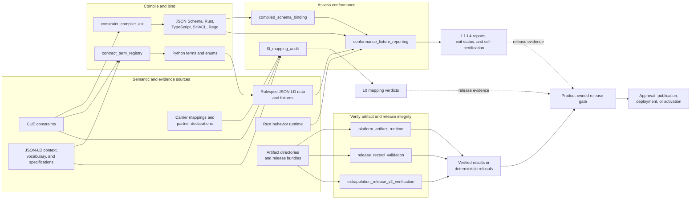
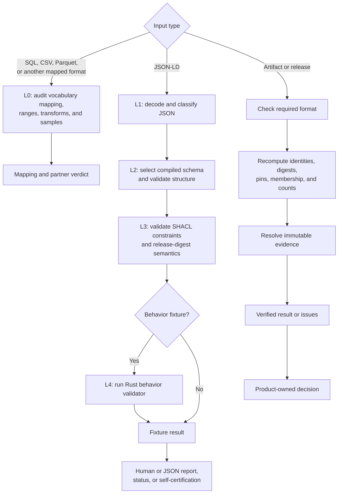

# Rulespec repository overview

## Purpose

Rulespec is a portable semantic and verification layer for software that uses legal, regulatory, and policy rules. It records a rule’s origin, authority, lifecycle, permitted uses, concepts, evidence, reference releases, and downstream effects.

The repository:

- Compiles authoritative CUE constraints into JSON Schema, Rust, TypeScript, Shapes Constraint Language (SHACL), and Rego.
- Exposes approved vocabulary terms to Python authors.
- Assesses non-JSON-LD mappings at L0 and JSON-LD data at L1–L4.
- Verifies immutable platform artifacts and release records before a product decides to publish, deploy, or activate them.

Rulespec does not acquire source documents, run product workflows, serve search, or make product release decisions.

## End-to-end architecture

The assessment paths remain distinct:

The term registry helps authors use approved names; it does not validate data. L0 audits non-JSON-LD mappings independently of the cumulative L1–L4 JSON-LD path. Integrity verification proves only the selected artifact or release format’s stated properties.

## Core module documentation

Area guides:

- [Semantic contract compilation and binding](/Users/mikewolfd/Work/rulespec/wiki/semantic_contract_compilation_and_binding.md)
- [Conformance assessment and certification](/Users/mikewolfd/Work/rulespec/wiki/conformance_assessment_and_certification.md)
- [Artifact and release integrity](/Users/mikewolfd/Work/rulespec/wiki/artifact_and_release_integrity.md)

| Core module | Implementation | Documentation |
|---|---|---|
| `constraint_compiler_ast` | [constraints_compile.py](/Users/mikewolfd/Work/rulespec/tools/constraints_compile.py) | [Constraint compiler AST](/Users/mikewolfd/Work/rulespec/wiki/constraint_compiler_ast.md) |
| `contract_term_registry` | [_term.py](/Users/mikewolfd/Work/rulespec/src/rulespec_conformance/contract/_term.py) | [Contract term registry](/Users/mikewolfd/Work/rulespec/wiki/contract_term_registry.md) |
| `compiled_schema_binding` | [conformance_lib.py](/Users/mikewolfd/Work/rulespec/src/rulespec_conformance/conformance_lib.py) | [Compiled schema binding](/Users/mikewolfd/Work/rulespec/wiki/compiled_schema_binding.md) |
| `conformance_fixture_reporting` | [conformance_report.py](/Users/mikewolfd/Work/rulespec/tools/conformance_report.py) | [Conformance fixture reporting](/Users/mikewolfd/Work/rulespec/wiki/conformance_fixture_reporting.md) |
| `l0_mapping_audit` | [l0_mapping_audit.py](/Users/mikewolfd/Work/rulespec/tools/l0_mapping_audit.py) | [L0 mapping audit](/Users/mikewolfd/Work/rulespec/wiki/l0_mapping_audit.md) |
| `platform_artifact_runtime` | [_artifact.py](/Users/mikewolfd/Work/rulespec/packages/rulespec-artifacts/src/rulespec_artifacts/_artifact.py) | [Platform artifact runtime](/Users/mikewolfd/Work/rulespec/wiki/platform_artifact_runtime.md) |
| `release_record_validation` | [rulespec_release.py](/Users/mikewolfd/Work/rulespec/tools/rulespec_release.py) | [Release record validation](/Users/mikewolfd/Work/rulespec/wiki/release_record_validation.md) |
| `extrapolation_release_v2_verification` | [extrapolation_release_v2.py](/Users/mikewolfd/Work/rulespec/tools/extrapolation_release_v2.py) | [Extrapolation release v2 verification](/Users/mikewolfd/Work/rulespec/wiki/extrapolation_release_v2_verification.md) |

The main verification entry points are `make compile`, `make test-audits`, `make test-conformance`, and the complete `make test` gate.