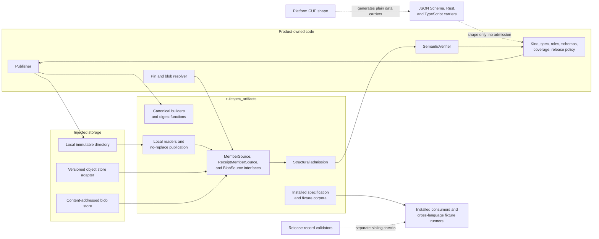
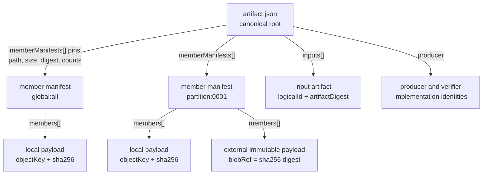
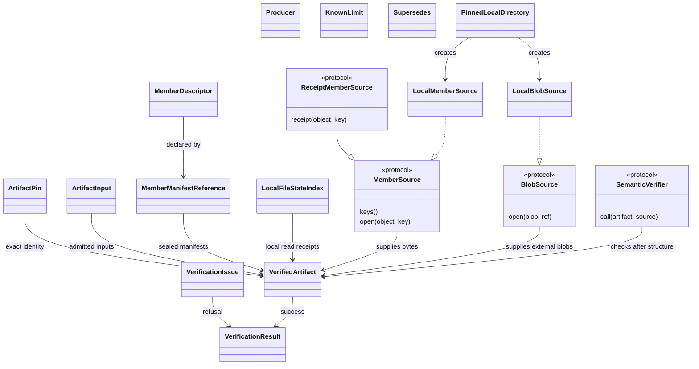
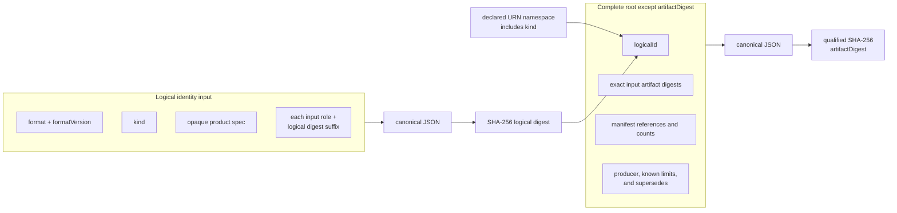
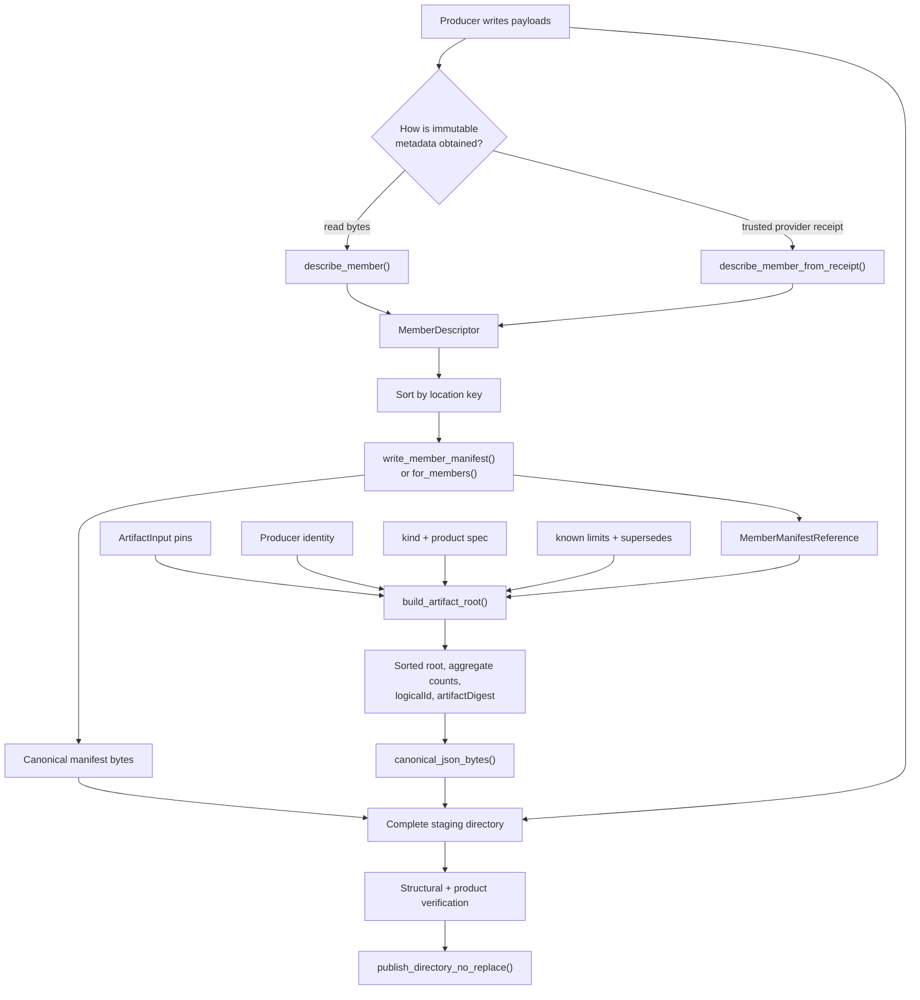
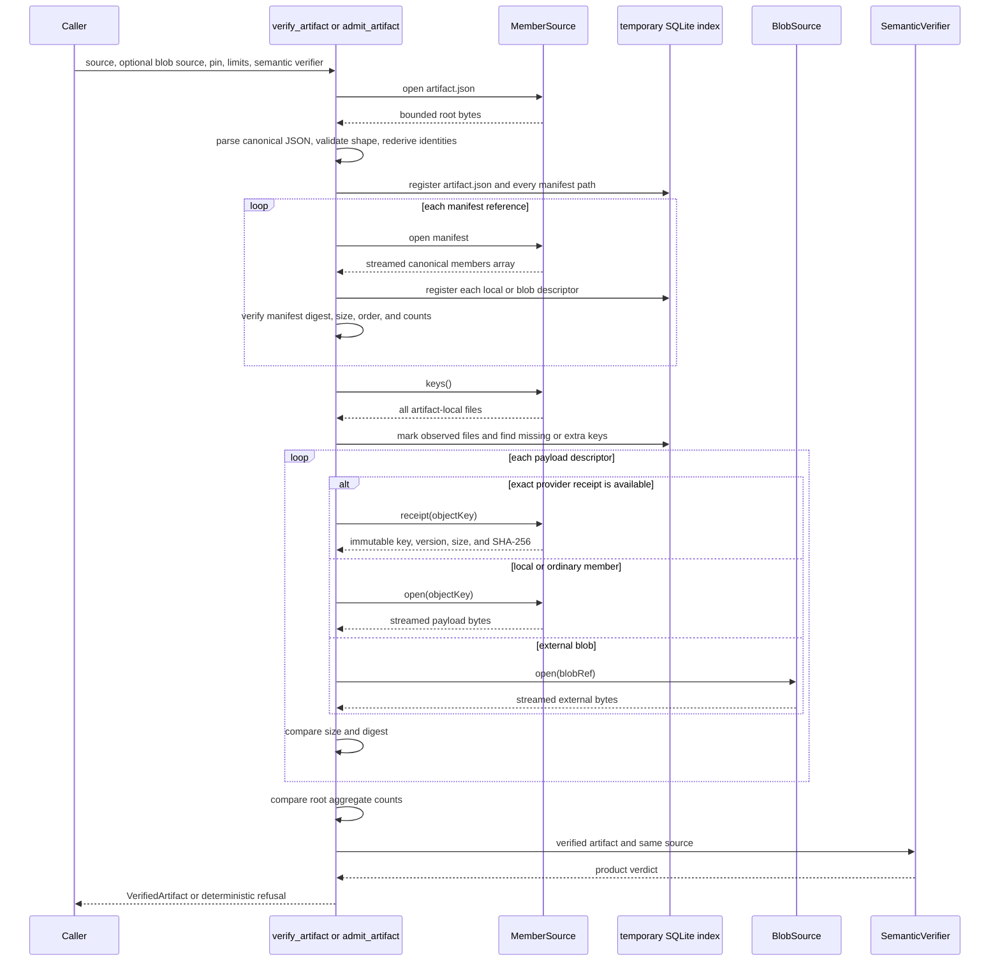
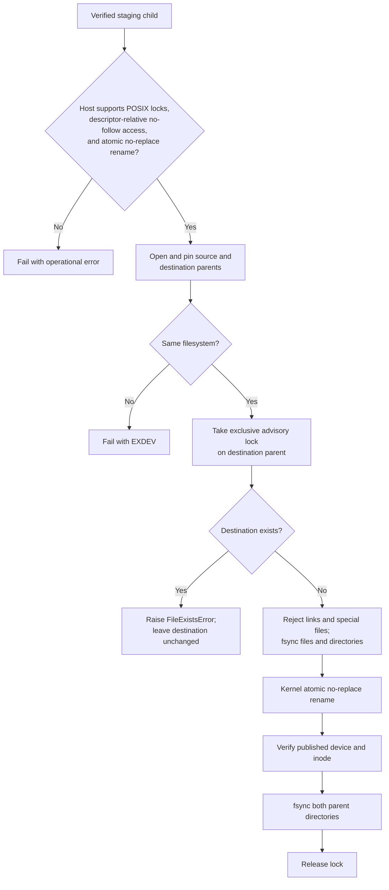

# Platform artifact runtime

The `platform_artifact_runtime` module is Rulespec's product-neutral runtime for building, identifying, verifying, and safely publishing immutable platform artifacts. It defines the common byte format and checks that an artifact's root, manifests, declared membership, payload digests, counts, and external pin all agree before product code can use the artifact.

The runtime lives in the standalone [`rulespec_artifacts` package](../packages/rulespec-artifacts/src/rulespec_artifacts/_artifact.py). Products provide storage access and semantic checks through small interfaces. The runtime does not know product kinds, catalog rules, document models, regulations, search indexes, or graph semantics. The [Rulespec platform-artifact specification](../spec/platform-artifacts.md) is normative; this page explains the implementation and contribution workflow.

## At a glance

| Question | Answer |
| --- | --- |
| What goes in? | Product metadata, exact input pins, payload descriptors, sealed member manifests, an injected `MemberSource`, and, when needed, a `BlobSource`, an expected `ArtifactPin`, and a product `SemanticVerifier`. |
| What happens? | The builder creates deterministic canonical JSON and two identities. The verifier checks canonical bytes, closed shapes, identities, manifests, exact membership, safe paths, sizes, SHA-256 digests, counts, and optional product semantics. |
| What comes out? | Construction returns canonical root and manifest data. Admission returns a `VerifiedArtifact`; result-style verification returns a `VerificationResult` containing either that artifact or one deterministic `VerificationIssue`. |
| How is it checked? | Package tests cover canonicalization, identity, manifests, receipts, external blobs, filesystem races, publication, and relation helpers. Packaged golden corpora and isolated-wheel tests check byte compatibility, structural diagnostics, public resources, and the artifact-only dependency boundary. |

## Responsibilities and boundary

The runtime owns the rules that every participating product must apply identically:

- canonical JSON encoding and byte-exact parsing;
- logical and physical artifact identity;
- root and member-manifest construction;
- portable object-key validation;
- exact local membership and external blob verification;
- bounded root, manifest, and payload reads;
- aggregate member, byte, record, and manifest counts;
- common diagnostic codes;
- provider-neutral source interfaces;
- local no-follow reads and immutable file-state capture;
- same-filesystem, durable, no-replace directory publication;
- shared framed-section, canonical-set, and schema-family digests; and
- optional structural rules for derivation and composition relationships.

Product code retains ownership of:

- the root `kind` and the closed meaning of its `spec` object;
- allowed producer and verifier identities;
- required input and member roles;
- payload schemas, record formats, coverage, completeness, and domain invariants;
- resolution from artifact pins or blob digests to storage;
- object-store credentials, authorization, retries, and version selection;
- mutable current pointers and succession policy; and
- release-record and product publication decisions.

Passing structural verification proves that the admitted bytes form one internally consistent platform artifact. It does not certify product meaning, authorize publication, validate a release record, or move a current pointer.

## System context and dependencies



The package uses only Python's standard library. Its physical dependencies are files or provider adapters supplied by callers. It has no RDF, JSON-LD, SHACL, catalog, database-service, cloud-provider, or network client dependency. SQLite is an internal, temporary exact-membership index, not a product database.

The generated platform types are plain data carriers. They can deserialize the root shape, but they do not canonicalize bytes, derive identity, prove membership, or hash payloads. See [Constraint compiler AST](constraint_compiler_ast.md#target-behavior) for the source-to-carrier path and [Compiled schema binding](compiled_schema_binding.md#discovery-inputs) for why platform schemas do not enter JSON-LD L2 dispatch.

Release records form a sibling integrity layer. [Release record validation](release_record_validation.md) and [Extrapolation release v2 verification](extrapolation_release_v2_verification.md) validate their own canonical records, release pins, and domain rules; neither check should be substituted for platform-artifact admission. Their companion pages are pending in this wiki; [`rulespec_release.py`](../tools/rulespec_release.py) and [`extrapolation_release_v2.py`](../tools/extrapolation_release_v2.py) remain the live references.

### Package surface

| File | Role |
| --- | --- |
| [`rulespec_artifacts/_artifact.py`](../packages/rulespec-artifacts/src/rulespec_artifacts/_artifact.py) | Canonical bytes, data records, source interfaces, construction, admission, local filesystem adapters, and publication. |
| [`rulespec_artifacts/__init__.py`](../packages/rulespec-artifacts/src/rulespec_artifacts/__init__.py) | Public re-export surface and package version. |
| [`rulespec_artifacts/resources.py`](../packages/rulespec-artifacts/src/rulespec_artifacts/resources.py) | Access to the installed specification, structural fixture corpus, canonical JSON corpus, and named fixture directories. |
| [`tools/platform_artifact.py`](../tools/platform_artifact.py) | Source-checkout compatibility shim. Reusable code should import `rulespec_artifacts` directly. |
| [`packages/rulespec-artifacts/pyproject.toml`](../packages/rulespec-artifacts/pyproject.toml) | Standalone wheel metadata and package-data inclusion. |

The full `rulespec-conformance` package depends on an exact compatible `rulespec-artifacts` release and exposes the packaged specification and fixtures through its contract resources. An artifact-only consumer installs the smaller package and does not acquire the graph-conformance stack.

## Artifact structure

One artifact is a closed local directory or object-store prefix. The root names every manifest; each manifest names every payload member in its scope. A member either lives inside the artifact under an `objectKey` or outside it under a digest-valued `blobRef`.



`artifact.json` has exact required fields and only two optional fields: `knownLimits` and `supersedes`. `spec` remains opaque to the common runtime, but it must be a canonical JSON object. Root fields, input entries, producer records, known-limit entries, succession records, manifest references, and member descriptors use closed field sets; unknown fields fail structural admission.

Format 1.0 limits the root to 1 MiB and each manifest to 64 MiB. Manifests contain a streamed canonical `members` array, and payload reads use 1 MiB chunks. The API accepts custom admission limits so a caller can impose a lower operational bound. A format 1.0 consumer must not raise the normative limits.

### Ordering and closure invariants

The runtime uses unsigned UTF-16 code-unit order wherever the format requires string sorting. Python's default Unicode ordering is not the format authority.

| Collection | Required order and uniqueness |
| --- | --- |
| Root `inputs` | Sorted and distinct by `(role, logical digest suffix)`. |
| Root `memberManifests` | Sorted and distinct by `(scopeKind, scopeId, objectKey)`. |
| Root `knownLimits` | Nonempty when present; sorted and distinct by `(scope, code)`. |
| `KnownLimit.evidenceDigests` | Nonempty, sorted, and distinct. Every value resolves to an exact input artifact digest or member digest. |
| Manifest `members` | Sorted and distinct by `(location kind, location value)`, where the kind is `object-key` or `blob-ref`. Location keys are also unique across all manifests. |
| `DerivationRelation.expectedOutputRoles` | Nonempty, sorted, and distinct. |
| `CompositionRelation.totalOrderKey` | Nonempty and distinct; declared order is meaningful and is preserved. |

Protocol files and payloads share one local namespace. `artifact.json`, every manifest path, and every local payload path must be unique. `MemberSource.keys()` must enumerate the complete artifact-local file set so the verifier can reject both missing and extra files. External blobs are outside that membership set.

## Component model



### Identity, provenance, and lifecycle records

| Component | Purpose | Important behavior |
| --- | --- | --- |
| `ArtifactPin` | Names one declared `logicalId` and exact `artifactDigest`. | Callers can pass it as `expected_pin` so admission refuses a different materialization. |
| `ArtifactInput` | Binds an input role to an exact upstream pin. | `logicalId` must be absolute and end in a 64-character digest; `artifactDigest` is a qualified SHA-256 value. |
| `Producer` | Records immutable publisher and verifier identities. | Both implementation IDs must contain a published SHA-256 digest or a full Git object ID. Structural admission validates syntax; product policy decides whether to trust the identities. |
| `KnownLimit` | Attaches an artifact-specific limitation and its evidence. | Evidence digests must resolve within the admitted artifact or its exact inputs. The record affects physical identity, not logical identity. |
| `Supersedes` | Names an exact predecessor and explains the replacement. | Structural checks validate its closed shape and digest syntax. Product pointer logic must resolve the predecessor and prove series continuity. |

### Manifests and member records

| Component | Purpose | Important behavior |
| --- | --- | --- |
| `MemberDescriptor` | Describes one payload's role, media type, size, optional record count and schema ID, and one location. | A local descriptor has `objectKey` and `sha256`; an external descriptor has `blobRef`. It cannot have both forms or neither. |
| `MemberManifestReference` | Pins one canonical manifest and repeats its aggregate accounting in the root. | `for_members()` sorts a finite sequence and returns both the reference and bytes. Direct `write_member_manifest()` accepts a pre-sorted iterable and streams it. |
| `FramedSection` | Names one counted iterable for `framed_section_digest()`. | The digester frames each section name, count, and canonical record length without materializing a corpus array. It refuses duplicate section names and count mismatches. |

`describe_member()` reads and hashes a local producer-written payload through a `MemberSource`. `describe_member_from_receipt()` validates caller-supplied immutable metadata without rereading bytes; it does not contact a provider or prove that the receipt came from one. Admission independently checks the member against bytes or a `ReceiptMemberSource`.

### Sources and local adapters

| Component | Purpose | Important behavior |
| --- | --- | --- |
| `MemberSource` | Lists and opens immutable files inside the artifact. | `keys()` defines exact local membership. `open()` returns a binary context manager. |
| `ReceiptMemberSource` | Adds exact object-store metadata for payload verification. | `receipt()` returns an `ImmutableMemberReceipt`. Root and manifests still open as bytes. |
| `ImmutableMemberReceipt` | Holds provider-issued object key, size, SHA-256, and immutable version ID. | The version must be non-null, nonempty, and contain no whitespace. The adapter must bind later reads to that same provider version. |
| `BlobSource` | Opens an external payload by its qualified content digest. | External members are always streamed and rehashed during admission. |
| `LocalMemberSource` | Implements safe local directory traversal. | It pins directory identity, refuses links and special files, opens paths relative to descriptors, and checks each file before, after, and after reopening it. |
| `LocalBlobSource` | Resolves `sha256:<hex>` to `sha256/<hex>` below a local root. | It verifies the content address on every open before yielding the same checked stream. |
| `PinnedLocalDirectory` | Pins a real parent directory and creates contained child artifact or blob sources. | It can also publish or move one named child through descriptor-relative operations. |
| `LocalFileState` | Captures device, inode, size, timestamps, and mode observed during hashing. | It supports later same-file checks without claiming that pathname alone proves identity. |
| `LocalFileStateIndex` | Exposes local file states from the temporary SQLite membership index. | It keeps memory bounded for large artifacts. Call `close()` when the retained index is no longer needed. |

`MemberNotFoundError` reports deterministic absence. Admission converts it to `invalid.membership-missing`. `MemberSourceError` reports storage or operating-system failure; it normally propagates so an outage is not mislabeled as invalid artifact data.

### Verification records and extension point

| Component | Purpose | Important behavior |
| --- | --- | --- |
| `VerifiedArtifact` | Exposes the parsed root, exact pin, inputs, manifests, aggregate counts, and optional local file states after structural admission. | The dataclass is frozen, but its nested `root` mapping is not recursively immutable. Treat it as read-only. |
| `SemanticVerifier` | Lets a product apply domain rules after common structural admission. | It receives the verified artifact and the same `MemberSource`; it should reuse `iter_member_descriptors()` instead of inventing another manifest parser. |
| `VerificationIssue` | Records one deterministic failure as `code`, `path`, and `message`. | Its string form is stable and human-readable. |
| `VerificationResult` | Represents result-style admission. | A success has `artifact` and no issues; a refusal has no artifact and the first issue. Its `code` property returns `valid` or that issue's code. |

`verify_artifact()` catches `ArtifactVerificationError` and returns a `VerificationResult`. `admit_artifact()` exposes the same checks but raises that error on refusal. Operational source errors, unexpected product-verifier exceptions, and programming errors propagate from both entry points.

## Canonical bytes and identity

The runtime admits a restricted JSON domain: null, booleans, valid Unicode strings, arrays, objects with string keys, and integers in the JSON-safe range from `-(2^53-1)` through `2^53-1`. It forbids binary floating-point values, non-finite values, duplicate keys, lone Unicode surrogates, a UTF-8 byte order mark, and noncanonical whitespace or escaping.

`canonical_json_bytes()` encodes values. `parse_canonical_json()` parses and then re-encodes input, refusing any byte sequence that differs from the canonical result. Because canonical bytes define identity, an encoder change that changes admitted bytes or refusal boundaries requires a new format major, not only a package patch.



The identities answer different questions:

- `logicalId` asks whether two publications describe the same product-defined logical state. Its digest includes the format, exact format version, kind, opaque `spec`, and each input's role and logical digest. It excludes storage, exact upstream materialization, producer evidence, known limits, succession evidence, manifests, and payload packaging.
- `artifactDigest` asks whether two roots describe the same exact materialization and publication evidence. It hashes the complete canonical root with only `artifactDigest` omitted.

The logical ID namespace must be an absolute URN ending in `:` and containing the kind. The namespace itself does not enter the logical digest. `build_artifact_root()` defaults it to `urn:spicy:artifact:<kind>:`; callers may supply another valid namespace.

Other public digest helpers cover narrower, reusable cases:

| Function | Use |
| --- | --- |
| `sha256_digest()` | Hash raw bytes or canonical JSON and return `sha256:<hex>`. |
| `CanonicalSetDigester` | Stream a sorted, duplicate-free text set into the digest of one canonical JSON array. |
| `framed_section_digest()` | Stream ordered, counted canonical record sections with unambiguous binary framing. |
| `schema_bundle_digest()` | Hash a closed JSON Schema family after removing only top-level `$id` values and rewriting contained relative `$ref` targets into one `$defs` object. |
| `expected_logical_digest()` / `expected_logical_id()` | Recompute logical identity. |
| `expected_artifact_digest()` | Recompute physical identity with self-reference removed. |
| `stamp_root()` | Copy a root, derive both identities, and validate the result. |

## Construction data flow

The construction API keeps manifest and root assembly in one implementation. Product publishers write payloads and choose product meaning; the runtime derives portable descriptors, manifest accounting, ordering, and identities.



The expected producer order is:

1. Write immutable payloads into a private staging location or obtain exact provider receipts.
2. Create one `MemberDescriptor` for each payload.
3. Seal each sorted descriptor stream with `write_member_manifest()`. The function spools the descriptor array after 1 MiB by default, computes counts while streaming, writes counts before the array in canonical key order, and returns the manifest reference.
4. Pass all sealed references to `build_artifact_root()`. The builder sorts inputs, manifests, and known limits; derives aggregate counts; stamps both identities; and validates the result.
5. Write the returned mapping as `canonical_json_bytes(root)` to `artifact.json`.
6. Run structural admission and the owning product's semantic build gate against the complete staged artifact.
7. Publish through the product's immutable storage operation. For a same-filesystem local directory, use `publish_directory_no_replace()`.

`build_artifact_root()` returns a mapping; it does not write files or publish anything. `MemberManifestReference.for_members()` is convenient for a bounded in-memory sequence because it returns manifest bytes. For large or one-pass descriptor streams, call `write_member_manifest()` with an already sorted iterator and an output stream.

### Minimal local construction

```python
from pathlib import Path

from rulespec_artifacts import (
    ROOT_OBJECT_KEY,
    LocalMemberSource,
    MemberManifestReference,
    Producer,
    build_artifact_root,
    canonical_json_bytes,
    describe_member,
)

staging = Path("build/example-artifact")
payload_path = staging / "records/items.jsonl"
payload_path.parent.mkdir(parents=True, exist_ok=True)
payload_path.write_bytes(b'{"id":"one"}\n')

source = LocalMemberSource(staging)
member = describe_member(
    source,
    object_key="records/items.jsonl",
    role="records",
    media_type="application/jsonl",
    record_count=1,
)
manifest, manifest_bytes = MemberManifestReference.for_members(
    scope_kind="global",
    scope_id="all",
    object_key="manifests/all.json",
    members=(member,),
)

manifest_path = staging / manifest.object_key
manifest_path.parent.mkdir(parents=True, exist_ok=True)
manifest_path.write_bytes(manifest_bytes)

root = build_artifact_root(
    kind="example-index",
    spec={"schemaDigest": "sha256:" + "3" * 64},
    producer=Producer(
        product="example",
        implementation_id="git:https://example.test/example@" + "1" * 40,
        verifier_id="urn:example:artifact-verifier",
        verifier_version="1.0.0",
        verifier_implementation_id=(
            "pkg:pypi/example-verifier@1.0.0?checksum=sha256:" + "2" * 64
        ),
    ),
    manifests=(manifest,),
)
(staging / ROOT_OBJECT_KEY).write_bytes(canonical_json_bytes(root))
```

The example demonstrates byte assembly only. A production publisher must also run its semantic verifier, use accepted immutable implementation identities, keep staging private until verification succeeds, and publish through its approved storage boundary.

## Admission and component interaction

Both public admission functions call the same internal `_admit()` pipeline. The verifier fails at the first deterministic issue, which makes diagnostics stable and prevents product logic from seeing partially admitted data.



### Admission stages

1. Read `artifact.json` within the root byte limit.
2. Require canonical JSON, the exact `spicy-artifact` format and `1.0` format version, closed root fields, and valid common records.
3. Recompute `logicalId` and `artifactDigest`; compare an optional external `ArtifactPin`.
4. Create a temporary SQLite index containing protocol paths and every streamed descriptor. A caller can place the database in `scratch_directory`; the verifier removes the temporary path after use.
5. Stream each manifest. Check framing, canonical member entries, location order, uniqueness, byte size, SHA-256, and manifest accounting.
6. Resolve every known-limit evidence digest to an input artifact or member.
7. Enumerate `MemberSource.keys()` once. Reject the first missing or lexically smallest extra local file.
8. Verify every payload. Use exact immutable receipt metadata only when the source implements `ReceiptMemberSource`; otherwise read and hash bytes. External blobs always require an injected `BlobSource` and byte verification.
9. Recompute root aggregate counts from admitted manifests and members.
10. Build `VerifiedArtifact`. A local source transfers the SQLite connection into `LocalFileStateIndex` so the result can expose captured file states without loading them all into memory.
11. Run the optional `SemanticVerifier` only after every common check succeeds.

The root and manifests always pass through byte verification. Provider receipts can replace only a local payload download performed solely to compare size and SHA-256. The artifact format does not store provider version IDs; the adapter must ensure that its receipt, open operation, and later product reads refer to the same immutable provider version.

### Result-style admission

```python
from pathlib import Path

from rulespec_artifacts import LocalFileStateIndex, LocalMemberSource, verify_artifact

result = verify_artifact(LocalMemberSource(Path("artifacts/example")))
if result.artifact is None:
    issue = result.issues[0]
    raise RuntimeError(f"artifact refused: {issue}")

artifact = result.artifact
states = artifact.local_member_states
try:
    print(artifact.pin.logical_id, artifact.member_count)
finally:
    if isinstance(states, LocalFileStateIndex):
        states.close()
```

Use `admit_artifact()` when refusal should raise `ArtifactVerificationError` directly. Use `verify_artifact()` at report or service boundaries that need a stable result record.

## Local filesystem safety and publication

The local adapter treats pathnames as untrusted lookup hints. `PinnedLocalDirectory` and `LocalMemberSource` establish directory identity from open file descriptors, reopen pinned directories by device and inode, and traverse children with descriptor-relative, no-follow operations. `LocalMemberSource.keys()` rejects symbolic links and special files. `open()` compares the file's state before reading, after reading, and after reopening the same key.

This design detects path replacement and in-read mutation, but it is not an authorization boundary against a hostile process with permission to rewrite the entire tree. Deployments separate mutually untrusted writers with operating-system accounts, filesystem permissions, or storage credentials.



`publish_directory_no_replace()` supports macOS through `renameatx_np` and Linux through `renameat2`. Unsupported systems fail closed. Publication requires source and destination on the same filesystem. It never overwrites an existing destination.

The lower-level functions serve callers that already hold pinned directory descriptors:

- `publish_child_directory_no_replace()` performs the durability pass, advisory locking, conditional rename, identity check, and parent sync;
- `move_child_directory_no_replace()` performs only the atomic no-replace move and identity check, which suits safe transaction cleanup; and
- matching `PinnedLocalDirectory` methods reopen and verify pinned parents before calling those operations.

An advisory lock coordinates only cooperating writers that use this API. The kernel no-replace rename remains the final authority.

## Product semantic checks and relation helpers

The `SemanticVerifier` boundary keeps product meaning outside the common reader. A verifier can inspect `artifact.root["spec"]`, producer identities, inputs, roles, schemas, coverage receipts, and member contents. It should run before product use and should not repeat canonicalization, membership, path, size, or digest work.

Use `iter_member_descriptors()` to re-stream descriptors from already verified manifests. This second pass rechecks manifest framing, bytes, and counts, so product code receives the same descriptor interpretation as structural admission.

The module provides two opt-in relation records:

- `DerivationRelation` binds processor, policy, parameters, partitioning, and expected output-role identities. `validate_derivation_relation()` requires at least one input, at least one output member, and an exact match between observed member roles and `expectedOutputRoles`.
- `CompositionRelation` binds merge-policy identity and a declared total-order key. `validate_composition_relation()` requires at least one input and requires every input role to equal `member`.

These helpers do not dispatch on root `kind` and do not reserve `derivation` or `composition` as kinds. They enforce only the shared rules listed above. A product must still validate its relation's placement in `spec`, input compatibility, output meaning, ordering, reference-only policy, and product-specific receipts.

## Failure model

Structural verification uses a closed diagnostic vocabulary. `_fail()` rejects undeclared common codes, which prevents accidental diagnostic drift.

| Code | Refusal category |
| --- | --- |
| `invalid.root-syntax` | Root bytes are invalid JSON, noncanonical, outside the canonical value domain, or otherwise syntactically inadmissible. |
| `invalid.format` | `format` or exact `formatVersion` is unsupported. |
| `invalid.identity` | Logical identity, physical identity, or an external pin differs. |
| `invalid.path` | A key escapes portable relative-path rules, traverses a link or non-directory, names a special file, or violates a pinned local root. |
| `invalid.manifest` | Manifest framing, canonical entries, ordering, uniqueness, size, digest, or reference agreement fails. |
| `invalid.membership-missing` | A declared root, manifest, local payload, or required external payload is absent. |
| `invalid.membership-extra` | The artifact-local source enumerates an undeclared file. |
| `invalid.member-digest` | Payload receipt, byte size, SHA-256, content address, or stable local file state differs. |
| `invalid.schema` | A closed common record has missing, unknown, malformed, unordered, duplicated, or inconsistent fields. Shared relation helper failures also use this code. |
| `invalid.statistics` | Manifest or root aggregate counts differ from observed members. |
| `invalid.limit` | A root or manifest exceeds the active bounded-read limit. |

The runtime distinguishes invalid artifacts from unavailable storage:

- `ArtifactVerificationError` carries a deterministic `VerificationIssue` and becomes a result refusal in `verify_artifact()`.
- `MemberNotFoundError` is an operational source signal that admission normalizes to a missing-membership issue.
- `MemberSourceError`, `OSError`, lock contention, and unsupported filesystem operations propagate as operational failures.
- `FileExistsError` from publication means the immutable destination already exists and remains unchanged.

The verifier reports one issue because it stops at the first failure. Consumers should branch on `issue.code`; `path` and `message` provide precise evidence for people and logs.

## Performance and resource behavior

The implementation keeps verification memory bounded by file and chunk limits rather than corpus size:

- the root is read into memory only within `root_byte_limit`;
- manifests stream through `_CanonicalArrayStream` one descriptor at a time;
- manifest construction spools descriptor bytes to disk after `spool_bytes`;
- payloads and external blobs hash in fixed-size chunks;
- exact membership, descriptor metadata, observations, and local file states live in temporary SQLite; and
- `framed_section_digest()` and `CanonicalSetDigester` accept ordered streams.

The verifier still performs work proportional to the number and total bytes of members unless exact immutable provider receipts avoid local payload downloads. Semantic verification may add another manifest or payload pass. Callers should choose a scratch directory with sufficient space for the exact-membership index and close a retained `LocalFileStateIndex` explicitly.

## Contribution guide

### Start from the owning layer

| Change | Primary owner | Required follow-through |
| --- | --- | --- |
| Change canonical JSON, identity, membership, or format rules. | [`spec/platform-artifacts.md`](../spec/platform-artifacts.md) and `_artifact.py`. | Decide format-version compatibility first. Update golden bytes, structural fixtures, package tests, and cross-version encoder evidence. |
| Change a root, manifest, or descriptor field. | Normative specification and [`constraints/platform/platform-artifact.cue`](../constraints/platform/platform-artifact.cue). | Update runtime closed-field sets and records, regenerate plain carriers, add positive and negative fixtures, and check installed resources. |
| Add a product kind, role, schema, or coverage rule. | The product repository and its semantic verifier. | Keep the common runtime opaque to the new product meaning. Add no product-name branch to `_artifact.py`. |
| Add a storage provider. | Consumer-owned adapter implementing `MemberSource`, optional `ReceiptMemberSource`, and optional `BlobSource`. | Test missing versus operational errors, exact versions, checksums, key closure, retries outside admission, and downstream reads from the same version. Keep provider SDKs out of this package. |
| Change local path or publication behavior. | Local adapter and publication functions in `_artifact.py`. | Add race, replacement, link, special-file, lock, crash-retry, same-filesystem, and destination-preservation tests on supported platforms. |
| Add common relation behavior. | Normative optional relation profile plus its runtime helper. | Keep dispatch explicit in product semantic verifiers and define which rules remain product-owned. |
| Change packaged specifications or fixtures. | `resources.py`, wheel force-includes, and fixture builders. | Prove access from an isolated installed wheel, not only from a checkout. |

### Invariants to preserve

Contributors should treat these properties as load-bearing:

- The common reader remains provider-neutral and product-neutral.
- Canonical byte changes follow format-major change control.
- Roots and manifests stay closed, canonical, bounded, and exactly versioned.
- Builders sort identity-bearing collections and derive counts; products do not duplicate that logic.
- Manifest parsing and writing remain streaming for large member sets.
- Exact local membership uses `keys()` plus a disk-backed index.
- Receipt admission requires provider-issued SHA-256, size, and immutable version identity; weaker stores use byte hashing.
- External `blobRef` values remain content digests, never URLs or mutable locators.
- Missing data becomes a deterministic issue; transient storage failure remains operational.
- Local traversal never follows symbolic links, and publication never replaces an existing destination.
- Product semantics run after structural admission and reuse the public descriptor iterator.
- Every public addition appears in `__all__`, package tests, and installed-wheel import checks where appropriate.

### Tests to add

Add focused tests in [`packages/rulespec-artifacts/tests/test_artifact.py`](../packages/rulespec-artifacts/tests/test_artifact.py). Match the changed boundary:

- canonical encoder/parser acceptance and refusal bytes;
- logical versus physical identity changes;
- closed fields, ordering, duplicate locations, and aggregate counts;
- root and manifest limits plus streaming behavior;
- missing, extra, corrupted, external, and receipt-backed members;
- source exceptions and deterministic diagnostic codes;
- symlink, special-file, directory-swap, file-mutation, and parent-replacement races;
- lock contention, source identity, cross-filesystem refusal, and destination preservation;
- relation helper input and role rules; and
- source-checkout and installed-wheel resource access.

Update the common fixture corpus through [`tools/build_platform_artifact_fixtures.py`](../tools/build_platform_artifact_fixtures.py) when a structural verdict changes. Update the canonical JSON golden corpus only as part of deliberate encoder change control. Do not calculate expected bytes with the candidate encoder alone; golden expectations must remain independent evidence.

### Local verification

Run from the repository root:

```bash
# Fast owner-package loop.
uv run --project packages/rulespec-artifacts \
  python -m unittest discover \
  -s packages/rulespec-artifacts/tests -p 'test_*.py'

# Repository wrapper and packaged fixture freshness.
uv run --no-project --python 3.12 --with-requirements requirements.txt \
  python -m unittest tools.test_platform_artifact -v
python3 tools/build_platform_artifact_fixtures.py --check

# Build the artifact-only wheel, install it outside the checkout, run its
# corpora, verify its dependency closure, and admit an unknown product kind.
make test-package-artifacts
```

If the platform CUE shape or generated carriers change, also run:

```bash
make cue-vet
make compile
make test-rust
make test-audits
```

If canonical encoder behavior may differ from an earlier package, compare installed wheels:

```bash
make test-artifact-encoder-compat \
  PREVIOUS_ARTIFACT_WHEEL=/absolute/path/to/previous.whl
```

Use `make test` for the full repository gate before a high-impact format, package, or cross-language change. `make compile` regenerates tracked Rust carriers and can update other derived evidence; review the complete diff and preserve unrelated worktree changes.

### Review checklist

- Does the change belong to the common byte/runtime layer, or to one product's semantic verifier or release process?
- Does every new field have a clear identity effect and a closed-shape rule?
- Do builders and verifiers use the same canonical order and aggregate definitions?
- Can the implementation process large manifests and corpora without one Python object per member?
- Does a provider receipt identify an exact immutable version and the exact SHA-256 algorithm required by the descriptor?
- Do local path operations remain descriptor-relative and no-follow at every component?
- Can publication survive lock contention and process death without overwriting or poisoning the destination?
- Do deterministic absence and transient storage failure remain distinguishable?
- Does product semantic verification start only after complete structural admission?
- Do source-checkout tests, packaged corpora, isolated-wheel tests, and any affected generated carriers agree?
- If canonical bytes or refusal boundaries changed, did the format major change and did the prior corpus remain verifiable?

## Key implementation and evidence files

- [`packages/rulespec-artifacts/src/rulespec_artifacts/_artifact.py`](../packages/rulespec-artifacts/src/rulespec_artifacts/_artifact.py) — runtime implementation and public surface list.
- [`packages/rulespec-artifacts/src/rulespec_artifacts/resources.py`](../packages/rulespec-artifacts/src/rulespec_artifacts/resources.py) — installed specification and fixture access.
- [`packages/rulespec-artifacts/tests/test_artifact.py`](../packages/rulespec-artifacts/tests/test_artifact.py) — canonicalization, identity, storage, local safety, publication, and relation tests.
- [`packages/rulespec-artifacts/tests/canonical_corpus_runner.py`](../packages/rulespec-artifacts/tests/canonical_corpus_runner.py) — language-neutral golden canonical JSON runner for an installed package.
- [`spec/platform-artifacts.md`](../spec/platform-artifacts.md) — normative format, ownership, identity, verification, and packaging rules.
- [`constraints/platform/platform-artifact.cue`](../constraints/platform/platform-artifact.cue) — authoritative plain-data carrier shape.
- [`tools/build_platform_artifact_fixtures.py`](../tools/build_platform_artifact_fixtures.py) — deterministic structural corpus builder.
- [`platform-fixtures/`](../platform-fixtures/) — common positive, negative, and canonical-byte evidence plus declared large-corpus sizing parameters shipped in the wheel.
- [`tools/platform_artifact.py`](../tools/platform_artifact.py) — checkout-only import shim.
- [`Makefile`](../Makefile) — owner tests, isolated-wheel checks, encoder comparison, and repository gates.
- [`CONTRIBUTING.md`](../CONTRIBUTING.md) — repository-wide contribution workflow.

## Related module documentation

- [Constraint compiler AST](constraint_compiler_ast.md) documents the plain-JSON carrier generation path and why generated types do not replace admission.
- [Semantic contract compilation and binding](semantic_contract_compilation_and_binding.md) places those carriers within the broader Rulespec compilation system.
- [Compiled schema binding](compiled_schema_binding.md) documents the separate JSON-LD L2 schema lookup path and its explicit exclusion of platform schemas.
- [Release record validation](release_record_validation.md) documents canonical `RulespecCoreRelease` and `ExtrapolationRelease` validation.
- [Extrapolation release v2 verification](extrapolation_release_v2_verification.md) documents the sibling document-release view and atlas-membership checks.
