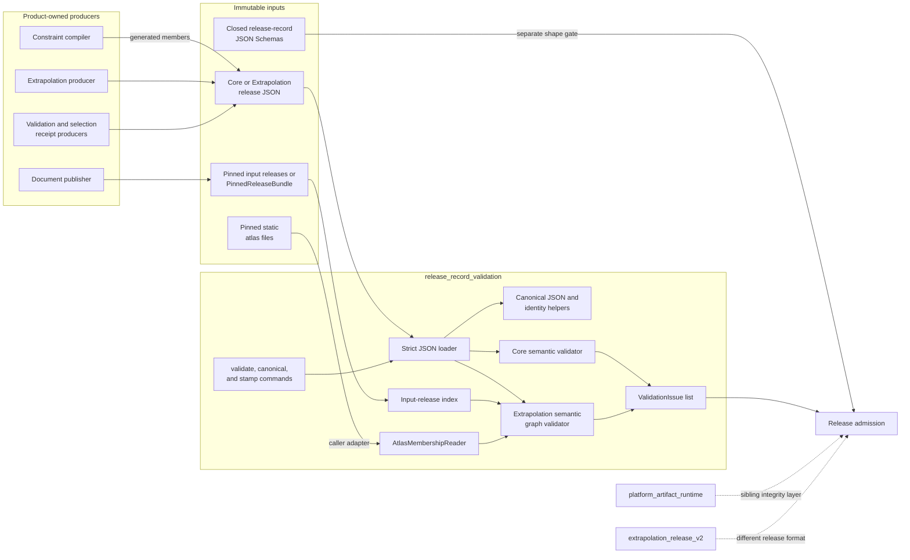
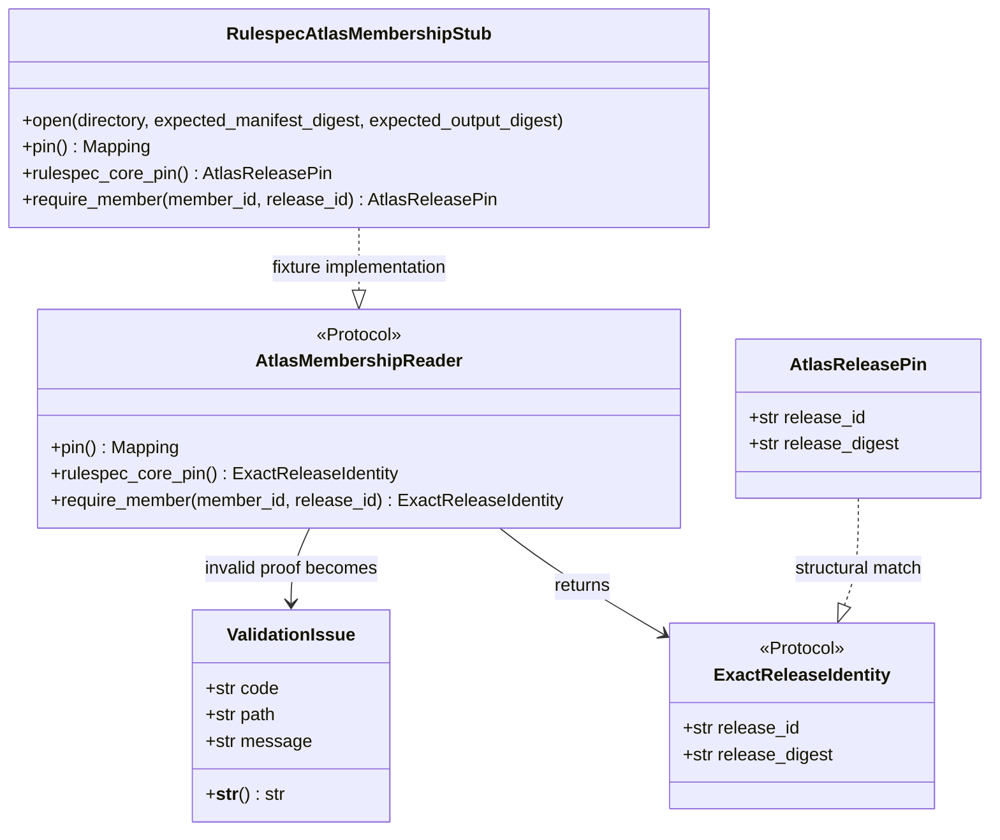
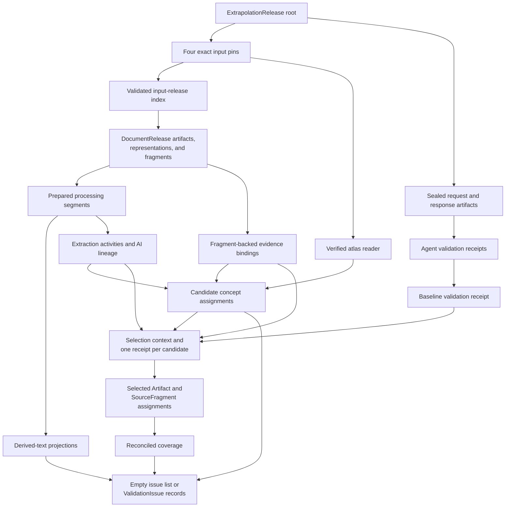
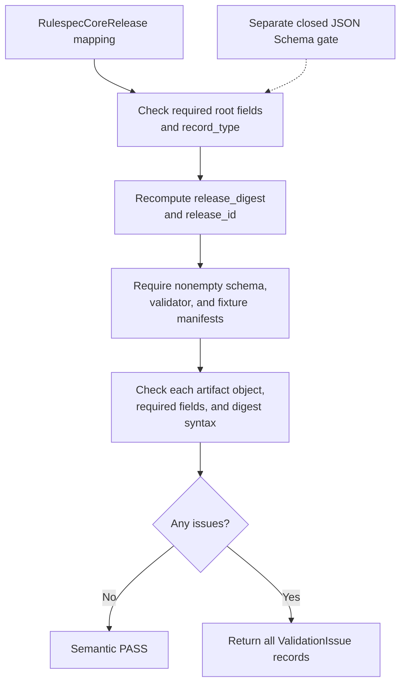
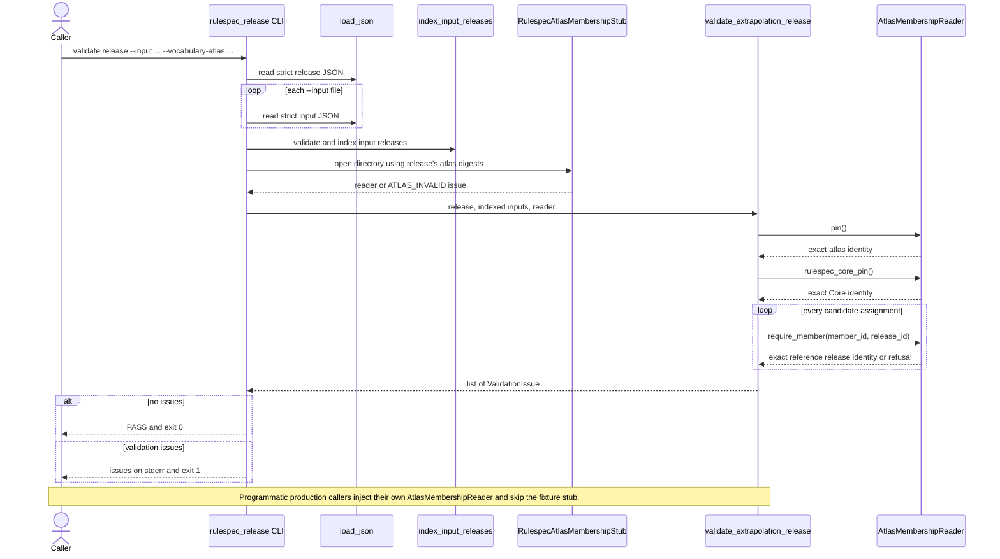

# Release record validation

The `release_record_validation` module is Rulespec's portable integrity and
semantic validator for canonical `RulespecCoreRelease` and JSON
`ExtrapolationRelease` records. It recomputes content-derived identities,
resolves exact input pins, checks the contained evidence and receipt graph,
and returns deterministic `ValidationIssue` records when any claim fails.

The implementation lives in
[`tools/rulespec_release.py`](../tools/rulespec_release.py) and uses only the
Python standard library. Extrapolation validation receives atlas membership
proof through the small `AtlasMembershipReader` interface, so the validator
does not need a sibling product checkout, network service, or mutable
database. The [Rulespec release-record specification](../spec/rulespec-releases.md)
defines the normative record meanings; this page explains the implementation,
its system boundaries, and the contribution workflow.

## At a glance

| Question | Answer |
| --- | --- |
| What goes in? | A Core or Extrapolation release mapping. Extrapolation also needs indexed Core and document releases plus a caller-supplied reader for the exact vocabulary atlas named by the release. |
| What happens? | The module recomputes identities, resolves references, verifies exact text and evidence links, checks submitted validation and selection receipts, and reconciles coverage. |
| What comes out? | Programmatic validators return `list[ValidationIssue]`. The CLI prints `PASS` for an empty list or prints each issue and refuses the release. Identity helpers return copied, restamped mappings or canonical bytes. |
| How is it checked? | Closed JSON Schemas check record shape. Focused unit tests check identities, pins, projections, atlas membership, receipt independence, deterministic fixture rebuilding, and sealed negative controls. |

## Scope and system role

This module covers two record types:

- `RulespecCoreRelease`, which pins generated schemas, validators, and positive
  conformance fixtures; and
- the single-JSON `ExtrapolationRelease` format defined by the version 1
  schema, which binds evidence-linked assignments to exact inputs and submitted
  validation and selection receipts.

It does not verify the partitioned `rulespec-extrapolation-release` version 2
distribution. That format has bounded manifests and Parquet members and uses
[`tools/extrapolation_release_v2.py`](../tools/extrapolation_release_v2.py).
It also does not replace platform-artifact admission. See
[Platform artifact runtime](platform_artifact_runtime.md) for canonical
platform directories, member manifests, storage readers, and publication.

The validator checks records that other processes produced. In particular, it
does not:

- compile CUE or generate Core artifacts; see
  [Constraint compiler AST](constraint_compiler_ast.md);
- choose a JSON Schema for a JSON-LD instance; see
  [Compiled schema binding](compiled_schema_binding.md);
- run JSON-LD conformance levels or produce certification reports; see
  [Conformance fixture reporting](conformance_fixture_reporting.md);
- parse documents, create processing segments, or transform source text;
- call machine validators, reduce attempts into a baseline, or run a selection
  policy; or
- approve, publish, deploy, or activate a release.

`ProcessingSegment`, `DerivedTextProjection`, `AgentValidationReceipt`,
`BaselineValidationReceipt`, and `ExtrapolationSelectionReceipt` are submitted
facts. This module verifies their internal consistency and admissibility. The
release-record specification records the current ownership gaps for the
processes that must produce baseline and selection receipts.

### Two required validation layers

The Python functions enforce identity and cross-record semantics. They do not
implement every closed-shape, field-type, enumeration, or
`additionalProperties: false` rule from the JSON Schemas. A complete admission
path therefore applies both layers:

1. Validate the root and contained records against
   [`rulespec-core-release.schema.json`](../release-records/schemas/rulespec-core-release.schema.json)
   or
   [`extrapolation-release.schema.json`](../release-records/schemas/extrapolation-release.schema.json).
2. Run `validate_rulespec_core_release()` or
   `validate_extrapolation_release()` for content identity and semantic checks.

The CLI performs the second layer. Producers and release gates must not treat
a CLI pass alone as proof that unknown fields or every schema-level type error
were rejected.

## Architecture and dependencies



### Physical dependency boundary

| Dependency | How the module uses it |
| --- | --- |
| Python standard library | `argparse`, `copy`, `dataclasses`, `hashlib`, `json`, `pathlib`, regular expressions, and typing protocols implement the complete reusable module. |
| `AtlasMembershipReader` supplied by the caller | Proves the selected atlas identity, its sealed Core release, and membership of every assignment target in the pinned reference release. |
| [`tools/atlas_membership_stub.py`](../tools/atlas_membership_stub.py) | The CLI loads this Rulespec-owned file adapter for checked-in fixtures. It is a test seam, not a production atlas format. |
| Release-record JSON Schemas | Supply closed-shape validation outside this module. Tests use `jsonschema`; reusable release logic does not depend on that package. |
| Fixture builder and corpus | Generate and retain deterministic positive releases and semantic negative controls for offline verification. |

There is no runtime import from the compiler, conformance package, platform
artifact package, SpicyRegs, RefSpec, or a provider SDK. Preserve this boundary
when adding new proof sources: define the smallest read interface in this
module, then implement product-specific storage and format handling outside it.

## Module surface

### Core types

| Component | Purpose |
| --- | --- |
| `ValidationIssue` | Immutable refusal detail with stable `code`, JSON-like `path`, and human-readable `message`. |
| `ExactReleaseIdentity` | Structural typing interface for an object with `release_id` and `release_digest`. |
| `AtlasMembershipReader` | File-oriented proof interface used by Extrapolation validation. |

### Validation and input functions

| Function | Responsibility |
| --- | --- |
| `validate_release_identity()` | Recomputes a root digest and verifies the content-derived release ID for a specified product and release kind. |
| `validate_rulespec_core_release()` | Checks the Core record type, required fields, root identity, nonempty manifests, artifact entry fields, and digest syntax. |
| `fixture_records()` | Normalizes one root object or a `PinnedReleaseBundle` into release records. |
| `index_input_releases()` | Validates supported input-release identities, rejects duplicate IDs, and builds the lookup used by pin resolution. |
| `validate_extrapolation_release()` | Checks the complete Extrapolation input, source, evidence, lineage, validation, selection, and coverage graph. |

### Identity and fixture functions

| Function | Responsibility |
| --- | --- |
| `load_json()` | Reads UTF-8 JSON and rejects duplicate object keys and non-finite constants. |
| `canonical_json_bytes()`, `canonical_digest()` | Produce the shared compact, sorted UTF-8 representation and its qualified SHA-256 digest. |
| `content_digest()`, `text_digest()` | Hash exact bytes or exact UTF-8 text. |
| `compute_release_digest()`, `expected_release_id()` | Derive root release identity. |
| `content_addressed_id()` | Derives a URN from a caller-selected identity mapping. |
| `stable_record_id()`, `stamp_record()` | Derive and attach durable child record IDs. |
| `stamp_release()`, `stamp_coverage()` | Deep-copy and restamp a root release or coverage record. |
| `extrapolation_selection_context_digest()` | Binds selection receipts to the complete pre-selection graph and the declared selection policies. |
| `apply_negative_control()` | Applies sealed JSON Pointer `replace` or `remove` operations and restamps the root so tests reach the intended semantic gate. |

`build_parser()` and `main()` expose `validate`, `canonical`, and `stamp` as a
small command-line interface.

## Core components



### `ValidationIssue`

`ValidationIssue` is a frozen dataclass. Validators accumulate issues instead
of stopping at the first invalid claim, which gives callers a useful repair
set without admitting a partially valid release. Its string form is stable:

```text
<CODE> <PATH>: <message>
```

`path` uses root markers such as `$`, `$/concept_assignments/...`, and
`$inputs/document/...`. Codes are the programmatic interface; messages explain
the current refusal and may include an expected digest or identifier.

An empty issue list means that this semantic validator found no refusal. It
does not widen the module's scope to schema closure, external publication, or
the truth of an assignment.

### `ExactReleaseIdentity`

`ExactReleaseIdentity` is a structural `Protocol`, not a runtime base class.
An adapter may return a dataclass, named object, or mapping. The internal
`_exact_release_pin()` helper normalizes either form and requires:

- an absolute `release_id`; and
- a lowercase `sha256:<64 hex>` `release_digest`.

This narrow return type prevents the validator from depending on an atlas's
internal record model.

### `AtlasMembershipReader`

`AtlasMembershipReader` gives the validator three proofs:

| Method | Required result | Validation use |
| --- | --- | --- |
| `pin()` | Exactly `asset_id`, `manifest_digest`, and `distribution_digest` | Must equal the atlas pin declared in `input_releases`. |
| `rulespec_core_pin()` | One exact Core release identity | Must equal the Extrapolation release's Core pin. |
| `require_member(member_id=..., release_id=...)` | Exact identity of the release that contains the member | Runs for every candidate assignment, then must equal the declared reference-resource release pin. |

The validator verifies every candidate target, not only selected assignments.
A missing reader yields `ATLAS_NOT_PROVIDED`. Invalid reader values and rejected
members become deterministic atlas or concept issues. A production integration
should verify immutable files before returning any of these facts.

The CLI currently constructs `RulespecAtlasMembershipStub`, whose fixture
directory contains canonical `manifest.json` and `members.json`. A production
atlas with another storage or wire format should implement the protocol and
call `validate_extrapolation_release()` directly.

## Identity model

All version 1 release identities use the same canonical JSON representation:

1. Sort object keys.
2. Emit compact separators with no insignificant whitespace.
3. Preserve Unicode characters and encode the result as UTF-8.
4. Reject non-finite numbers.
5. Hash the bytes with SHA-256 and prefix the lowercase hex with `sha256:`.

`load_json()` adds file-level rejection of duplicate keys. Programmatic callers
that supply a mapping directly are responsible for obtaining it from an
equally strict parser.

### Root releases

The root digest omits only the root's `release_id` and `release_digest`. Nested
fields with those names remain identity-defining.

```text
release_digest = sha256(canonical_json(root without root identity fields))
release_id     = urn:<product>:<release-kind>:<digest hex>
```

`stamp_release()` deep-copies the mapping and recomputes those two fields. It
does not validate the release or restamp contained records.

### Contained identities

| Identity | Preimage |
| --- | --- |
| Ordinary durable record | The record-type-specific fields in `RECORD_IDENTITIES`. |
| Agent, baseline, or selection receipt | The complete receipt except `record_id`, so decisions and outcomes change the ID. |
| Validation artifact | `artifact_type`, `content_digest`, `media_type`, and `coordinate_system`. |
| Validation sample manifest | The canonical `{"record_refs": [...]}` mapping. |
| Extrapolation coverage | The complete coverage object except `coverage_id` and `coverage_digest`. |
| Selection context | The pre-selection input pins, profile, sample manifest, candidate and evidence graph, activity and lineage records, segments and projections, validation artifacts, agent receipts, baseline receipts, and sorted selection policy names. |

Content addressing creates a dependency chain. Changing an agent receipt can
change its ID, a baseline reference and ID, the selection context, selection
receipt IDs, and the root release identity. Contributors must restamp the
whole affected chain rather than editing only the final root fields.

## Input and record model

`index_input_releases()` accepts individual release objects or a
`PinnedReleaseBundle.records` array. It recognizes these root record types:

- `RulespecCoreRelease`;
- `DocumentRelease`;
- `ReferenceResourceRelease`; and
- `ExtrapolationRelease`.

It validates each root identity before indexing by `release_id`. Unsupported
types, invalid identities, and duplicate IDs produce issues. The
Extrapolation validator then resolves the declared Core and document pins from
that index. The reference-resource release is verified through atlas
membership proof rather than by trusting an unverified local record.

An `ExtrapolationRelease` must name exactly four inputs:

| Pin | Required fields | What proves it |
| --- | --- | --- |
| `rulespec_core_release` | `release_id`, `release_digest` | Indexed Core release, Core semantic validation, the document's upstream Core pin, and the atlas's sealed Core pin must agree. |
| `document_release` | `release_id`, `release_digest` | Indexed `DocumentRelease` identity and all downstream document references. |
| `vocabulary_atlas_asset` | `asset_id`, `manifest_digest`, `distribution_digest` | Exact equality with `AtlasMembershipReader.pin()`. |
| `reference_resource_release` | `release_id`, `release_digest` | Each assignment target's atlas membership proof must return this exact identity. |

### Extrapolation data flow



## Validation process

### Core release flow

`validate_rulespec_core_release()` applies a compact set of checks:



The function checks declared artifact digest syntax but does not open each
artifact and hash repository bytes. The focused tests perform that repository
consistency check for the checked-in Core fixture.

### Extrapolation release phases

`validate_extrapolation_release()` runs one fail-closed pass and appends issues
as it moves through the graph.

| Phase | Main checks |
| --- | --- |
| Root | Required fields, `record_type`, canonical root digest, and content-derived release ID. |
| Inputs | Exact four-pin set; Core and document lookup, type, and digest; atlas and reference pin shape. |
| Atlas and Core alignment | Atlas bytes selected by exact pin, atlas-sealed Core identity, Core release validation, document-to-Core pin consistency, and concept membership proof. |
| Child identities | Expected record type, stable `record_id`, uniqueness, and index construction for assignments, evidence, activities, lineage, segments, projections, and three receipt kinds. |
| Document sources | Artifact content-digest syntax, representation text digests, fragment source pins, Unicode code-point bounds, and selected-text digests. |
| Prepared text | Segment-to-document pin, input fragment resolution, reciprocal projection links, exact derived-text digest, and complete ordered-slice accounting. |
| Evidence and lineage | Evidence targets and fragment digests, assignment-to-evidence links, extraction activity, AI lineage for `aiSuggested` candidates, and exact four-resource activity inputs. |
| Selection | One receipt per candidate, pre-selection context binding, complete selection inputs, selected result, passing checks, usable baseline, supported subject kinds, and `searchOnly` eligibility. |
| Validation receipts | Content-addressed request and response artifacts, sealed sample manifest, execution outcome rules, evidence scope, exact target profile, validator independence, and deterministic baseline checks. |
| Coverage | Content-derived coverage identity and candidate, selected, not-selected, and deferred counts. |

### Exact source and projection checks

Document validation indexes published artifacts, source fragments, and text
representations from the pinned `DocumentRelease`, including embedded
projections on document versions, text representations, and structural
passages. It then checks fragment coordinates against exact Unicode text.

Selectors use half-open Unicode code-point bounds: `start` is included and
`end` is excluded. The selected text digest is SHA-256 over the exact UTF-8
bytes of `source_text[start:end]`.

A `DerivedTextProjection` must account for every code point in its segment's
`derived_text` through contiguous `ordered_slices` beginning at zero:

| Slice kind | Check |
| --- | --- |
| `source_range` | The source representation exists, the source slice equals the derived slice, named fragments resolve, and the range falls within at least one declared input fragment. |
| `inserted_text` | The declared text equals the derived slice and its UTF-8 digest matches. |
| `transformed_range` | A versioned `transform_method_version` is present. The current validator records the transform boundary; it does not rerun the transformation. |

Declared omitted ranges must resolve to valid bounds in an exact text
representation. The validator verifies supplied segments and projections; it
never constructs model input or claims ownership of segmentation.

### Evidence, validation, and selection checks

Every candidate assignment must have resolvable evidence, extraction lineage,
and verified reference-resource membership. Every AI-suggested assignment also
needs `AILineage`. Selected assignments must:

- target a published `Artifact` or `SourceFragment` in the document release;
- never target a `ProcessingSegment`;
- use `usage_eligibility=searchOnly`;
- have a selection receipt whose result is `selected`;
- pass every deterministic selection check; and
- reference a baseline result of `usable_for_search` or
  `usable_with_nonblocking_limits`.

A nonempty release must serve at least one document-level `Artifact`
assignment and one fragment-level `SourceFragment` assignment.

The sealed validation sample manifest names every retained request, response,
and evidence artifact used by validator checks. A completed agent attempt needs
a valid recommendation and exact response artifact. A failed attempt needs a
failure reason and cannot have a recommendation. Abstention remains a refusal
for a usable baseline.

A usable baseline requires exactly two completed, unanimously supporting
agent receipts. They must have distinct nonempty independence groups,
validator actors, provider/model identities, and response artifacts. Every
agent check and deterministic baseline check must pass. These are acceptance
rules for submitted receipts, not code that invokes validators or produces the
baseline.

### Component interaction



## Failure and result model

Issues fall into stable families. The exact code is the machine-readable
result; the path locates the failed claim.

| Family | Representative codes | Meaning |
| --- | --- | --- |
| Shape and identity | `MISSING_FIELD`, `WRONG_RECORD_TYPE`, `INVALID_DIGEST`, `RELEASE_DIGEST_MISMATCH`, `RECORD_ID_MISMATCH` | A required value, digest, root identity, or durable child identity is invalid. |
| Input pins | `PINNED_RELEASE_NOT_FOUND`, `PINNED_RELEASE_TYPE_MISMATCH`, `ATLAS_ASSET_PIN_MISMATCH`, `ATLAS_CORE_PIN_MISMATCH` | The release does not resolve to the exact declared upstream data. |
| Source text | `FRAGMENT_SOURCE_NOT_FOUND`, `FRAGMENT_SELECTOR_INVALID`, `TEXT_REPRESENTATION_DIGEST_MISMATCH`, `PROJECTION_NOT_CLOSED` | Source coordinates, text, or reversible derived-text accounting fail. |
| Evidence and lineage | `MISSING_EVIDENCE`, `EVIDENCE_DIGEST_MISMATCH`, `MISSING_EXTRACTION_ACTIVITY`, `MISSING_AI_LINEAGE`, `CONCEPT_NOT_IN_RELEASE` | An assignment lacks its required proof chain. |
| Selection and scope | `SELECTION_CONTEXT_MISMATCH`, `SELECTION_RECEIPT_MISSING`, `UNSELECTED_ASSIGNMENT_INCLUDED`, `NON_SEARCH_ONLY_ASSIGNMENT`, `M2_SCOPE_INCOMPLETE` | The served subset is not bound to a complete, admissible selection decision. |
| Validation receipts | `VALIDATOR_REQUEST_NOT_FOUND`, `VALIDATOR_ABSTENTION`, `VALIDATORS_NOT_INDEPENDENT`, `BASELINE_VALIDATOR_CHECK_FAILED` | Submitted validator or baseline receipts cannot support use. |
| Coverage | `COVERAGE_DIGEST_MISMATCH`, `COVERAGE_ID_MISMATCH`, `COVERAGE_MISMATCH` | Coverage identity or counts disagree with the validated graph. |

The CLI uses three result classes:

| Exit status | Meaning |
| --- | --- |
| `0` | The selected semantic validator returned no issues. |
| `1` | The record parsed, but one or more validation issues refused it. |
| `2` | The command, file, or JSON value could not be processed, including malformed JSON, duplicate keys, I/O errors, or a non-object root. |

Direct callers receive issue lists from validation functions. Strict parsing,
file access, invalid negative-control operations, and some operational adapter
failures may raise exceptions instead. Do not convert a storage outage into a
claim that release data is invalid unless the adapter can make that distinction
reliably.

## Using the module

Run commands from the repository root.

### Validate the checked-in Core fixture

```bash
python tools/rulespec_release.py validate \
  release-records/fixtures/rulespec-core-release-m2.json
```

### Validate the checked-in Extrapolation fixture

```bash
python tools/rulespec_release.py validate \
  release-records/fixtures/m2-extrapolation-release-positive.json \
  --input release-records/fixtures/rulespec-core-release-m2.json \
  --input release-records/fixtures/m2-input-releases.json \
  --vocabulary-atlas release-records/fixtures/rulespec-atlas-membership-stub
```

`--input` is repeatable. Each file may contain one release or a
`PinnedReleaseBundle`. The CLI's atlas path currently uses the in-repository
fixture adapter described above.

### Inspect canonical bytes or restamp a draft

```bash
python tools/rulespec_release.py canonical path/to/release.json

python tools/rulespec_release.py stamp path/to/draft.json \
  --product rulespec \
  --release-kind core
```

`canonical` writes compact canonical JSON followed by a newline. `stamp`
prints a pretty JSON copy with a recomputed root identity. Neither command
validates contained semantics, and `stamp` does not update child IDs.

### Programmatic validation

```python
from pathlib import Path

from tools.rulespec_release import (
    index_input_releases,
    load_json,
    validate_extrapolation_release,
)

release = load_json(Path("release.json"))
core = load_json(Path("core-release.json"))
document_bundle = load_json(Path("document-inputs.json"))

inputs, issues = index_input_releases([core, document_bundle])
issues.extend(validate_extrapolation_release(release, inputs, atlas_reader))

if issues:
    for issue in issues:
        print(issue)
```

`atlas_reader` may be any object that satisfies `AtlasMembershipReader` and
returns verified immutable facts. Apply the appropriate closed JSON Schema
before relying on the empty issue list.

## Contribution guide

### Files that move together

| Change | Files to inspect or update |
| --- | --- |
| Record meaning or ownership | [`spec/rulespec-releases.md`](../spec/rulespec-releases.md) and any applicable decision record. |
| Closed shape or field enumeration | [`release-records/schemas/`](../release-records/schemas/), plus schema-validation tests. |
| Semantic invariant or issue code | [`tools/rulespec_release.py`](../tools/rulespec_release.py) and focused positive and negative tests. |
| Durable identity fields | `RECORD_IDENTITIES`, fixture builders, every downstream reference, selection context, coverage, and root stamps. |
| Atlas proof behavior | `AtlasMembershipReader`, the production adapter outside this module, and [`tools/atlas_membership_stub.py`](../tools/atlas_membership_stub.py) only when the fixture seam also changes. |
| Checked-in evidence | [`tools/build_rulespec_release_fixtures.py`](../tools/build_rulespec_release_fixtures.py) and [`release-records/fixtures/`](../release-records/fixtures/). |
| Version 2 packaging | [`tools/extrapolation_release_v2.py`](../tools/extrapolation_release_v2.py), its schemas, and its own corpus. Do not add v2 member logic to this module. |

### Implementation rules

1. Keep the reusable validator standard-library-only and repository
   independent.
2. Treat JSON Schema closure and semantic graph validation as complementary
   gates. Add a schema rule for shape and a Python rule for relationships that
   JSON Schema cannot express clearly.
3. Reuse the canonical digest and ID helpers. A second encoder or ad hoc hash
   preimage will create identities that cannot be compared safely.
4. Preserve raw input authority. Resolve artifacts, fragments, and concept
   members from the exact pinned releases; never invent a substitute ID or
   silently repair a mismatch.
5. Add issues through `_issue()` with a stable uppercase code, the narrowest
   useful path, and a concrete message. Invalid submitted data should normally
   become issues; programmer errors and operational failures should remain
   distinguishable.
6. Verify supplied processing segments and projections. Do not add a segmenter
   or text-construction policy to this validator.
7. Keep receipt production outside the validator. The module may verify a
   request, response, attempt, baseline, or selection result but must not call
   a provider or choose a candidate.
8. Restamp from the changed child outward. Receipt and selection changes often
   require several new IDs before the root can be stamped correctly.

### Test strategy

[`tools/test_rulespec_releases.py`](../tools/test_rulespec_releases.py) covers:

- strict and canonical JSON behavior;
- Core identity, schema acceptance, and repository artifact digests;
- deterministic fixture reproduction;
- repository-independent positive Extrapolation validation;
- atlas proof calls for every candidate;
- exact derived-text projection closure;
- independent terminal validation receipts;
- selection-context non-reuse;
- content-addressed terminal outcomes;
- sealed negative controls whose roots remain correctly restamped; and
- the fixture-only segmentation boundary.

[`tools/test_atlas_membership_stub.py`](../tools/test_atlas_membership_stub.py)
checks exact membership, tamper resistance, generation identity, missing
releases, and symlink refusal for the local fixture adapter.

Run the focused tests with the repository's pinned Python environment:

```bash
uv run --no-project --python 3.12 \
  --with-requirements requirements.txt \
  python -m unittest \
  tools.test_rulespec_releases \
  tools.test_atlas_membership_stub -v
```

Run `make test-audits` before merging a change that affects shared schemas,
compiled artifacts, release fixtures, or cross-module invariants. A new
semantic refusal should include a positive test and a restamped negative
control that reaches the new code rather than failing first on root identity.

## Related documentation

- [Rulespec release-record specification](../spec/rulespec-releases.md) —
  normative canonical JSON, record meanings, version boundaries, receipt
  acceptance rules, fixtures, and ownership gaps.
- [Platform artifact runtime](platform_artifact_runtime.md) — immutable member
  packaging and structural admission below product release records.
- [Constraint compiler AST](constraint_compiler_ast.md) — generation of Core
  schema artifacts that a Core release can pin.
- [Compiled schema binding](compiled_schema_binding.md) — runtime selection of
  generated JSON Schemas for JSON-LD instance validation.
- [Conformance fixture reporting](conformance_fixture_reporting.md) — L1-L4
  fixture assessment and certification reporting, separate from release
  identity validation.
- [`release-records/README.md`](../release-records/README.md) — release schema
  and fixture corpus layout.
