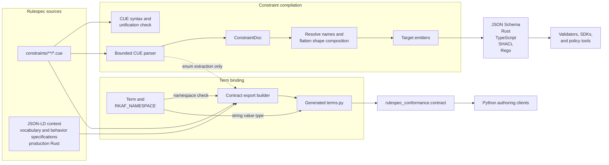
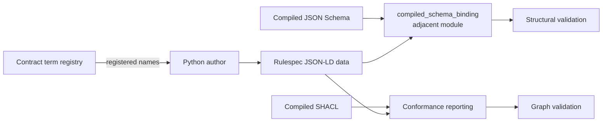

# Semantic contract compilation and binding

## Purpose

`semantic_contract_compilation_and_binding` turns Rulespec’s semantic sources into two complementary consumer surfaces:

- The constraint compiler parses the supported CUE subset into a target-neutral `ConstraintDoc`, resolves sibling definitions and shape composition, validates shared rules, and emits JSON Schema, Rust, TypeScript, SHACL, and Rego.
- The term registry binds admitted compact `rkaf:` names to string-compatible Python attributes. `Term` also expands compact names to absolute Internationalized Resource Identifiers (IRIs).

The paths share source material but remain independent. Registry membership proves that an admitted source contains a name; it does not define that name’s meaning or validate instance data. Compiled schemas and SHACL perform those checks downstream.

## Architecture

### Build-time flow

Term discovery uses a lexical scan rather than the compiler AST. The export builder calls the compiler parser only for the separate enum export generated by the same command.

### Consumer boundary

The registry helps authors spell compact names correctly. It does not participate in schema selection or validation. The adjacent `compiled_schema_binding` module reads fixed `@type` values from generated JSON Schema.

Compilation fails when the normalized model cannot preserve the CUE source faithfully. Separate checks run `cue vet`, detect generated-file drift and namespace disagreement, compare target behavior, and test the packaged Python surface.

## Core component documentation

| Component | Responsibility | Documentation |
| --- | --- | --- |
| `constraint_compiler_ast` | Parses supported CUE forms, builds and validates `ConstraintDoc`, resolves composition, and emits target formats. | [Constraint compiler AST](/Users/mikewolfd/Work/rulespec/wiki/constraint_compiler_ast.md) |
| `contract_term_registry` | Defines `Term`, maintains the `rkaf` namespace binding, and exposes generated Python vocabulary attributes and membership checks. | [Contract term registry](/Users/mikewolfd/Work/rulespec/wiki/contract_term_registry.md) |